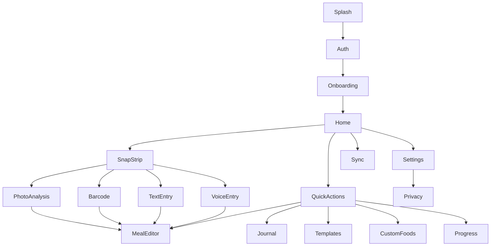
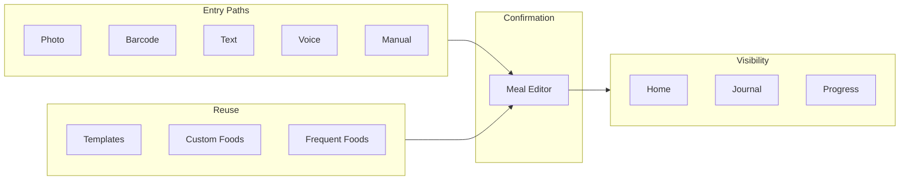

# SnapGrub App Feature Walkthrough

## What SnapGrub Is

SnapGrub is a **premium calorie tracker** positioned as a **fast, trustworthy multimodal food ledger**—not just "take a photo and guess calories." The core promise: turn meals into **editable, user-confirmed nutrition logs in seconds**, with AI as a draft assistant rather than the source of truth.

**Stack:** Flutter mobile app + Supabase backend (Auth, Postgres, RLS, Edge Functions, private storage).

---

## App Flow (High Level)

Every logging path converges on **Meal Editor** before anything is saved. Nothing from AI or parsers is auto-committed.

---

## 1. Auth and Onboarding

### Auth

**Code:** [`apps/mobile/lib/features/auth/`](../../apps/mobile/lib/features/auth/)

- Supabase sign-in gate
- Production: email/password, email OTP fallback, email OTP sign-up, and email-code password recovery
- Dev/E2E: email + password
- Signed-out users are redirected here from the router

### Onboarding

**Code:** [`apps/mobile/lib/features/onboarding/`](../../apps/mobile/lib/features/onboarding/)

Six-step first-run flow that blocks Home until complete:

1. **Welcome** — display name
2. **Goal** — lose / maintain / gain / custom; metric or imperial
3. **Body** — height, weight, age, sex
4. **Macro Target** — calorie and macro goals
5. **Cuisine** — cuisine preferences + timezone
6. **Permission Primer** — camera consent + optional meal reminders

Output feeds Home rollups and Progress goal tracking.

---

## 2. Home — The Daily Hub

**Screen:** [`apps/mobile/lib/features/home/presentation/home_screen.dart`](../../apps/mobile/lib/features/home/presentation/home_screen.dart)

Home is the main dashboard after onboarding. It combines capture, summary, and navigation.

| Component | Purpose |
| --- | --- |
| **SnapStrip** | Live camera preview + capture actions (photo, barcode, text, voice) |
| **DailyProgressCard** | Calories vs goal, meal count |
| **MacroSummaryCard** | Protein / carbs / fat breakdown |
| **QuickActionsRow** | Manual, Journal, Templates, Foods, Progress |
| **RecentMealsCarousel** | Tap any today meal to edit |
| **Smart repeats** | Feature-flagged recent/frequent/template suggestions that open Meal Editor for review |
| **Sync toolbar + pull-to-refresh** | Background sync; conflict banner links to Sync screen |

---

## 3. Five Ways to Log a Meal

All paths produce a **MealDraft** and route to Meal Editor for user confirmation.

### Photo Capture → Photo Analysis

- **SnapStrip** captures a still → compressed local asset → [`/photo-analysis`](../../apps/mobile/lib/features/photo_analysis/)
- Backend AI identifies foods; staged UI ("Identifying foods…")
- Success → Meal Editor with draft; failure → retry or manual entry

### Barcode Scan

- [`/barcode`](../../apps/mobile/lib/features/barcode/presentation/barcode_screen.dart)
- Scan packaged food → backend catalog lookup (Open Food Facts + cache)
- Not found → manual nutrition entry or **Label OCR** (camera + ML Kit → backend parse)

### Text Entry

- [`/text-entry`](../../apps/mobile/lib/features/text_entry/)
- Natural language: e.g. "2 rotis and dal"
- Backend text parser → editable draft → Meal Editor

### Voice Entry

- [`/voice-entry`](../../apps/mobile/lib/features/voice_entry/)
- Push-to-talk (speech-to-text) → editable transcript → backend voice parser
- Fallback link to Text Entry

### Manual Entry

- Quick Actions "Manual" or Journal "+" → Meal Editor with empty draft

**Feature flags** ([`apps/mobile/lib/core/feature_flags/feature_flags.dart`](../../apps/mobile/lib/core/feature_flags/feature_flags.dart)): `photo_analysis`, `barcode`, `ocr_assist`, `voice_capture`, `smart_foods_v2`, and `weekly_insights` can be toggled per user/server.

---

## 4. Meal Editor — Single Source of Truth

**Screen:** [`apps/mobile/lib/features/meal_editor/presentation/meal_editor_screen.dart`](../../apps/mobile/lib/features/meal_editor/presentation/meal_editor_screen.dart)

Central hub for all meal creation and editing:

- Accept drafts from photo / barcode / text / voice / templates / frequent foods / Smart repeats
- Edit title, meal type, time, line items, macros
- Add items or insert from custom foods
- Save locally + enqueue outbox sync
- Save as template (toolbar)
- Delete existing meal

**Design principle:** AI output is always a draft. User confirmation is required before durable storage.

---

## 5. Visibility and Management

### Journal

**Code:** [`apps/mobile/lib/features/journal/`](../../apps/mobile/lib/features/journal/)

- Full list of today's meals with sync status and macros
- Edit, duplicate, delete, or add meals

### Progress

**Code:** [`apps/mobile/lib/features/progress/`](../../apps/mobile/lib/features/progress/)

- Daily macro progress vs onboarding goals
- **Weekly check-in** (feature-flagged deterministic insights from backend)
- **Logging rhythm** streak card
- **Smart repeats** — feature-flagged ranked suggestions from learned defaults, recent meals, and templates; each opens Meal Editor before save

### Templates

**Code:** [`apps/mobile/lib/features/templates/`](../../apps/mobile/lib/features/templates/)

- Reusable meal snapshots saved from Meal Editor
- "Use template" → new draft → Meal Editor

### Custom Foods

**Code:** [`apps/mobile/lib/features/custom_foods/`](../../apps/mobile/lib/features/custom_foods/)

- Personal food library (name, serving, macros)
- Insert into Meal Editor drafts from Quick Actions or editor

---

## 6. Profile, Settings, and Privacy

### Settings

**Code:** [`apps/mobile/lib/features/profile/`](../../apps/mobile/lib/features/profile/)

- Profile summary and active macro goal
- Edit goals (calories, P/C/F, goal type)
- Refresh profile from server
- Entry to Privacy sub-screens
- Sign out

### Privacy

**Code:** [`apps/mobile/lib/features/privacy/`](../../apps/mobile/lib/features/privacy/)

GDPR-style controls synced via `settings-patch` backend:

- AI improvement consent toggle
- Cloud media storage preferences
- JSON/CSV data export (poll + open/copy link)
- Clear local device cache
- Account deletion (typed confirmation)

---

## 7. Offline Sync (Infrastructure, User-Visible)

**Screen:** [`apps/mobile/lib/offline/sync/sync_status_screen.dart`](../../apps/mobile/lib/offline/sync/sync_status_screen.dart)

Local-first architecture:

- Saves appear immediately on device
- Mutations replay to Supabase via outbox
- Home shows banner on conflict/failure → Sync screen for retry/discard
- All writes (meals, profile, templates, custom foods) go through outbox

See also: [Offline sync architecture](../02-architecture/offline-sync.md) and [Frontend outbox behavior](../05-frontend/offline-outbox.md).

---

## Backend Support (What Powers Each Feature)

| App feature | Backend |
| --- | --- |
| App start / flags | `profile-bootstrap` |
| Onboarding / goals / privacy prefs | `settings-patch` |
| Meals CRUD + day rollups | `meals` |
| Photo analysis | `analysis-photo-create`, `analysis-get` |
| Barcode / label OCR / text / voice | `barcode-resolve`, `analysis-label-create`, `analysis-text-create`, `analysis-voice-create` |
| Custom foods / templates | `custom-foods`, `meal-templates` |
| Smart repeats | Local cache of meals, templates, and `user_food_defaults`; confirmed saves use `meals` |
| Weekly check-in | `weekly-insights-generate` |
| Export / delete account | `exports-create`, `account-delete` |
| Media retention | `media-retention-cleanup` (scheduled) |

Full API catalog: [Edge Functions](../06-backend/edge-functions.md)

---

## Mental Model (How Features Connect)

1. **Entry (5 paths):** Photo, barcode, text, voice, manual → all produce/edit a `MealDraft`
2. **Confirmation (1 path):** Meal Editor — review confidence, edit, save
3. **Visibility (3 surfaces):** Home summary, Journal list, Progress goals
4. **Reuse (2 libraries):** Templates (whole meals), Custom Foods + Frequent Foods (items)
5. **Account (2 areas):** Settings/Profile, Privacy/Sync

---

## Completeness Status

| Area | Status |
| --- | --- |
| Phases 0–8 (core MVP) | Backend verified locally; mobile implemented at source level |
| Device QA (camera, barcode, voice, offline, sync conflicts) | Not yet release-complete |
| Real AI providers in staging | Needs Gemini/OpenAI secrets beyond mock |
| Scheduled jobs (weekly insights, media cleanup) | Example SQL exists; needs staging deploy |
| Phases 9–10 (observability, store release) | Documented gates only |

Canonical status: [Phase status](../14-project-management/phase-status.md)

---

## Deferred (Post-MVP)

Coach chat, wearables, restaurant/menu OCR, meal planning/fasting, social features, rich micronutrient scoring.

---

## Key Files for Deeper Dives

- Router / navigation: [`apps/mobile/lib/app/router/app_router.dart`](../../apps/mobile/lib/app/router/app_router.dart)
- Mobile architecture: [Mobile architecture](../02-architecture/mobile-architecture.md)
- Product handoff: [UNIFIED SnapGrub MVP Dev Handoff Report](../UNIFIED%20SnapGrub%20MVP%20Dev%20Handoff%20Report.md)
