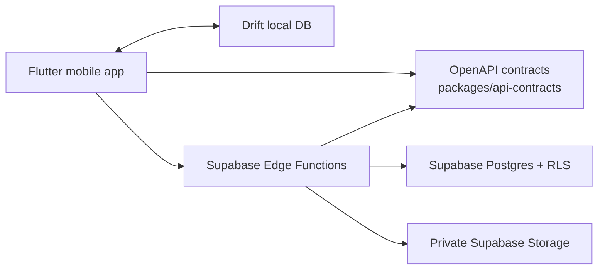

# Architecture

SnapGrub is a contract-first monorepo. Flutter owns the local-first user experience; Supabase owns auth, Postgres, RLS, storage, and Edge Functions. `packages/api-contracts/openapi.yaml` is the frontend/backend integration boundary.

## Current Architecture Rules

- Mobile initializes Supabase with anon config only.
- Mobile calls Edge Functions for protected settings writes; it does not own direct table-write behavior for settings.
- Backend protects user data with RLS and service-side validation.
- API contract changes start in OpenAPI and regenerate committed clients.
- Local data must be scoped by authenticated user ID.

More detail:

- [Mobile architecture](mobile-architecture.md)
- [Backend architecture](backend-architecture.md)
- [Offline sync](offline-sync.md)
- [Security boundaries](security-boundaries.md)

Legacy references:

- [../architecture/system-overview.md](../architecture/system-overview.md)
- [../architecture/mobile-architecture.md](../architecture/mobile-architecture.md)
- [../architecture/backend-architecture.md](../architecture/backend-architecture.md)
