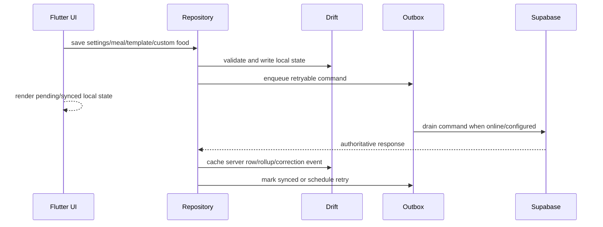

# Offline Sync

SnapGrub uses local-first writes for settings and Phase 3 meal logging. The outbox records retryable commands by authenticated `userId` and drains them when remote services are configured.

## How It Works

## Command Families

- `settings.patch`: profile, active goal, optional body measurement through `settings-patch`.
- `meal.create`, `meal.update`, `meal.delete`: meal writes through the `meals` Edge Function.
- `template.upsert`, `template.delete`: RLS-backed sync to `meal_templates`.
- `custom_food.upsert`, `custom_food.delete`: RLS-backed sync to `custom_foods`.

Photo analysis does not add an outbox command family: asset upload and analysis creation run immediately through Supabase Storage and `analysis-photo-create`. The confirmed photo meal then uses the existing `meal.create`/`meal.update` outbox path. Phase 5 barcode/OCR/voice commands should not be added until their contracts and server behavior exist.

## Safe Change Rules

- Scope outbox commands by `userId`.
- Do not queue validation or auth failures.
- Preserve `client_request_id` for idempotency.
- Cache authoritative server responses after sync, including meal rollups and correction events.
- Avoid adding new command types without documenting replay, conflict, failure behavior, and QA cases.
