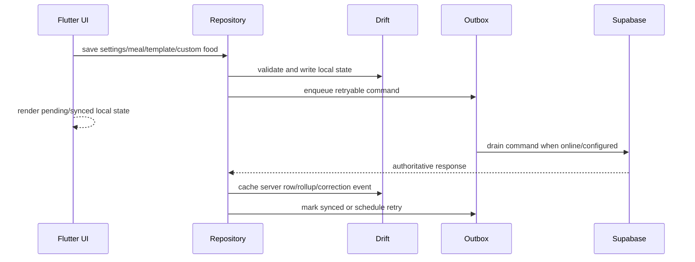

# Offline Sync

SnapGrub uses local-first writes for settings, meal logging, templates, custom foods, and Phase 6 sync-readiness commands. The outbox records commands by authenticated `userId`, preserves payload hashes for replay diagnostics, drains them when network and remote services are available, and exposes failed/conflict states from Home and the Sync status screen.

## How It Works

## Command Families

- `settings.patch`: profile, active goal, optional body measurement through `settings-patch`.
- `meal.create`, `meal.update`, `meal.delete`: meal writes through the `meals` Edge Function.
- `template.upsert`, `template.delete`: idempotent sync through `meal-templates`.
- `custom_food.upsert`, `custom_food.delete`: idempotent sync through `custom-foods`.
- `asset.upload`: Supabase Storage upload command with optional thumbnail dependency support.
- `body_measurement.create`: idempotent create through `body-measurements`.
- `analytics.batch`: non-blocking event replay through `events-ingest`.
- `export.create`: idempotent export request through `exports-create`.

Photo, barcode, OCR, text, and voice parser calls are not durable outbox commands. Confirmed meal drafts enter the existing meal outbox after the user accepts them in Meal Editor.

## Safe Change Rules

- Scope outbox commands by `userId`.
- Do not queue validation or auth failures.
- Preserve `client_request_id` for idempotency.
- Use `Idempotency-Key` on every mutation endpoint.
- Classify validation/auth errors as failed, revision/idempotency conflicts as conflict, and transient errors as retryable with backoff.
- Cache authoritative server responses after sync, including meal rollups and correction events.
- Avoid adding new command types without documenting replay, conflict, failure behavior, and QA cases.
- Treat `export.create` as request enqueue only. Export artifact generation is Phase 8+.
