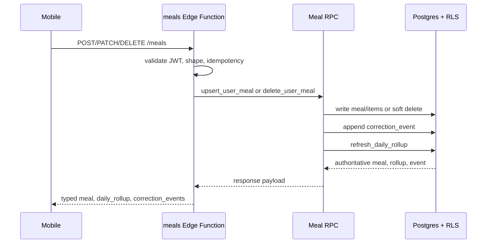

# Meal Core RPCs

Meal writes are exposed through the `meals` Edge Function and executed by service-role RPCs so meal rows, item rows, correction events, and daily rollups stay consistent.

## RPCs

- `public.upsert_user_meal`: creates or updates a `manual`, `duplicate`, or validated `photo` meal, replaces its item set, appends a correction event, refreshes affected rollup days, and returns authoritative data.
- `public.delete_user_meal`: soft-deletes a meal, appends a `meal_deleted` event, refreshes the rollup, and returns authoritative data.
- `public.refresh_daily_rollup`: recalculates calories/macros/count/photo flag for one user/day using the meal’s stored timezone semantics.

## Photo Meal Rules

- `source=photo` requires non-null `analysis_job_id` and `photo_asset_id`.
- The analysis job and asset must both belong to the authenticated user.
- The analysis job must be `completed`.
- The analysis job's `asset_id` must match the submitted `photo_asset_id`.
- Non-photo writes must not include analysis/photo asset references.

## Safe Change Rules

- Add RPC changes through a new migration and re-apply grants/revokes.
- Return typed correction events in meal responses.
- Add/update `backend:test:meal-core` when write, rollup, or correction behavior changes.
