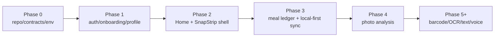

# Phase Status

## Current Phase

Phase 0-4 photo analysis implementation is in place. Current work is verification, documentation alignment, and environment readiness before Phase 5 barcode/OCR/text/voice work.

## Capability Map

## Implemented

- Contract generation/check flow exists.
- Supabase migrations cover identity, goals, devices, flags, analytics, body measurements, storage, settings RPC, meal core, photo analysis tables, RLS, and idempotency.
- Edge Functions exist for bootstrap, settings patch, events ingest, and meals.
- Flutter app has auth/onboarding/profile/local-first scaffolding.
- Outbox supports settings, meal, template, and custom-food commands.
- RLS isolation harness exists.
- Numbered documentation system is being established.
- Phase 3 meal schema, local meal tables, and `meals` Edge Function exist.
- Meal Editor, Journal, Progress, Templates, Custom Foods, rollups, and correction-event caching exist.
- Phase 4 photo-analysis contracts, migrations, Edge Functions, local capture asset pipeline, and Meal Editor draft handoff exist.

## Verification Blockers

- Flutter/Dart/Supabase CLI/Deno toolchain must be installed in the execution environment.
- Real Flutter Android/iOS platform projects must be generated and committed.
- Android/iOS platform folders currently contain only `.gitkeep`; real flavor projects remain a Phase 0 compliance gap.
- Supabase local env keys must be exported before RLS and meal-core smoke tests are authoritative.

## Next Phase Entry

Proceed to Phase 5 only after [../10-quality/phase-3-acceptance.md](../10-quality/phase-3-acceptance.md) plus Phase 4 photo QA pass, real platform folders are generated, and backend AI provider secrets are configured outside the repository.
