# Phase Status

## Current Phase

Phase 0-8 source implementation is in place. Backend smoke checks through Phase 8 and backend remediation checks pass locally against the Supabase stack. Flutter/Dart are available locally again, and current work is mobile test/build cleanup, device acceptance, staging operations validation, real-provider AI validation, scheduled job validation, and Phase 9/10 beta-release hardening.

Detailed reviews:

- [Phase 0-7 implementation review](phase-0-7-implementation-review-2026-05-21.md)
- [Phase 8-10 implementation review](phase-8-10-implementation-review-2026-05-21.md)

## Capability Map

```mermaid
flowchart LR
  P0["Phase 0\nrepo/contracts/env"]
  P1["Phase 1\nauth/onboarding/profile"]
  P2["Phase 2\nHome + SnapStrip shell"]
  P3["Phase 3\nmeal ledger + local-first sync"]
  P4["Phase 4\nphoto analysis"]
  P5["Phase 5\nbarcode/OCR/text/voice"]
  P6["Phase 6\noffline sync hardening"]
  P7["Phase 7\ninsights + retention"]
  P8["Phase 8\nprivacy/export/delete"]
  P9["Phase 9\nobservability + beta QA"]
  P10["Phase 10\nrelease candidate"]

  P0 --> P1 --> P2 --> P3 --> P4 --> P5 --> P6 --> P7 --> P8 --> P9 --> P10
```

## Implemented

- Contract generation/check flow exists and OpenAPI is now at Phase 0-8 scope.
- Supabase migrations cover identity, goals, devices, flags, analytics, body measurements, storage, settings RPC, meal core, photo analysis tables, RLS, idempotency, export artifacts, deletion audit rows, rate limits, cleanup helper RPCs, and hardening through `000018`.
- Edge Functions exist for bootstrap, settings patch, events ingest, meals, photo analysis, multimodal parsing/search, Phase 6 sync replay surfaces, Phase 8 export/delete/cleanup, and weekly insights.
- Flutter app has auth/onboarding/profile/local-first scaffolding, Home/SnapStrip, meal ledger, photo/barcode/text/voice entry, sync status, weekly insights, and Phase 8 privacy/export/delete settings surfaces.
- Outbox supports settings, meal, template, custom-food, asset upload, analytics, body measurement, and export create commands.
- RLS isolation harness exists, and backend smoke coverage now includes Phase 1, RLS, meal core, Phase 4, Phase 5, Phase 6, Phase 7, Phase 8, and backend remediation checks.
- Native Android/iOS platform projects and Drift generated code are present.
- CI now includes Phase 8 backend smoke coverage.
- Operations docs now include beta observability gates, synthetic staging tests, and release blockers.

## Verification Status

Verified locally on 2026-05-21:

- `npm run check:contracts`
- `npm run backend:typecheck`
- `npm run backend:lint:migrations`
- `supabase db reset`
- `npm run backend:test:auth-profile`
- `npm run backend:test:rls`
- `npm run backend:test:meal-core`
- `npm run backend:test:photo-analysis`
- `npm run backend:test:multimodal`
- `npm run backend:test:offline-sync`
- `npm run backend:test:insights`
- `npm run backend:test:privacy`
- `npm run backend:test:remediation`
- `npm run backend:test:remediation-unit`

## Remaining Gates

- Flutter/Dart are available on the local PATH. `flutter analyze` passes, but `flutter test` previously failed before executing tests because ignored iOS SwiftPM ephemeral state could not be deleted; CI now runs `scripts/clean-flutter-ephemeral.sh` before mobile checks.
- Full manual acceptance still requires at least one iOS simulator/device and one Android emulator/device.
- Camera lifecycle, barcode, OCR, voice, offline reconnect, sync conflict recovery, privacy/export/delete UI, and weekly insight flag behavior need device validation.
- Real Gemini/OpenAI provider validation still requires server-side staging secrets.
- Scheduled weekly insights and media-retention cleanup must be configured from `infra/supabase/scheduled-jobs.example.sql` and observed in staging before production rollout.
- Phase 9 dashboards/alerts and Phase 10 release artifacts remain operational gates, not merely source-code gates.

## Next Phase Entry

Proceed to Phase 9 beta hardening after mobile automated checks stay green in CI, iOS/Android manual acceptance has no P0/P1 issues, Phase 8 privacy flows pass on device, and staging validates real-provider AI plus scheduled weekly insight and cleanup jobs.
