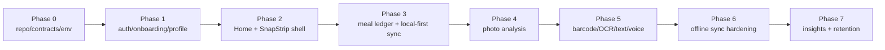

# Phase Status

## Current Phase

Phase 0-7 implementation is in place. Backend smoke checks through Phase 7 and Flutter analyze/tests pass locally. Current work is Android build unblock, iOS/Android device acceptance, and staging operations validation.

Detailed current review: [phase-0-7-implementation-review-2026-05-21.md](phase-0-7-implementation-review-2026-05-21.md).

## Capability Map

## Implemented

- Contract generation/check flow exists.
- Supabase migrations cover identity, goals, devices, flags, analytics, body measurements, storage, settings RPC, meal core, photo analysis tables, RLS, and idempotency.
- Edge Functions exist for bootstrap, settings patch, events ingest, and meals.
- Flutter app has auth/onboarding/profile/local-first scaffolding.
- Outbox supports settings, meal, template, and custom-food commands.
- RLS isolation harness exists.
- Numbered documentation system is being established.
- Phase 3 meal schema, local meal tables, and `meals` Edge Function exist.
- Meal Editor, Journal, Progress, Templates, Custom Foods, rollups, and correction-event caching exist.
- Phase 4 photo-analysis contracts, migrations, Edge Functions, local capture asset pipeline, and Meal Editor draft handoff exist.
- Phase 5 barcode, OCR assist, text entry, voice entry, catalog migration, and parser Edge Functions exist.
- Phase 6 readiness now includes idempotent template/custom-food/body-measurement/export functions, analytics idempotency, server-owned daily rollups, idempotency cleanup, and expanded mobile outbox command support.
- Phase 6 source now includes deterministic sync drain order, queued/direct photo upload de-duplication, authoritative pull-after-push for server-owned tables, and a visible sync conflict recovery surface.
- Phase 7 source now includes `weekly_insights`, `user_food_defaults`, weekly insight generation, learned-default refresh from saved meals, local insight/default caches, and Progress/Frequent Food UI surfaces behind `weekly_insights.enabled`.
- Native Android/iOS platform projects and Drift generated code are present.
- CI now includes Phase 1, Phase 4, and Phase 7 backend smoke gates and applies `NODE_OPTIONS=--experimental-websocket` to Node 20 Supabase integration tests.

## Verification Blockers

- Android debug APK build is blocked locally because no Java Runtime/JDK is installed.
- Full manual acceptance still requires at least one iOS simulator/device and one Android emulator/device.
- Camera lifecycle, barcode, OCR, voice, offline reconnect, sync conflict recovery, and weekly insight flag behavior need manual validation.
- Weekly insight scheduled/cron generation remains a staging operations gap.

## Next Phase Entry

Proceed to Phase 8 only after Android build succeeds, iOS/Android manual acceptance passes, and staging operations validates real AI-provider secrets plus weekly insight scheduling.
