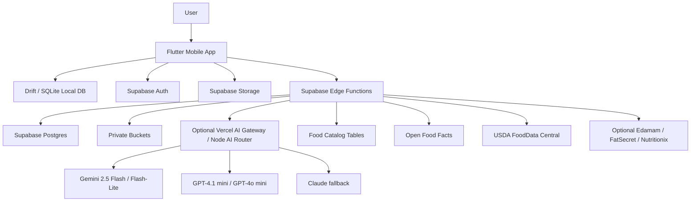

# SnapGrub Multi-Phase Backend + Frontend Execution Plan

**Product:** SnapGrub  
**Goal:** Build the best premium, AI-powered calorie tracking and weight-loss app with camera-first UX, multimodal food logging, trusted nutrition data, editable AI results, and offline-first reliability.  
**Primary platforms:** iOS and Android via Flutter  
**Backend:** Supabase-first: Postgres, Auth, RLS, Storage, Edge Functions, Cron. Optional Vercel AI Gateway / Node AI router.  
**Document audience:** Frontend developers, backend developers, tech leads, QA, product/design.  
**Execution style:** Separate frontend and backend workspaces inside one monorepo, integrated through shared contracts and CI gates.

---

## 1. North Star

SnapGrub should not be a traditional calorie diary with an AI feature attached. It should feel like a premium camera utility that turns meals into trusted, editable nutrition logs in seconds.

The key MVP promise is:

> Open SnapGrub, snap food or scan a package, confirm/edit the result, and save calories plus macros in seconds.

The app must win on five things:

1. **Speed** — camera-first SnapStrip is always one tap away.
2. **Trust** — AI results show confidence, uncertainty, and provenance.
3. **Editability** — every estimated item, portion, and macro can be corrected quickly.
4. **Reliability** — the app saves locally first and syncs later.
5. **Delight** — premium, warm, friendly, non-punitive UX.

---

## 2. Product Scope

### 2.1 MVP must include

- Auth and onboarding.
- Goal setup: calories, macros, units, cuisine preferences.
- Camera-first Home with persistent SnapStrip.
- Photo meal analysis using AI.
- Barcode logging for packaged foods.
- Nutrition-label OCR assist for barcode misses.
- Text meal entry.
- Push-to-talk short voice meal entry.
- Unified Meal Editor for all input modes.
- Journal/history.
- Daily calorie and macro progress.
- Favorites/templates.
- Custom foods/products.
- Offline-first local saves.
- Sync outbox.
- Confidence and provenance labels.
- Correction events for active learning.
- Basic weekly insight/check-in.
- Data export.
- Account deletion.
- Privacy settings and AI consent.
- Analytics and observability.

### 2.2 MVP should not include

- Full AI coach/chat.
- Social/community feed.
- Restaurant menu scanner.
- Full meal planner.
- Fasting program.
- Deep micronutrient scoring.
- Wearable calorie adjustment engine.
- Before/after consumption analysis.
- Full personalized model training.

### 2.3 Post-MVP candidates

- Adaptive calorie target recommendations.
- Recipe import.
- Restaurant/menu parsing.
- HealthKit / Google Fit integration.
- Rich micronutrients.
- AI coach.
- Premium meal planning.
- Family/shared plans.
- Advanced analytics dashboard.

---

## 3. Recommended Monorepo Structure

```txt
snapgrub/
  README.md
  docs/
    product/
      mvp-scope.md
      competitor-landscape.md
    architecture/
      system-overview.md
      mobile-architecture.md
      backend-architecture.md
      ai-pipeline.md
      nutrition-catalog.md
    api/
      openapi.md
      error-codes.md
      event-taxonomy.md
    qa/
      manual-test-plan.md
      release-checklist.md
    runbooks/
      ai-provider-outage.md
      supabase-incident.md
      storage-cleanup.md
      catalog-ingestion.md

  apps/
    mobile/
      lib/
      test/
      integration_test/
      android/
      ios/
      pubspec.yaml

    admin-web/
      README.md
      package.json
      src/

  services/
    backend/
      supabase/
        config.toml
        migrations/
        seed/
        functions/
          profile-bootstrap/
          settings-patch/
          analysis-photo-create/
          analysis-get/
          analysis-text-create/
          barcode-resolve/
          foods-search/
          meal-upsert/
          events-ingest/
          export-create/
          account-delete/
          weekly-insights-generate/
          catalog-sync-openfoodfacts/
          catalog-sync-usda/
        policies/
        tests/

    ai-gateway/
      README.md
      package.json
      src/
        providers/
          google-gemini.ts
          openai.ts
          anthropic.ts
        schemas/
        prompts/
        routes/
        observability/

  packages/
    api-contracts/
      openapi.yaml
      schemas/
        Meal.schema.json
        MealAnalysisResult.schema.json
        FoodSearchResult.schema.json
        ErrorEnvelope.schema.json
      generated/
        dart/
        typescript/

    shared-domain/
      nutrition/
      confidence/
      units/
      ids/

    design-tokens/
      colors.json
      typography.json
      spacing.json
      radii.json
      shadows.json

  infra/
    github-actions/
    supabase/
    vercel/

  scripts/
    generate-api-clients.sh
    seed-catalog.sh
    validate-openapi.sh
    run-local-supabase.sh
    reset-dev-db.sh
```

---

## 4. Ownership Model

### 4.1 Frontend owns

```txt
apps/mobile
packages/api-contracts/generated/dart
packages/design-tokens
mobile tests
mobile CI build
mobile release pipeline
```

### 4.2 Backend owns

```txt
services/backend
services/ai-gateway
packages/api-contracts/openapi.yaml
packages/api-contracts/schemas
packages/api-contracts/generated/typescript
database migrations
RLS policies
Storage buckets
Edge Functions
catalog ingestion
AI provider integration
observability
```

### 4.3 Shared ownership

```txt
docs/architecture
docs/api
docs/qa
packages/shared-domain
analytics event taxonomy
release checklist
manual QA matrix
```

### 4.4 Non-negotiable engineering rules

1. The mobile app must never contain AI provider keys or Supabase service-role keys.
2. AI output is a draft, not the source of truth.
3. The user-confirmed meal is the source of truth.
4. Every write path must support idempotency.
5. Every nutrition estimate must preserve source/provenance.
6. Every AI result must include confidence and warnings.
7. The app must save locally before syncing.
8. The Meal Editor must be used for photo, barcode, text, voice, and manual flows.
9. Catalog data must not be merged in a way that destroys licensing/source identity.
10. Coaching/chat must not be built until logging is excellent.

---

## 5. Target Architecture

## 5.1 System shape



### 5.2 Frontend architecture

Flutter should use feature-first clean architecture:

```txt
feature/
  domain/          pure entities and value objects
  application/     controllers, use cases, state
  data/            repositories, DTOs, mappers
  presentation/    screens, widgets, view models
```

Recommended Flutter stack:

- `flutter_riverpod`
- `riverpod_annotation`
- `go_router`
- `drift`
- `supabase_flutter`
- `camera`
- `mobile_scanner`
- `google_mlkit_text_recognition`
- `speech_to_text`
- `flutter_image_compress`
- `workmanager`
- `connectivity_plus`
- `freezed`
- `json_serializable`
- `uuid`
- `intl`

### 5.3 Backend architecture

Supabase is the system of record:

- Auth for identity.
- Postgres for relational data.
- RLS for tenant isolation.
- Storage for meal photos and exports.
- Edge Functions for mutation APIs, AI orchestration, catalog lookup, export/delete flows.
- Cron for cleanup, ingest, rollups, weekly insights.
- Optional Vercel AI Gateway for model routing, fallbacks, budgets, and model observability.

---

# 6. Phase 0 — Repo, Contracts, Environments

## 6.1 Goal

Create the foundation so frontend and backend teams can work independently but integrate through contracts.

## 6.2 Duration

3–5 working days.

## 6.3 Backend tasks

### Implementation tasks

1. Create Supabase projects:
   - `snapgrub-dev`
   - `snapgrub-staging`
   - `snapgrub-prod`

2. Initialize Supabase CLI in `services/backend/supabase`.

3. Create first migration:
   - `profiles`
   - `nutrition_goals`
   - `devices`
   - `feature_flags`
   - `analytics_events`

4. Enable required extensions:
   - `pgcrypto`
   - `pg_cron` later when needed
   - `pg_net` later when needed

5. Add base RLS policies.

6. Create private storage buckets:
   - `meal-originals-private`
   - `meal-thumbnails-private`
   - `exports-private`

7. Create empty Edge Function shells:
   - `profile-bootstrap`
   - `settings-patch`
   - `events-ingest`

8. Create `packages/api-contracts/openapi.yaml`.

9. Create initial shared schemas:
   - `ErrorEnvelope.schema.json`
   - `Profile.schema.json`
   - `NutritionGoal.schema.json`

10. Add backend CI checks:
   - migration lint
   - OpenAPI validation
   - Edge Function typecheck
   - RLS smoke test script placeholder

### Manual backend steps

1. Install Supabase CLI.
2. Login to Supabase CLI.
3. Link local project to `snapgrub-dev`.
4. Run local Supabase stack.
5. Apply migrations locally.
6. Apply migrations to dev.
7. Create storage buckets in dev.
8. Confirm RLS is enabled on all user-owned tables.
9. Create service-role secrets only in Supabase/Vercel environments, not in repository.
10. Document environment variables in `.env.example`.

### Backend acceptance criteria

- Supabase local stack runs.
- Dev Supabase project is linked.
- Initial migration applies locally and in dev.
- All user-owned tables have RLS enabled.
- Storage buckets exist and are private.
- Edge Function shells deploy to dev.
- OpenAPI validates in CI.
- No secret values are committed.

## 6.4 Frontend tasks

### Implementation tasks

1. Create Flutter app in `apps/mobile`.
2. Add flavors:
   - `dev`
   - `staging`
   - `prod`
3. Add app bootstrap:
   - environment config
   - Supabase initialization
   - Riverpod root scope
   - GoRouter
   - base theme
4. Add placeholder screens:
   - Splash
   - Auth
   - Onboarding
   - Home
   - Meal Editor
   - Journal
   - Settings
5. Add Drift database shell.
6. Add generated API model pipeline.
7. Add frontend CI:
   - `flutter format`
   - `flutter analyze`
   - unit tests
   - build dev APK
   - iOS simulator build if CI supports macOS runner

### Manual frontend steps

1. Install Flutter stable.
2. Run `flutter doctor`.
3. Configure iOS bundle IDs per flavor.
4. Configure Android application IDs per flavor.
5. Add Supabase anon URL/key for dev flavor.
6. Run app on iOS simulator.
7. Run app on Android emulator.
8. Confirm the app loads Splash and routes to Auth.
9. Confirm generated Dart models compile.
10. Confirm CI can build at least Android dev flavor.

### Frontend acceptance criteria

- Flutter app launches on iOS and Android.
- App can initialize Supabase for dev.
- App can route between placeholder screens.
- Drift DB opens successfully.
- Flavor configuration works.
- Generated models compile.
- CI passes on pull requests.

## 6.5 Shared acceptance criteria

- Repo structure matches agreed monorepo layout.
- `README.md` explains local setup for frontend and backend.
- `docs/architecture/system-overview.md` exists.
- `packages/api-contracts` is the only source of truth for API shape.
- Pull requests cannot merge if OpenAPI validation fails.

---

# 7. Phase 1 — Auth, Onboarding, Profile, Goals

## 7.1 Goal

Users can sign in, complete onboarding, and create their calorie/macro plan.

## 7.2 Duration

1 week.

## 7.3 Backend tasks

### Tables

Create/complete:

```txt
profiles
nutrition_goals
body_measurements
devices
feature_flags
feature_flag_overrides
```

### Edge Functions

Implement:

```txt
profile-bootstrap
settings-patch
```

### `profile-bootstrap` responsibilities

- Validate JWT.
- Create profile if missing.
- Register/update current device.
- Return profile.
- Return active goal.
- Return feature flags.
- Return server time.

Example response:

```json
{
  "profile": {
    "id": "uuid",
    "locale": "en-IN",
    "timezone": "Asia/Kolkata",
    "unit_system": "metric",
    "cuisine_preferences": ["Indian", "North Indian"]
  },
  "active_goal": {
    "goal_type": "lose",
    "calories_kcal": 1900,
    "protein_g": 130,
    "carbs_g": 190,
    "fat_g": 60
  },
  "feature_flags": {
    "snapstrip.enabled": true,
    "photo_analysis.enabled": true,
    "barcode.enabled": true
  }
}
```

### `settings-patch` responsibilities

- Patch profile settings.
- Patch active goal.
- Enforce one active goal.
- Validate macro ranges.
- Return updated profile and goal.

### Manual backend steps

1. Create test users in dev Supabase Auth.
2. Run `profile-bootstrap` manually using a test JWT.
3. Verify a missing profile gets created.
4. Verify device registration updates `last_seen_at`.
5. Verify RLS blocks user A from user B profile.
6. Verify active goal uniqueness.
7. Insert sample feature flags.
8. Verify app can read enabled flags via bootstrap.

### Backend acceptance criteria

- User can bootstrap profile after login.
- User can update profile settings.
- User can create/update an active goal.
- Only one active goal can exist per user.
- RLS blocks cross-user access.
- Invalid macro targets are rejected.
- Bootstrap endpoint returns all app-start data in one call.

## 7.4 Frontend tasks

### Screens

Implement:

```txt
SplashScreen
AuthScreen
OnboardingWelcomeScreen
OnboardingGoalScreen
OnboardingBodyScreen
OnboardingMacroTargetScreen
OnboardingCuisineScreen
OnboardingPermissionPrimerScreen
```

### Onboarding data collection

Collect:

- Name or display name.
- Goal: lose, maintain, gain, custom.
- Sex/body metadata if using BMR estimate.
- Age or DOB.
- Height.
- Weight.
- Target weight.
- Activity level.
- Unit system.
- Cuisine preferences.
- Timezone.
- Notification preference.
- Camera permission education.

### Local Drift tables

Create:

```txt
profiles_local
nutrition_goals_local
devices_local
feature_flags_local
sync_state
outbox_commands
```

### Manual frontend steps

1. Run app fresh install.
2. Complete auth.
3. Complete onboarding with metric units.
4. Complete onboarding with imperial units.
5. Turn network off before final onboarding submit.
6. Confirm local profile is still saved.
7. Turn network on and confirm sync.
8. Kill and relaunch app.
9. Confirm user lands on Home after completed onboarding.
10. Reset local data and repeat onboarding.

### Frontend acceptance criteria

- User can complete onboarding in under 2 minutes.
- Onboarding does not feel like a medical form.
- User can skip non-critical items.
- Profile and goal are saved locally first.
- App syncs profile and goal when online.
- User can edit goals from Settings later.
- Bad network does not trap user in onboarding.

## 7.5 QA scenarios

- Sign in with email/OAuth depending chosen method.
- Reinstall app and login again.
- Onboarding interrupted mid-way.
- Network loss during submit.
- Invalid height/weight.
- Unit switch from metric to imperial.
- Cuisine preference empty.
- Timezone mismatch.

---

# 8. Phase 2 — Home + SnapStrip Camera Shell

## 8.1 Goal

Build the core SnapGrub home experience: camera-first, not dashboard-first.

## 8.2 Duration

1 week.

## 8.3 Backend tasks

Backend work is light in this phase.

### Implementation tasks

1. Add feature flags:
   - `snapstrip.enabled`
   - `photo_analysis.enabled`
   - `barcode.enabled`
   - `voice_capture.enabled`
   - `ocr_assist.enabled`
2. Add `events-ingest` endpoint.
3. Add analytics events table indexes.
4. Define event names for SnapStrip.

### Manual backend steps

1. Insert feature flags in dev.
2. Toggle `snapstrip.enabled` off and verify mobile receives it.
3. Send sample `snapstrip_preview_started` event.
4. Verify event row is inserted.
5. Verify unauthenticated event behavior if pre-auth telemetry is allowed.

### Backend acceptance criteria

- Feature flags can be read during bootstrap.
- Events can be ingested in batches.
- Event ingestion rejects malformed payloads.
- Event ingestion does not expose user data across users.

## 8.4 Frontend tasks

### Feature structure

```txt
features/home/
  application/
    home_controller.dart
  presentation/
    home_screen.dart
    widgets/
      snap_strip.dart
      daily_progress_card.dart
      macro_summary_card.dart
      recent_meals_carousel.dart
      quick_actions_row.dart

features/capture/
  application/
    camera_controller_adapter.dart
    capture_controller.dart
  domain/
    capture_asset.dart
    capture_state.dart
  presentation/
    camera_permission_view.dart
    capture_preview_view.dart
```

### SnapStrip states

```txt
loading
permission_needed
camera_ready
camera_paused
capture_in_progress
analysis_in_progress
error
feature_disabled
```

### SnapStrip actions

- Tap shutter.
- Tap barcode.
- Tap text.
- Tap voice.
- Tap permission CTA.
- Tap retry camera.

### Camera lifecycle rules

- Initialize only after Home loads.
- Do not initialize camera on Splash/Auth.
- Pause preview when app backgrounded.
- Dispose controller when leaving Home if needed.
- Use low-resolution preview.
- Capture full still only on shutter.
- Do not stream frames to backend.
- Do not upload until user explicitly captures.

### Manual frontend steps

1. Fresh install with no camera permission.
2. Land on Home.
3. Tap permission CTA.
4. Grant camera.
5. Verify preview appears.
6. Background app; confirm camera pauses.
7. Foreground app; confirm camera resumes.
8. Deny permission; confirm text/barcode/manual fallbacks remain visible.
9. Toggle feature flag off; confirm SnapStrip disabled state.
10. Test low-end Android emulator or physical device.

### Frontend acceptance criteria

- Warm launch to usable Home is under 1 second target.
- SnapStrip preview is ready under 1.2 seconds after permission on target devices.
- Camera permission denied state is graceful.
- App does not crash when app backgrounds/foregrounds.
- No captured image is uploaded automatically without user action.
- Home remains useful without camera permission.
- Text, voice, and barcode affordances are visible from SnapStrip.

## 8.5 QA scenarios

- iOS camera permission denied.
- Android camera permission denied.
- Permission changed from Settings while app is backgrounded.
- Camera unavailable.
- Device orientation changes.
- Low memory event.
- Rapid tap shutter multiple times.
- App killed after capture but before analysis.

---

# 9. Phase 3 — Meal Domain, Local Journal, Meal Editor

## 9.1 Goal

Build the source-of-truth meal logging flow before adding AI sophistication.

## 9.2 Duration

1–1.5 weeks.

## 9.3 Backend tasks

### Tables

Create:

```txt
meals
meal_items
meal_templates
custom_foods
correction_events
daily_rollups
```

### Edge Functions

Implement:

```txt
meal-upsert
```

In this repository, the deployed Supabase Edge Function remains `meals`; `meal-upsert` names the transactional create/update/delete responsibility exposed through `POST /meals`, `PATCH /meals/{mealId}`, and `DELETE /meals/{mealId}`.

### API endpoints

```http
GET /v1/meals
GET /v1/meals/{mealId}
POST /v1/meals
PATCH /v1/meals/{mealId}
DELETE /v1/meals/{mealId}
```

### `meal-upsert` responsibilities

- Validate auth.
- Validate ownership.
- Validate idempotency key.
- Validate meal totals and item totals.
- Write meal and meal items transactionally.
- Append correction events.
- Update daily rollup.
- Return authoritative meal.

### Daily rollup behavior

Daily rollup should update when:

- meal created
- meal updated
- meal deleted
- meal restored later if restore exists

### Manual backend steps

1. Create a manual meal via API.
2. Create a meal with two items.
3. Update meal title and portions.
4. Delete meal.
5. Verify daily rollup changes.
6. Retry same request with same idempotency key.
7. Verify no duplicate meal is created.
8. Attempt cross-user meal access.
9. Verify RLS blocks access.
10. Inspect correction events.

### Backend acceptance criteria

- Meal create/update/delete works.
- Meal items are transactionally saved with meal.
- Daily rollup is correct after create/update/delete.
- Duplicate requests do not create duplicate meals.
- Cross-user access is blocked.
- Correction events are append-only.
- Soft-delete works.

## 9.4 Frontend tasks

### Features

```txt
features/meal_editor/
features/journal/
features/progress/
features/custom_foods/
features/templates/
```

### Meal Editor requirements

The editor must support:

- Meal title.
- Meal type.
- Meal time.
- Ingredient rows.
- Quantity.
- Unit.
- Estimated grams.
- Calories.
- Protein.
- Carbs.
- Fat.
- Confidence badge if AI source.
- Provenance label.
- Delete item.
- Add item.
- Save meal.
- Save as favorite/template.
- Duplicate meal.

### Local tables

```txt
meals_local
meal_items_local
meal_templates_local
custom_foods_local
daily_rollups_local
```

### Editor states

```txt
manual_draft
ai_draft
barcode_draft
text_draft
voice_draft
saving_local
sync_pending
synced
sync_failed
```

### Manual frontend steps

1. Create manual meal with one item.
2. Create manual meal with multiple items.
3. Edit quantity.
4. Edit unit.
5. Delete item.
6. Add custom item.
7. Save meal offline.
8. Confirm journal updates immediately.
9. Kill and reopen app.
10. Confirm meal persists locally.
11. Turn network on.
12. Confirm meal syncs.
13. Duplicate a meal.
14. Delete a meal.
15. Verify daily progress updates.

### Frontend acceptance criteria

- User can manually create a full meal without AI.
- User can edit every field before saving.
- Local save completes under 250 ms target.
- Saved meal appears instantly in Today journal.
- Daily progress updates locally.
- Offline saved meal displays sync-pending state.
- Failed sync is non-blocking.
- Editor is reusable by AI/photo/barcode/text/voice flows.

## 9.5 QA scenarios

- Empty meal title.
- Zero quantity.
- Extremely high quantity.
- Macro mismatch between items and totals.
- Timezone day boundary.
- Editing yesterday’s meal.
- Deleting sync-pending meal.
- Duplicate meal offline.
- App killed during save.

---

# 10. Phase 4 — Photo Analysis MVP

## 10.1 Goal

Deliver the first complete AI loop:

```txt
Snap photo → upload → AI analysis → editable result → save meal
```

## 10.2 Duration

1.5–2 weeks.

## 10.3 Recommended model strategy

### Primary MVP model

```txt
Gemini 2.5 Flash
```

Use for default photo analysis because it is cost-effective, fast, multimodal, and suitable for structured extraction.

### Cheap fallback / retry

```txt
Gemini 2.5 Flash-Lite
```

Use for:

- simple meals
- schema repair
- cheap retries
- OCR-assisted packaging cases

### Cross-provider fallback

```txt
GPT-4.1 mini or GPT-4o mini
```

Use if:

- Gemini response is invalid repeatedly
- Gemini provider outage
- structured output quality is poor for specific cases

### Premium escalator later

```txt
Claude Sonnet / higher-end OpenAI model
```

Use only for:

- hard mixed dishes
- QA evaluation
- low-confidence adjudication
- not default MVP traffic

## 10.4 Backend tasks

### Tables

Create:

```txt
meal_assets
analysis_jobs
analysis_revisions
analysis_candidates
model_invocations
```

### Storage flow

1. Mobile compresses image.
2. Mobile uploads image to private bucket.
3. Mobile calls `analysis-photo-create`.
4. Backend verifies object path and ownership.
5. Backend creates `analysis_jobs` row.
6. Backend sends image to model provider.
7. Model returns structured JSON.
8. Backend validates schema.
9. Backend normalizes food names.
10. Backend computes confidence.
11. Backend persists `analysis_revisions`.
12. Backend returns editable meal draft.

### Edge Function

Implement:

```txt
analysis-photo-create
analysis-get
```

### Input contract

```json
{
  "client_request_id": "uuid",
  "storage_path": "user-id/capture-id.jpg",
  "meal_type_hint": "lunch",
  "locale": "en-IN",
  "timezone": "Asia/Kolkata",
  "cuisine_hints": ["Indian", "North Indian"],
  "user_hint_text": "paneer and roti"
}
```

### Output contract

```json
{
  "analysis_id": "uuid",
  "status": "completed",
  "result": {
    "title": "Paneer curry with roti",
    "meal_type": "lunch",
    "total": {
      "calories_kcal": 680,
      "protein_g": 28,
      "carbs_g": 72,
      "fat_g": 31
    },
    "confidence": {
      "overall": 0.72,
      "item_identification": 0.83,
      "portion_estimation": 0.55,
      "nutrition_source_quality": 0.8,
      "warnings": [
        "Oil/ghee amount is visually uncertain",
        "Roti size should be reviewed"
      ]
    },
    "components": []
  }
}
```

### Prompt rules

The model prompt must require:

- JSON only.
- Conservative estimates.
- No false certainty.
- Separate mixed meals into components.
- Include household units.
- Include estimated grams where possible.
- Explicit warnings for oils, sauces, dressings, hidden ingredients.
- Indian serving units where relevant: roti, katori, bowl, cup, piece, plate.
- Alternatives for ambiguous items.

### Manual backend steps

1. Upload sample image to private bucket.
2. Call analysis endpoint with signed-in user.
3. Verify path ownership validation.
4. Verify structured response validates.
5. Verify model invocation row is created.
6. Verify provider/model/latency/cost are logged.
7. Simulate invalid model response.
8. Verify schema repair retry.
9. Simulate provider timeout.
10. Verify graceful failure.
11. Simulate low-confidence Indian thali.
12. Verify warnings are returned.

### Backend acceptance criteria

- Photo analysis returns valid editable meal draft.
- Invalid image is rejected.
- Cross-user storage path is rejected.
- AI provider timeout returns retryable error.
- Model output is schema-validated.
- Invalid JSON is repaired or fails gracefully.
- Every invocation logs provider, model, latency, status, and estimated cost.
- Every result includes confidence and provenance.

## 10.5 Frontend tasks

### Image pipeline

Implement:

```txt
capture
normalize orientation
strip EXIF if possible
compress image
generate thumbnail
hash image
save local asset draft
upload image
call photo analysis API
map result to MealEditorDraft
open Meal Editor
```

### Loading UX

Do not show a blank spinner. Show:

- captured meal thumbnail
- staged copy:
  - “Checking the photo…”
  - “Identifying foods…”
  - “Estimating portions…”
  - “Preparing your editable log…”
- manual fallback button
- retry button after failure

### Low-confidence UX

If low confidence:

- Show banner: “Please review this estimate.”
- Highlight uncertain rows.
- Show warnings.
- Let user save after review.
- Capture corrections when user edits.

### Manual frontend steps

1. Capture a clear single-food photo.
2. Capture a mixed Indian plate.
3. Capture a low-light photo.
4. Capture non-food photo.
5. Capture and turn network off before upload.
6. Confirm draft asset remains local.
7. Retry upload after network returns.
8. Receive analysis result.
9. Edit portion.
10. Save meal.
11. Confirm correction event is created.
12. Test timeout state.
13. Test invalid response state using mock server.

### Frontend acceptance criteria

- Photo capture creates local draft immediately.
- Upload failure does not lose the photo.
- Analysis failure does not trap the user.
- AI result always opens in Meal Editor.
- Low-confidence rows are visibly reviewable.
- User edits are captured as correction events.
- Image payload target is under 700 KB after compression.
- No EXIF location metadata is uploaded if stripping is available.

## 10.6 QA scenarios

- Indian thali.
- Roti + sabzi.
- Dal chawal.
- Biryani.
- Salad.
- Packaged snack photo.
- Restaurant meal.
- Soup/liquid.
- Transparent container.
- Dark image.
- Blurry image.
- Multiple plates.
- Non-food photo.

---

# 11. Phase 5 — Barcode, OCR, Text, Voice

## 11.1 Goal

Make SnapGrub truly multimodal. Every entry path must end in the same Meal Editor.

## 11.2 Duration

1–1.5 weeks.

## 11.3 Backend tasks

### Catalog seed

Seed initial catalog from:

```txt
USDA FoodData Central
Curated Indian starter foods
Curated portion units
Open Food Facts hot barcode cache
```

### Tables

Create:

```txt
canonical_foods
food_aliases
food_nutrients
food_portions
branded_products
product_barcodes
catalog_food_mappings
catalog_ingest_runs
```

### Edge Functions

Implement:

```txt
barcode-resolve
foods-search
analysis-text-create
```

### Barcode resolver order

```txt
1. product_barcodes local cache
2. branded_products local cache
3. Open Food Facts lookup
4. optional commercial provider lookup
5. nutrition-label OCR / custom product fallback
```

### Text parser requirements

Support phrases like:

```txt
2 rotis and dal
1 bowl rajma chawal
paneer tikka 200g
chicken biryani half plate
1 katori curd
poha one bowl
idli 3 pieces with sambar
```

### Manual backend steps

1. Seed 100–300 canonical foods.
2. Seed 50–100 Indian foods and aliases.
3. Seed common units: g, ml, cup, bowl, katori, piece, roti, plate.
4. Resolve a known barcode from local cache.
5. Resolve an uncached barcode via Open Food Facts.
6. Cache the barcode result.
7. Search “roti”, “chapati”, and “phulka” and verify alias behavior.
8. Parse `2 rotis, dal, paneer`.
9. Parse malformed text.
10. Verify every output maps to Meal Editor draft schema.

### Backend acceptance criteria

- Known barcode resolves under 1 second p50 target.
- Unknown barcode returns custom product fallback.
- Open Food Facts results preserve license/source tag.
- Text parser handles common Indian meal phrases.
- Food search returns canonical, branded, custom, and recent results.
- Every result has provenance.

## 11.4 Frontend tasks

### Barcode feature

```txt
features/barcode/
  application/
  presentation/
```

States:

```txt
scanning
matched
multiple_candidates
not_found
manual_product_entry
network_error
```

### OCR assist

Use OCR only as an assist for barcode misses or label capture.

Extract:

- product name
- serving size
- calories
- protein
- carbs
- fat

### Text entry

Flow:

```txt
Open text sheet → type phrase → parse → editable draft → Meal Editor
```

### Voice entry

Flow:

```txt
Push-to-talk → transcript → editable text → parse → Meal Editor
```

Voice must not be always-on.

### Manual frontend steps

1. Scan known barcode.
2. Scan unknown barcode.
3. Enter custom product from unknown barcode.
4. Use OCR to prefill custom product.
5. Type `2 rotis, dal, paneer`.
6. Confirm draft opens in editor.
7. Use voice to speak short meal phrase.
8. Edit transcript before parse.
9. Deny microphone permission.
10. Confirm text fallback remains available.

### Frontend acceptance criteria

- Barcode scanner opens quickly.
- Barcode detection is reliable on iOS and Android.
- Unknown barcode does not dead-end.
- OCR prefill can be edited before save.
- Text and voice use the same parser.
- Every path ends in Meal Editor.
- Voice permission denial is graceful.

## 11.5 QA scenarios

- Barcode glare.
- Barcode partially damaged.
- Indian packaged snack.
- Imported packaged food.
- Nutrition label without barcode.
- Hindi/Devanagari label if supported by OCR model.
- Voice with Indian accent.
- Voice with noisy background.
- Text with misspellings: `paneer buter masala`, `rajma chawl`.

---

# 12. Phase 6 — Offline Sync, Idempotency, Conflict Handling

## 12.1 Goal

Make the product reliable for daily use even with bad network.

## 12.2 Duration

1 week.

## 12.3 Backend tasks

### Tables

Create:

```txt
api_idempotency
```

### Rules

- Every mutation accepts `Idempotency-Key`.
- Same key + same request hash returns same response.
- Same key + different request body returns conflict.
- Idempotency rows expire after configured TTL.

### Sync approach for MVP

Prefer endpoint-specific sync first:

```txt
meal-upsert
settings-patch
custom-food-upsert
template-upsert
```

Full generic sync can come later.

### Conflict policy

```txt
profiles: last-write-wins
nutrition_goals: server validates one active goal
meals: revision check
meal_items: replace full set on meal update
correction_events: append-only
analytics_events: append-only
```

### Manual backend steps

1. Send same meal create twice with same idempotency key.
2. Verify same response, no duplicate.
3. Send same key with different request hash.
4. Verify conflict response.
5. Update stale meal revision.
6. Verify revision mismatch error.
7. Retry after pulling latest meal.
8. Run idempotency cleanup job manually.

### Backend acceptance criteria

- Idempotency works for all mutation APIs.
- Conflict errors are explicit and recoverable.
- Stale meal updates are rejected or safely merged.
- Append-only events are never overwritten.
- Cleanup job removes expired idempotency rows.

## 12.4 Frontend tasks

### Outbox command types

```txt
meal.create
meal.update
meal.delete
template.upsert
custom_food.upsert
settings.patch
body_measurement.create
asset.upload
analytics.batch
export.create
```

### Sync triggers

- app foreground
- network restored
- successful login
- manual pull-to-refresh
- background best effort

### Sync states

```txt
idle
syncing
synced
pending
failed
conflict
```

### Manual frontend steps

1. Turn off network.
2. Create meal.
3. Edit meal.
4. Delete meal.
5. Confirm all actions appear locally.
6. Relaunch app.
7. Confirm outbox persists.
8. Turn network on.
9. Confirm commands drain in order.
10. Simulate API failure.
11. Confirm exponential backoff.
12. Simulate conflict.
13. Confirm recoverable conflict UI.

### Frontend acceptance criteria

- User can save meals offline.
- Outbox survives app restart.
- Sync happens automatically when online.
- Duplicate sync does not duplicate meals.
- Failed sync is visible but non-blocking.
- Sync conflict does not corrupt local journal.
- Analytics batch sync does not block core meal sync.

## 12.5 QA scenarios

- Offline for whole day.
- 20 pending meal changes.
- Image upload pending but meal saved.
- User deletes meal before image upload completes.
- App killed during sync.
- Auth token expires during sync.
- Server returns 429.
- Server returns 500.

---

# 13. Phase 7 — Insights, Retention, Delight

## 13.1 Goal

Add the first premium retention loop without turning MVP into a bloated coaching product.

## 13.2 Duration

1 week.

## 13.3 Backend tasks

### Tables

```txt
weekly_insights
user_food_defaults
daily_rollups
```

### Edge Function

```txt
weekly-insights-generate
```

### Insight types

- Protein target hit rate.
- Most repeated meal.
- Highest variance meal slot.
- Logging streak.
- Average daily intake vs target.
- Helpful next-week suggestion.

### Manual backend steps

1. Seed 7 days of meal logs.
2. Run weekly insight function.
3. Verify one insight per type.
4. Verify no medical claims.
5. Verify insight payload is explainable from user data.
6. Verify user can only read own insights.

### Backend acceptance criteria

- Weekly insight generation works.
- Insights are deterministic enough to test.
- Insights are non-medical and non-shaming.
- Insights are stored as snapshots.
- Insights are gated by feature flag.

## 13.4 Frontend tasks

### Screens/widgets

```txt
WeeklyInsightCard
ProgressTrendScreen
StreakCard
FrequentMealsSection
FavoriteMealQuickAdd
```

### UX rules

- Do not shame users for exceeding calorie target.
- Avoid red-heavy punitive states.
- Use friendly, forward-looking copy.
- Make repeated meals one-tap loggable.
- Use light haptics for save success.

### Manual frontend steps

1. Log meals for multiple days.
2. View weekly insight card.
3. Tap into insight detail.
4. Quick-add repeated meal.
5. Save favorite meal.
6. Log from favorite meal.
7. Exceed calorie target.
8. Confirm copy remains non-punitive.

### Frontend acceptance criteria

- Weekly insight appears after enough data exists.
- Favorite/recent meals reduce repeat logging time.
- Streak card encourages without guilt.
- Insight cards are visually premium and lightweight.
- No full AI chat is introduced in MVP.

## 13.5 QA scenarios

- No meals logged.
- One day logged.
- Seven days logged.
- Over target all week.
- Under target all week.
- High protein days.
- Multiple identical meals.
- Deleted meals affect insight recomputation.

---

# 14. Phase 8 — Privacy, Security, Export, Delete

## 14.1 Goal

Make the product trustworthy for health-adjacent personal data.

## 14.2 Duration

4–5 working days.

## 14.3 Backend tasks

### Edge Functions

```txt
export-create
account-delete
media-retention-cleanup
```

### Export should include

```txt
profile
goals
body_measurements
meals
meal_items
custom_foods
templates
correction_events
weekly_insights
```

### Delete account should remove or purge

- profile
- goals
- body measurements
- meals
- meal items
- custom foods
- templates
- correction events if required by policy
- meal images
- thumbnails
- exports
- auth user or deletion request record

### Manual backend steps

1. Create export for test user.
2. Verify export file is generated in private bucket.
3. Verify signed download URL works.
4. Verify URL expires.
5. Delete test account.
6. Verify database rows are deleted/anonymized as intended.
7. Verify storage objects are deleted.
8. Verify user cannot login after deletion if auth user is deleted.
9. Run expired export cleanup.

### Backend acceptance criteria

- Export job works.
- Export file is private.
- Export link expires.
- Account delete removes user-owned data.
- Storage cleanup works.
- No service role access leaks to client.

## 14.4 Frontend tasks

### Screens

```txt
PrivacySettingsScreen
AIConsentScreen
MediaRetentionScreen
ExportDataScreen
DeleteAccountScreen
ClearLocalDataScreen
```

### User controls

- Export data.
- Delete account.
- Toggle cloud media retention.
- Toggle original photo retention.
- Toggle AI improvement consent.
- Clear local cache.
- Delete all local data.

### Manual frontend steps

1. Open Privacy Settings.
2. Toggle AI improvement consent.
3. Toggle photo retention.
4. Request data export.
5. Poll export status.
6. Download export.
7. Clear local cache.
8. Delete account with confirmation.
9. Relaunch app.
10. Confirm user is signed out.

### Frontend acceptance criteria

- Privacy controls are clear and not buried.
- Export request gives user feedback.
- Delete account has irreversible confirmation.
- Clear local data does not accidentally delete cloud account.
- AI consent is explicit.
- Photo retention settings are understandable.

## 14.5 QA scenarios

- Export with no meals.
- Export with photos.
- Delete account with pending outbox.
- Delete account offline.
- Toggle consent offline.
- Clear local data after pending sync.

---

# 15. Phase 9 — Observability, QA, Beta Hardening

## 15.1 Goal

Make the system safe for beta users.

## 15.2 Duration

1 week.

## 15.3 Backend tasks

### Dashboards

Track:

- photo analysis success rate
- p50/p95 analysis latency
- AI provider cost/day
- model fallback rate
- upload failure rate
- barcode match rate
- sync failure rate
- Edge Function 5xx rate
- RLS errors
- active users
- meals saved/day
- low-confidence analysis rate

### Alerts

Alert on:

- analysis failure rate > 5%
- p95 photo analysis > 12 seconds
- Edge Function 5xx spike
- storage upload failure spike
- AI spend exceeds daily threshold
- provider outage
- RLS policy failures
- sync failure spike

### Manual backend steps

1. Generate test traffic.
2. Verify dashboards update.
3. Force provider failure.
4. Verify fallback metric.
5. Force Edge Function 500.
6. Verify alert.
7. Force storage error.
8. Verify alert.
9. Review model cost logs.
10. Review request IDs end-to-end.

### Backend acceptance criteria

- Dashboards are live for dev/staging.
- Alerts are configured for critical failures.
- Request IDs are propagated.
- Model cost is tracked per invocation.
- Logs contain enough context to debug without exposing sensitive image data.

## 15.4 Frontend tasks

### Hardening tasks

- Add crash reporting.
- Add analytics event wrappers.
- Add user-facing error mapper.
- Add retry UI.
- Add accessibility labels.
- Add large text testing.
- Tune image compression.
- Tune camera lifecycle.
- Optimize journal scrolling.
- Add integration tests for critical flows.

### Manual frontend steps

1. Run full onboarding.
2. Run photo meal flow.
3. Run barcode flow.
4. Run text flow.
5. Run voice flow.
6. Run offline save/sync.
7. Run export/delete flow.
8. Enable large text.
9. Enable VoiceOver/TalkBack.
10. Test on low-end Android.
11. Test on older iPhone.
12. Capture performance traces.

### Frontend acceptance criteria

- No known P0/P1 crashers.
- Critical flows have integration tests.
- Core screens have accessibility labels.
- Camera preview does not leak resources.
- Journal scroll remains smooth.
- Error states are understandable.
- Beta build is signed and distributable.

## 15.5 Manual QA matrix

| Scenario | Expected result |
|---|---|
| New user onboarding | completes and lands on Home |
| Camera permission denied | app still supports text/manual logging |
| Clear food photo | AI draft generated |
| Mixed Indian meal | draft generated with low/medium confidence warnings |
| Barcode known product | packaged product draft generated |
| Barcode unknown product | custom product fallback shown |
| Voice permission denied | text fallback shown |
| Offline manual meal | saved locally and sync pending |
| Network returns | pending changes sync |
| Analysis timeout | user can retry or edit manually |
| Delete meal | journal and rollup update |
| Export data | private export generated |
| Delete account | user data removed and signed out |

---

# 16. Phase 10 — MVP Release Candidate

## 16.1 Goal

Ship a polished MVP that beats manual trackers on speed, trust, and delight.

## 16.2 Release scope

MVP includes:

```txt
Auth
Onboarding
Goals
SnapStrip
Photo meal analysis
Barcode logging
OCR assist
Text logging
Voice logging
Meal editor
Journal
Daily progress
Favorites/templates
Custom foods
Offline save
Sync outbox
Confidence/provenance
Correction events
Export data
Delete account
Basic weekly insight
Analytics
Observability
```

MVP excludes:

```txt
full AI coach
restaurant menu scan
meal planning
social/community
fasting plans
deep micronutrients
wearable calorie adjustment
before/after meal analysis
```

## 16.3 Release candidate checklist

### Backend checklist

- Production Supabase project configured.
- Production migrations applied.
- RLS audit complete.
- Storage buckets private.
- Edge Functions deployed.
- AI provider keys configured only in server environment.
- Rate limits configured.
- Cron jobs configured.
- Export/delete verified.
- Dashboards and alerts live.
- Cost monitoring enabled.
- Runbooks documented.

### Frontend checklist

- Production flavor configured.
- App icons and launch screen ready.
- Camera permission copy added.
- Microphone permission copy added.
- Privacy strings added.
- Crash reporting enabled.
- Analytics enabled.
- Store privacy labels drafted.
- Android release build passes.
- iOS release build passes.
- Obfuscation/symbol handling configured if used.
- TestFlight/internal testing build distributed.

### Manual release steps

1. Freeze OpenAPI contracts.
2. Cut release branch.
3. Deploy backend to staging.
4. Run full staging QA.
5. Deploy backend to prod.
6. Build mobile release candidates.
7. Run smoke test against prod.
8. Submit iOS TestFlight.
9. Submit Android internal test.
10. Monitor errors, latency, and AI spend.
11. Fix release blockers.
12. Promote to phased rollout.

## 16.4 MVP release acceptance criteria

- A new user can complete onboarding in under 2 minutes.
- User can snap a meal and save an edited result.
- User can scan a barcode and save packaged food.
- User can type/speak a meal and save result.
- App works offline for manual logging.
- Saved meals are visible in journal.
- Daily progress updates correctly.
- User can export data.
- User can delete account.
- AI estimates are clearly labeled as estimates.
- No hidden AI or service keys exist in the app.
- P95 photo analysis target is under 12 seconds in staging.
- Beta crash-free sessions target is at least 99%.

---

# 17. Parallel Team Execution Plan

## 17.1 Backend developer weekly track

```txt
Week 1
- Supabase setup
- base migrations
- RLS base
- storage buckets
- OpenAPI v1 starter
- profile bootstrap

Week 2
- profile/settings APIs
- feature flags
- analytics ingest
- meal schema
- meal-upsert

Week 3
- daily rollups
- meal templates
- custom foods
- analysis schema
- meal assets

Week 4
- photo analysis endpoint
- AI provider adapter
- model invocation logs
- schema validation and fallback

Week 5
- catalog schema
- USDA seed
- Indian starter foods
- Open Food Facts resolver
- food search

Week 6
- barcode resolver
- text parser
- idempotency
- sync hardening

Week 7
- weekly insights
- export pipeline
- delete account
- storage cleanup cron

Week 8
- observability
- rate limiting
- dashboards
- alerts
- staging/prod hardening
```

## 17.2 Frontend developer weekly track

```txt
Week 1
- Flutter app shell
- routing
- theme
- Supabase init
- Drift setup
- auth shell

Week 2
- onboarding
- profile/goals local cache
- settings shell
- Home shell

Week 3
- SnapStrip
- camera lifecycle
- image capture pipeline
- local capture drafts

Week 4
- Meal Editor
- local meal save
- Journal
- daily progress

Week 5
- photo upload
- analysis loading UX
- AI draft mapping
- low-confidence UI

Week 6
- barcode scanner
- text entry
- voice entry
- OCR assist

Week 7
- offline outbox
- sync status
- templates/favorites
- custom foods
- privacy/export/delete screens

Week 8
- insights
- accessibility
- performance tuning
- integration tests
- beta polish
```

---

# 18. Integration Gates

## Gate 1 — Contract Freeze

Before frontend integrates backend APIs:

```txt
OpenAPI paths finalized for:
- profile-bootstrap
- settings-patch
- meal-upsert
- meals list/detail
- analysis-photo-create
- analysis-get
- barcode-resolve
- foods-search
- analysis-text-create
```

Acceptance criteria:

- OpenAPI validates.
- Dart and TypeScript clients generate.
- Mock server responses exist.
- Error envelope is finalized.

## Gate 2 — Local Meal Demo

Before AI work is considered complete:

```txt
User can manually create, edit, delete, duplicate, and view meals offline.
```

Acceptance criteria:

- Manual meal works without backend.
- Journal updates immediately.
- Daily progress updates immediately.
- Outbox command is created.

## Gate 3 — AI Draft Demo

```txt
Photo → upload → backend AI → editable result → save.
```

Acceptance criteria:

- AI result opens in Meal Editor.
- Confidence and warnings show.
- Edited fields create correction events.
- Failure path preserves draft.

## Gate 4 — Multimodal Demo

```txt
Photo, barcode, text, and voice all end in the same Meal Editor.
```

Acceptance criteria:

- No duplicate editor implementations.
- Same save path.
- Same correction event model.
- Same journal model.

## Gate 5 — Trust Demo

Every saved meal must have:

```txt
source
provenance
confidence when applicable
user correction events if edited
sync status
```

Acceptance criteria:

- Meal detail screen shows source/provenance.
- Backend persists source/provenance.
- Analytics can distinguish photo/barcode/text/voice/manual meals.

## Gate 6 — Beta Readiness

Acceptance criteria:

- Release candidate build available.
- Backend staging/prod environments are ready.
- Dashboards are live.
- Critical path QA passes.
- Privacy/export/delete flows pass.
- No known P0/P1 bugs.

---

# 19. Jira Epic Breakdown

## Epic 1 — Platform Foundation

- MONO-001 Create monorepo structure.
- MONO-002 Configure GitHub Actions.
- MONO-003 Configure Flutter flavors.
- MONO-004 Configure Supabase environments.
- MONO-005 Add OpenAPI validation.
- MONO-006 Add generated API clients.

## Epic 2 — Auth and Onboarding

- BE-001 Profiles schema.
- BE-002 Goals schema.
- BE-003 Profile bootstrap API.
- BE-004 Settings patch API.
- FE-001 Auth flow.
- FE-002 Onboarding flow.
- FE-003 Profile local cache.
- FE-004 Goal edit screen.

## Epic 3 — SnapStrip and Capture

- FE-010 Home shell.
- FE-011 SnapStrip camera preview.
- FE-012 Camera permission states.
- FE-013 Capture pipeline.
- FE-014 Local capture draft.
- BE-010 Storage buckets.
- BE-011 Signed path validation.

## Epic 4 — Meal Core

- BE-020 Meals schema.
- BE-021 Meal items schema.
- BE-022 Meal upsert API.
- BE-023 Daily rollups.
- FE-020 Meal Editor.
- FE-021 Journal.
- FE-022 Daily progress.
- FE-023 Manual meal create.

## Epic 5 — AI Photo Analysis

- BE-030 Analysis schema.
- BE-031 Gemini provider adapter.
- BE-032 Structured response validation.
- BE-033 Model invocation logging.
- BE-034 AI fallback handling.
- FE-030 Photo upload.
- FE-031 Analysis loading UX.
- FE-032 AI draft mapping.
- FE-033 Low-confidence UI.

## Epic 6 — Catalog and Barcode

- BE-040 Canonical foods schema.
- BE-041 USDA seed.
- BE-042 Indian food seed.
- BE-043 Open Food Facts resolver.
- BE-044 Food search API.
- FE-040 Barcode scanner.
- FE-041 Barcode result UI.
- FE-042 Unknown barcode custom product.

## Epic 7 — Text, Voice, OCR

- BE-050 Text parser API.
- BE-051 Portion unit resolver.
- FE-050 Text meal entry.
- FE-051 Voice meal entry.
- FE-052 OCR label assist.

## Epic 8 — Offline Sync

- BE-060 Idempotency.
- BE-061 Sync-safe APIs.
- FE-060 Drift outbox.
- FE-061 Sync processor.
- FE-062 Offline banners.
- FE-063 Conflict handling.

## Epic 9 — Privacy and Trust

- BE-070 Export API.
- BE-071 Delete account API.
- BE-072 Media cleanup cron.
- FE-070 Privacy settings.
- FE-071 Export screen.
- FE-072 Delete account screen.
- FE-073 AI consent screen.

## Epic 10 — Insights and Retention

- BE-080 Weekly insight generation.
- BE-081 User food defaults.
- FE-080 Weekly insight card.
- FE-081 Streak card.
- FE-082 Favorites/templates polish.

## Epic 11 — Beta Hardening

- BE-090 Observability dashboards.
- BE-091 Rate limiting.
- BE-092 Cost monitoring.
- BE-093 Runbooks.
- FE-090 Accessibility.
- FE-091 Performance tuning.
- FE-092 Crash reporting.
- FE-093 Integration tests.

---

# 20. Manual End-to-End Smoke Test

Run this before every release candidate.

## 20.1 New user flow

1. Install fresh app.
2. Sign up/login.
3. Complete onboarding.
4. Land on Home.
5. Confirm SnapStrip visible.

Expected:

- User profile created.
- Goal created.
- Home loads.
- Feature flags loaded.

## 20.2 Photo meal flow

1. Capture food photo.
2. Wait for analysis.
3. Review result.
4. Edit one portion.
5. Save meal.
6. Open journal.

Expected:

- Meal saved locally.
- Meal syncs to backend.
- Correction event captured.
- Daily progress updates.

## 20.3 Barcode flow

1. Open barcode scanner.
2. Scan known product.
3. Review result.
4. Save meal.

Expected:

- Product resolved.
- Provenance shows barcode source.
- Meal saved.

## 20.4 Text flow

1. Enter `2 rotis, dal, paneer`.
2. Parse.
3. Edit result.
4. Save.

Expected:

- Draft opens in Meal Editor.
- Indian food aliases resolve.
- Meal saved.

## 20.5 Voice flow

1. Tap voice.
2. Speak short phrase.
3. Confirm transcript.
4. Parse.
5. Save.

Expected:

- Transcript editable.
- Same text parser used.
- Meal saved.

## 20.6 Offline flow

1. Turn network off.
2. Create manual meal.
3. Confirm journal update.
4. Kill app.
5. Reopen app.
6. Turn network on.

Expected:

- Meal remains local.
- Outbox syncs.
- No duplicate meal.

## 20.7 Privacy flow

1. Open Settings.
2. Request export.
3. Download export.
4. Toggle AI consent.
5. Delete account.

Expected:

- Export generated.
- Consent saved.
- Account deleted.
- User signed out.

---

# 21. Definition of Done

## 21.1 Backend Definition of Done

A backend ticket is done only when:

- Migration exists if schema changed.
- RLS policy exists if table is user-owned.
- API contract is updated if response/request changed.
- Edge Function has validation.
- Error envelope is used.
- Idempotency is handled for mutations.
- Unit/integration test exists.
- Manual test steps are documented.
- Logs include request ID.
- No secrets are committed.

## 21.2 Frontend Definition of Done

A frontend ticket is done only when:

- UI state handles loading, success, empty, error.
- Offline behavior is defined.
- Local persistence is updated if needed.
- Generated API models are used.
- Widget/unit test exists for important logic.
- Accessibility labels are added.
- Analytics event is emitted if relevant.
- Manual QA steps pass on iOS and Android.
- No direct backend table writes are added for complex mutations.

## 21.3 Shared Definition of Done

A shared feature is done only when:

- Frontend and backend contracts match.
- Staging smoke test passes.
- Error states are usable.
- Analytics event appears in dashboard.
- Privacy implications are reviewed.
- Release notes are updated if user-facing.

---

# 22. Immediate Next Actions

Start with these tickets first:

```txt
1. MONO-001: Create monorepo structure and CI skeleton.
2. API-001: Define OpenAPI v1 contracts for profile, meal, analysis, barcode, and food search.
3. BE-001: Create Supabase base schema, RLS, and storage buckets.
4. FE-001: Create Flutter app shell with flavors, routing, Riverpod, Drift, and Supabase.
5. FE-010: Build Home + SnapStrip camera preview shell.
6. BE-020: Build meal schema and meal-upsert API.
7. FE-020: Build manual Meal Editor and local journal before AI integration.
```

Execution order should be:

```txt
contracts → local meal flow → photo AI → barcode/text/voice → sync hardening → privacy/export/delete → insights → beta polish
```

This sequencing prevents the team from overbuilding AI before the core nutrition logging product is reliable.

---

# 23. Appendix — Core Technical Decisions

## 23.1 Backend decision

Use Supabase as the core backend for MVP.

Use Vercel AI Gateway or Node AI router only if you want stronger provider abstraction, budget controls, and cross-provider fallbacks from day one.

## 23.2 AI model decision

Recommended MVP stack:

```txt
Primary: Gemini 2.5 Flash
Cheap fallback: Gemini 2.5 Flash-Lite
OpenAI fallback: GPT-4.1 mini or GPT-4o mini
Premium escalation later: Claude Sonnet / higher OpenAI model
```

## 23.3 Nutrition catalog decision

Recommended MVP stack:

```txt
USDA FoodData Central: primary generic/canonical food base
Indian IFCT / curated Indian starter catalog: Indian staple and dish support
Open Food Facts: open barcode/product source
Optional commercial later: FatSecret, Edamam, Nutritionix
```

## 23.4 Mobile architecture decision

Use Flutter with:

```txt
Riverpod for state
Drift for local database
Supabase Flutter for auth/storage/API access
Feature-first clean architecture
Offline-first outbox
Unified Meal Editor
```

## 23.5 Product decision

Do not chase “perfect AI calorie accuracy” in MVP. Build a fast, honest, editable, confidence-aware system. The moat is not just recognition; it is the loop of:

```txt
capture → estimate → edit → save → learn defaults → improve catalog → reduce friction next time
```
