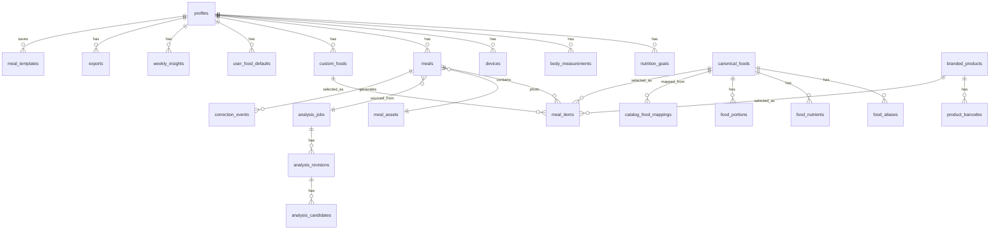
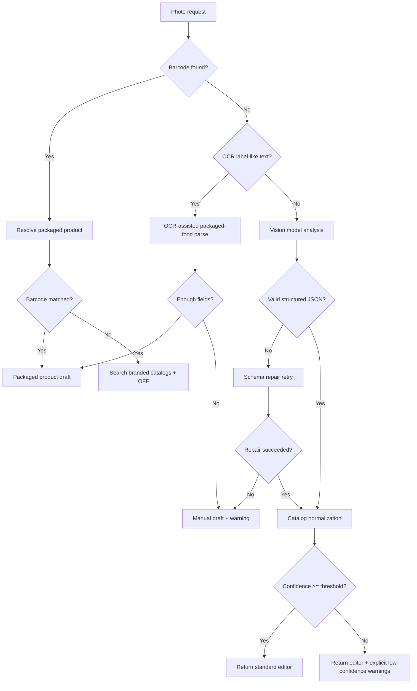
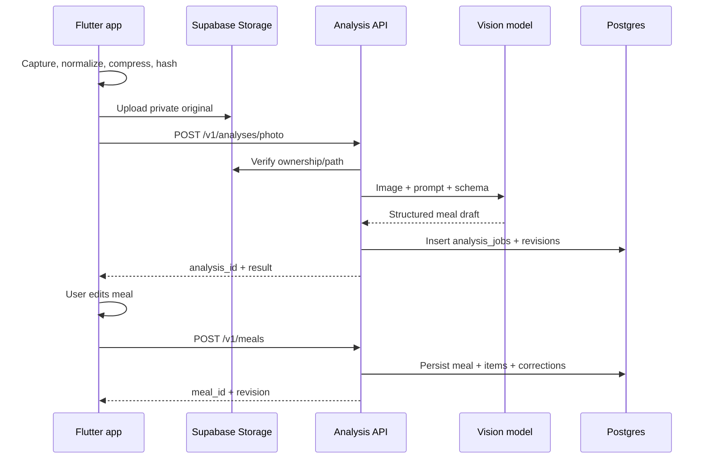
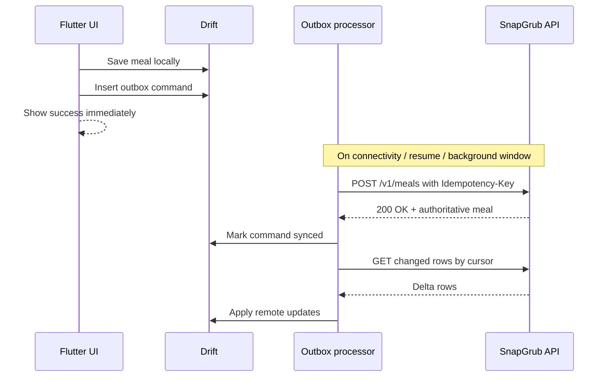
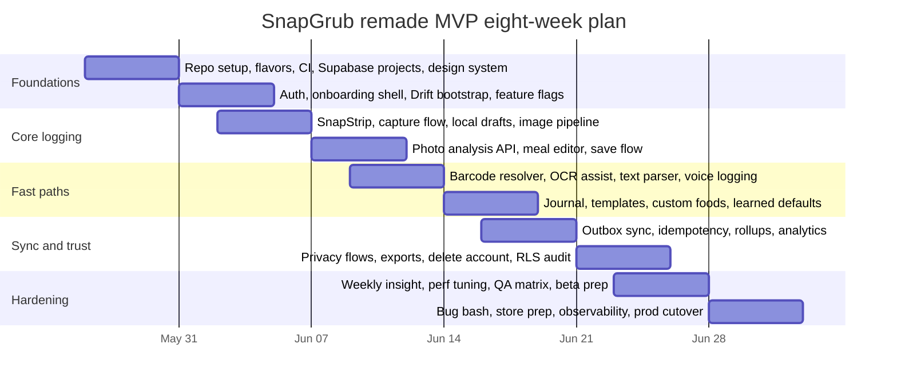

# SnapGrub Unified Developer Handoff

## Table of contents

- Executive summary
- Market landscape and the remade MVP
- Backend and data handoff
- API, AI orchestration, and nutrition catalogs
- Flutter mobile handoff
- Delivery, security, privacy, and operations
- Open questions and limitations

## Executive summary

This unified handoff merges the strongest ideas from the two architect ZIP handoffs you provided plus the earlier SnapGrub PRD, roadmap, technical notes, mocks, and the inspiration repos. In practical terms, the merged result keeps the **Supabase-first backend, explicit RLS/storage/cron discipline, and editability-first data model** from the more backend-heavy handoff, while also keeping the **screen-level product UX, design-system direction, richer Flutter feature slicing, and SnapStrip-first home experience** from the more frontend-heavy handoff.

The premium calorie-tracking market has shifted in a very specific direction: **photo logging is now table stakes, not differentiation**. Cal AI markets photo, barcode, and natural-language logging; MyFitnessPal has barcode, voice log, and ML/CV-based Meal Scan; YAZIO markets AI photo tracking plus barcode, recipes, fasting, and device sync; Lose It! Premium advertises photo meal logging and AI Voice; Cronometer Gold offers Photo Log and Voice Log; and MacroFactor combines adaptive coaching check-ins with newly launched AI photo logging. SnapGrub should therefore not position itself as “an app that can identify food from a photo.” It should position itself as **the fastest trustworthy multimodal food ledger**: camera-first, brutally editable, globally relevant, and privacy-forward. citeturn9view0turn9view1turn9view2turn9view3turn9view5turn9view7turn9view8turn9view9

The remade MVP recommendation is to ship a **camera-first but trust-first** product: SnapStrip on the home screen, multimodal logging from one surface, honest confidence/provenance, a fast meal editor, barcode and label OCR fast paths, offline-first outbox sync, favorites/templates, learned defaults, and one light premium retention loop such as a **weekly check-in insight** rather than a full chat coach. This leverages the convenience users now expect from Cal AI/Lose It!/YAZIO while competing on the trust and data quality axis that products like Cronometer and MacroFactor emphasize. citeturn9view0turn9view3turn9view5turn9view6turn9view7turn9view8turn9view9

The strongest default backend recommendation remains **Supabase as the system of record**, with **Vercel optional** for a Node-heavy AI/BFF tier. Supabase’s Flutter docs explicitly cover database access, database changes, Edge Functions, login/user management, and large-file management from `supabase_flutter`; its Auth and Storage docs tie naturally into RLS; and its scheduling docs support `pg_cron` plus `pg_net` for recurring jobs. Vercel Functions and AI Gateway are excellent optional additions for AI-heavy traffic because Vercel positions Functions as well suited for AI workloads and AI Gateway adds unified model access, budgets, monitoring, provider routing, and fallbacks. citeturn20search0turn20search5turn20search6turn20search3turn20search11turn21search12turn21search2turn21search14

For meal-photo AI, the best default **single-provider** choice today is **Google Gemini 2.5 Flash** as the primary photo-analysis model, with **Gemini 2.5 Flash-Lite** as the low-cost downgrade path. The best **cross-provider** choice is Gemini 2.5 Flash primary plus **OpenAI GPT-4.1 mini** as a structured-output/quality fallback. Google’s published Gemini pricing currently lists Gemini 2.5 Flash Standard at **$0.30 per 1M text/image/video input tokens and $2.50 per 1M output tokens**, and Gemini 2.5 Flash-Lite at **$0.10 input / $0.40 output**; OpenAI’s current model cards list GPT-4.1 mini at **$0.40 input / $1.60 output** and GPT-4o mini at **$0.15 input / $0.60 output**, all with image input support. Exact monthly AI spend remains **no specific constraint**, and per-photo cost will still vary with prompt length and image tokenization. citeturn12view0turn12view1turn11view0turn14view0turn14view2turn13search9turn4view2

For nutrition catalogs, the recommended MVP stack is **USDA FoodData Central + IFCT 2017 + Open Food Facts**, with optional commercial augmentation from **Edamam**, **fatsecret Platform API**, or **Nutritionix** if barcode or localized branded-food coverage becomes a blocker. USDA FoodData Central is public-domain/CC0, API-accessible, and includes branded, foundation, legacy, and dietary-study data; Open Food Facts is open and widely reusable but carries ODbL/CC-BY-SA licensing and a volunteer-data accuracy caveat; IFCT adds crucial India-relevant staple and portion reality; Edamam offers NLP and image recognition with listed plans; fatsecret offers broad localized international coverage and barcode depth; and Nutritionix remains partner-oriented with its public free tier discontinued. citeturn8view0turn8view1turn7view2turn6search2turn16view1turn7view3turn7view7turn17search2turn18search1turn18search2turn18search4

Assumptions explicitly treated as **no specific constraint** unless you override them:

| Area | Current assumption |
|---|---|
| AI provider concentration risk | No specific constraint |
| AI monthly budget ceiling | No specific constraint |
| Launch concurrency / DAU target | No specific constraint |
| Subscription/paywall vendor | No specific constraint |
| Supported launch markets beyond US/India | No specific constraint |
| Health integrations | Deferred |
| Restaurant/menu OCR | Deferred |
| Full coach chat | Deferred |

## Market landscape and the remade MVP

### What the market now proves

The current premium landscape shows two patterns at the same time. First, convenience is converging: image logging, barcode, voice, and natural-language meal entry are no longer rare. Second, the successful products differentiate by the **secondary loop around logging**: database trust, wearable integration, fasting/planning ecosystems, coaching, or progress insights. That means SnapGrub’s product advantage cannot be “we use AI on food photos.” It must be **the fastest reliable path from meal to editable log, with less friction and more transparency than the incumbents**. citeturn9view0turn9view1turn9view2turn9view3turn9view5turn9view6turn9view7turn9view8turn9view9

### Competitive landscape

| App | Current premium pattern | Why users pay | Structural weakness for SnapGrub to exploit |
|---|---|---|---|
| **Cal AI** | AI-first consumer positioning: snap a photo, scan barcode, or describe the meal. Official site/app pages center the “track calories with just a picture” message. Source: official site and App Store page. citeturn9view0turn0search3 | Radical convenience and camera-led onboarding | Marketing leans hard on simplicity; trust, provenance, and editability cues are much less central |
| **MyFitnessPal** | Huge incumbent with barcode, voice log, and a Meal Scan FAQ describing ML/CV models trained on millions of images and a verified food database. Premium Plus adds meal planning. Source: official home/help/Play listing. citeturn9view1turn9view2turn0search14 | Breadth, habit lock-in, ecosystem, meal planning | Heavy, broad product; SnapGrub can be faster and less cognitively loaded |
| **YAZIO** | AI photo tracking, manual/barcode logging, fasting plans, recipes, and fitness tracker sync. Source: official site and help center. citeturn9view3turn9view4 | “All-in-one” weight management stack | Scope sprawl; not obviously optimized around ultra-fast logging |
| **Lose It!** | Premium features include photo meal logging, AI voice, barcode scanning, and deeper advanced tracking. Source: official Play listing. citeturn9view5 | Convenience and consumer familiarity | Often weaker trust messaging around data provenance than accuracy-focused competitors |
| **Cronometer Gold** | Premium adds Photo Log, Voice Log, custom charts, nutrition scores, and a strong accuracy/micronutrient positioning. Source: official site and Gold page. citeturn9view6turn9view7 | Trust, verification, depth, micronutrients | Less camera-first and less playful/premium-consumer in feel |
| **MacroFactor** | Paid, ad-free, science-backed coaching app with weekly check-ins; now adding AI-powered food logging and favorites. Source: official site and help center. citeturn9view8turn9view9 | Adaptive coaching and serious nutrition credibility | More “serious optimization tool” than instant AI logging product |

### The remade SnapGrub MVP

The improved MVP should take the market’s best ideas but compress them into a more opinionated system:

| Product pillar | Keep in MVP | Why it matters |
|---|---|---|
| **One-surface multimodal logging** | Yes | Cal AI, Lose It!, MyFitnessPal, YAZIO, and Cronometer all prove multimodal logging is expected |
| **SnapStrip persistent camera card on home** | Yes | Strong differentiator in daily habit speed |
| **Brutally editable meal editor** | Yes | The only honest answer to current photo-estimation limits |
| **Confidence + provenance badges** | Yes | Competes on trust, not hype |
| **Barcode-first packaged-food fast path** | Yes | Removes avoidable AI cost and uncertainty |
| **Favorites / templates / learned defaults** | Yes | This is where premium retention starts |
| **Weekly insight or check-in** | Yes, but lightweight | MacroFactor proves adaptive guidance matters; do not ship full chat coach |
| **Recipes / meal planning / fasting / social** | No | Valuable later, but not core to “ultimate AI-powered logging” during MVP |
| **Wearables integration** | No for GA MVP | Defer to post-MVP unless strategic for a launch partnership |

### Prioritized backlog

| Priority | Deliverables |
|---|---|
| **P0** | Auth, onboarding, goals, units/timezone, SnapStrip, full photo capture, barcode scan, OCR assist, text entry, push-to-talk short voice entry, AI result editor, journal/history, favorites/templates, custom foods/products, offline outbox, exports/delete account, feature flags, analytics |
| **P1** | Learned defaults per food, one weekly insight/check-in, richer nearest-recent suggestions, duplicate-from-recent, better low-confidence remediation UX |
| **P2** | Recipes, coach chat, meal plans, restaurant/menu analysis, fasting, health integrations, community/social |


### Product principles

The attached mocks and your internal docs point to a clear visual and interaction thesis: warm surfaces, rounded cards, progress-first cards, and a friendly premium tone rather than a punitive “diet app” tone. Flutter’s accessibility guidance should be treated as a hard product constraint from day one: TalkBack/VoiceOver testing, minimum 48×48 tap targets, and at least 4.5:1 contrast for text and controls. citeturn22search5turn22search11

## Backend and data handoff

### Role split between Supabase and Vercel

| Capability | Recommended owner | Why |
|---|---|---|
| Auth, JWT, user identity | **Supabase** | Auth is already integrated with Postgres and RLS. citeturn20search5turn20search9 |
| Transactional data and journaling | **Supabase** | Postgres + RLS + Flutter client integration. citeturn20search0turn20search1 |
| Storage for meal images and exports | **Supabase** | Private buckets + signed access + per-object RLS. citeturn20search2turn20search6turn20search10 |
| Realtime/Postgres change listeners | **Supabase** | Supported directly in the Flutter client. citeturn20search0turn20search15 |
| Data-adjacent cron jobs | **Supabase** | `pg_cron` + `pg_net` + Vault are a natural fit. citeturn20search3turn20search11turn20search22 |
| AI BFF / model router | **Optional Vercel** | Node runtime, AI Gateway, provider fallbacks, budget monitoring. citeturn21search0turn21search2turn21search6turn21search14 |
| Admin console / marketing frontend | **Optional Vercel** | Natural fit for web surfaces |

### Unified database schema

The schema below is intentionally **meal-led and editability-led**. AI output is persisted, but the user’s saved meal is the durable truth.

#### User, preferences, sync, and insights tables

| Table | Columns and types | Indexes / constraints |
|---|---|---|
| `profiles` | `id uuid pk references auth.users(id)`, `display_name text`, `avatar_path text null`, `locale text not null default 'en-US'`, `timezone text not null`, `unit_system text not null check (unit_system in ('metric','imperial'))`, `country_code text null`, `cuisine_preferences text[] default '{}'`, `cloud_media_storage boolean not null default true`, `save_original_photos boolean not null default false`, `ai_improvement_consent boolean not null default false`, `created_at timestamptz`, `updated_at timestamptz` | PK `id`; trigger on `updated_at` |
| `nutrition_goals` | `id uuid pk`, `user_id uuid not null`, `goal_type text check (goal_type in ('lose','maintain','gain','custom'))`, `calories_kcal numeric(10,2)`, `protein_g numeric(10,2)`, `carbs_g numeric(10,2)`, `fat_g numeric(10,2)`, `fiber_g numeric(10,2) null`, `starts_on date`, `ends_on date null`, `is_active boolean default true`, timestamps | unique partial index `one_active_goal_per_user` on `(user_id)` where `is_active`; check positive ranges |
| `body_measurements` | `id uuid pk`, `user_id uuid not null`, `measured_at timestamptz not null`, `weight_kg numeric(8,3) null`, `body_fat_pct numeric(5,2) null`, `source text default 'manual'`, timestamps | index `(user_id, measured_at desc)` |
| `devices` | `id uuid pk`, `user_id uuid not null`, `install_id text not null`, `platform text check (platform in ('ios','android'))`, `app_version text`, `build_number text`, `push_token text null`, `last_seen_at timestamptz`, `last_sync_cursor text null`, timestamps | unique `(install_id)`; index `(user_id, last_seen_at desc)` |
| `user_food_defaults` | `id uuid pk`, `user_id uuid not null`, `food_ref_kind text`, `food_ref_id text`, `preferred_quantity numeric(10,2)`, `preferred_unit text`, `last_used_at timestamptz`, `use_count int default 0`, timestamps | unique `(user_id, food_ref_kind, food_ref_id)` |
| `daily_rollups` | `user_id uuid`, `day date`, total macros, `meal_count int`, `has_photo_meal boolean`, `updated_at timestamptz`, PK `(user_id, day)` | PK only; refreshed incrementally or nightly |
| `weekly_insights` | `id uuid pk`, `user_id uuid`, `week_start date`, `insight_type text`, `payload jsonb`, `status text default 'ready'`, timestamps | unique `(user_id, week_start, insight_type)` |
| `feature_flags` | `key text pk`, `enabled boolean`, `rollout_percent integer`, `rules jsonb`, `description text`, `updated_at timestamptz` | PK `key` |
| `feature_flag_overrides` | `id uuid pk`, `flag_key text references feature_flags(key)`, `scope_type text check (scope_type in ('user','device','email','build_env'))`, `scope_id text`, `forced_value jsonb`, timestamps | unique `(flag_key, scope_type, scope_id)` |

#### Meal, assets, analysis, and correction tables

| Table | Columns and types | Indexes / constraints |
|---|---|---|
| `meal_assets` | `id uuid pk`, `user_id uuid not null`, `storage_bucket text not null`, `storage_path text not null`, `thumb_storage_path text null`, `sha256 text not null`, `mime_type text not null`, `width integer`, `height integer`, `size_bytes bigint`, `retention_until timestamptz null`, `created_at`, `deleted_at` | unique `(storage_bucket, storage_path)`; index `(user_id, created_at desc)`; index `(retention_until)` where `deleted_at is null` |
| `analysis_jobs` | `id uuid pk`, `user_id uuid not null`, `client_request_id text not null`, `analysis_mode text check (analysis_mode in ('photo','text','barcode'))`, `status text check (status in ('queued','processing','completed','failed'))`, `asset_id uuid null`, `input_payload jsonb`, `provider text null`, `model_name text null`, `latency_ms integer null`, `error_code text null`, `created_at`, `updated_at`, `completed_at` | unique `(user_id, client_request_id)`; index `(status, created_at)`; index `(user_id, created_at desc)` |
| `analysis_revisions` | `id uuid pk`, `analysis_job_id uuid not null`, `user_id uuid not null`, `revision_no integer not null`, `title text`, `meal_type text`, total macros, `confidence_overall numeric(4,3)`, `confidence_breakdown jsonb`, `warnings text[]`, `provenance jsonb`, `result_payload jsonb not null`, `created_at` | unique `(analysis_job_id, revision_no)`; index `(analysis_job_id, revision_no desc)` |
| `analysis_candidates` | `id uuid pk`, `analysis_revision_id uuid not null`, `rank integer not null`, `candidate_title text`, `confidence numeric(4,3)`, `payload jsonb`, `created_at` | unique `(analysis_revision_id, rank)` |
| `meals` | `id uuid pk`, `user_id uuid not null`, `client_id text not null`, `analysis_job_id uuid null`, `title text not null`, `meal_type text not null`, `source text not null check (source in ('photo','barcode','text','voice','manual','duplicate'))`, `logged_at timestamptz not null`, `timezone text not null`, total macros, `confidence_overall numeric(4,3) null`, `provenance_type text null`, `photo_asset_id uuid null`, `revision integer not null default 1`, `created_at`, `updated_at`, `deleted_at` | unique `(user_id, client_id)`; index `(user_id, logged_at desc)` where `deleted_at is null`; index `(user_id, updated_at desc)` |
| `meal_items` | `id uuid pk`, `meal_id uuid not null`, `user_id uuid not null`, `client_id text not null`, `position integer not null`, `name text not null`, `food_ref_kind text not null check (food_ref_kind in ('canonical','branded','custom','manual'))`, `canonical_food_id uuid null`, `branded_product_id uuid null`, `custom_food_id uuid null`, `quantity numeric(10,2) not null`, `unit text not null`, `grams_estimated numeric(10,2) null`, item macros, `confidence numeric(4,3) null`, `source_type text`, `source_id text`, `notes text null`, timestamps | index `(meal_id, position)`; index `(user_id, created_at desc)`; check `num_nonnulls(canonical_food_id, branded_product_id, custom_food_id) <= 1` |
| `correction_events` | `id uuid pk`, `user_id uuid not null`, `meal_id uuid null`, `analysis_job_id uuid null`, `event_type text`, `field_name text`, `before_value jsonb`, `after_value jsonb`, `reason text null`, `created_at` | index `(user_id, created_at desc)`; index `(meal_id, created_at desc)` |
| `meal_templates` | `id uuid pk`, `user_id uuid not null`, `title text`, `snapshot jsonb not null`, `source_meal_id uuid null`, `created_at`, `updated_at`, `deleted_at` | index `(user_id, updated_at desc)` |

#### Catalog, barcode, and ingest tables

| Table | Columns and types | Indexes / constraints |
|---|---|---|
| `canonical_foods` | `id uuid pk`, `name text not null`, `normalized_name text not null`, `category text null`, `default_unit text null`, `default_quantity numeric(10,2) null`, `default_grams numeric(10,2) null`, `source_type text not null`, `source_id text null`, `license_tag text null`, `source_quality text null`, `region_tags text[] default '{}'`, `is_active boolean default true`, timestamps | unique `(source_type, source_id)` where `source_id is not null`; index `(normalized_name)` |
| `food_aliases` | `id uuid pk`, `canonical_food_id uuid not null`, `alias text not null`, `normalized_alias text not null`, `locale text null`, `region text null`, timestamps | unique `(canonical_food_id, normalized_alias, coalesce(locale,''), coalesce(region,''))`; index `(normalized_alias)` |
| `food_nutrients` | `id uuid pk`, `canonical_food_id uuid not null`, `per_grams numeric(10,2) not null default 100`, total macros plus optional micro fields, timestamps | unique `(canonical_food_id, per_grams)` |
| `food_portions` | `id uuid pk`, `canonical_food_id uuid not null`, `unit text not null`, `qualifier text null`, `grams numeric(10,2) not null`, `locale text null`, `region text null`, `confidence numeric(4,3) default 1`, timestamps | unique `(canonical_food_id, unit, coalesce(qualifier,''), coalesce(locale,''), coalesce(region,''))` |
| `branded_products` | `id uuid pk`, `name text not null`, `brand text null`, `normalized_name text`, `serving_quantity numeric(10,2) null`, `serving_unit text null`, `serving_grams numeric(10,2) null`, per-100g macros, per-serving macros, `ingredients_text text null`, `source_type text not null`, `source_id text not null`, `license_tag text null`, `source_quality text null`, `raw_payload jsonb`, `last_verified_at timestamptz null`, timestamps | unique `(source_type, source_id)`; index `(brand, normalized_name)` |
| `product_barcodes` | `barcode text pk`, `branded_product_id uuid not null`, `barcode_type text default 'ean_upc'`, `region text null`, `created_at` | PK `barcode`; index `(branded_product_id)` |
| `custom_foods` | `id uuid pk`, `user_id uuid not null`, `name text not null`, `normalized_name text not null`, `serving_quantity numeric(10,2) not null`, `serving_unit text not null`, `grams_per_serving numeric(10,2) not null`, total macros, timestamps, `deleted_at` | index `(user_id, normalized_name)` where `deleted_at is null` |
| `catalog_food_mappings` | `id uuid pk`, `source_type text not null`, `source_food_id text not null`, `canonical_food_id uuid not null`, `mapping_method text not null`, `mapping_confidence numeric(4,3) not null`, `created_at`, `updated_at` | unique `(source_type, source_food_id)`; index `(canonical_food_id)` |
| `catalog_ingest_runs` | `id uuid pk`, `source_type text not null`, `started_at timestamptz`, `finished_at timestamptz null`, `status text`, `rows_seen bigint default 0`, `rows_inserted bigint default 0`, `rows_updated bigint default 0`, `details jsonb` | index `(source_type, started_at desc)` |

#### Ops and idempotency tables

| Table | Columns and types | Indexes / constraints |
|---|---|---|
| `analytics_events` | `id uuid pk`, `user_id uuid null`, `device_id uuid null`, `event_name text not null`, `properties jsonb not null`, `occurred_at timestamptz not null`, `received_at timestamptz not null default now()` | index `(event_name, occurred_at desc)`; index `(user_id, occurred_at desc)` |
| `exports` | `id uuid pk`, `user_id uuid not null`, `format text check (format in ('json','csv','zip'))`, `status text`, `storage_bucket text null`, `storage_path text null`, `expires_at timestamptz null`, `created_at`, `completed_at null` | index `(user_id, created_at desc)`; index `(expires_at)` |
| `api_idempotency` | `id uuid pk`, `user_id uuid not null`, `endpoint text not null`, `key text not null`, `request_hash text not null`, `response_status integer null`, `response_body jsonb null`, `created_at`, `expires_at` | unique `(user_id, endpoint, key)`; index `(expires_at)` |

### Sample SQL migration starter

```sql
create extension if not exists "pgcrypto";

create or replace function public.set_updated_at()
returns trigger language plpgsql as $$
begin
  new.updated_at = now();
  return new;
end;
$$;

create table public.profiles (
  id uuid primary key references auth.users(id) on delete cascade,
  display_name text,
  avatar_path text,
  locale text not null default 'en-US',
  timezone text not null,
  unit_system text not null default 'metric'
    check (unit_system in ('metric','imperial')),
  country_code text,
  cuisine_preferences text[] not null default '{}',
  cloud_media_storage boolean not null default true,
  save_original_photos boolean not null default false,
  ai_improvement_consent boolean not null default false,
  created_at timestamptz not null default now(),
  updated_at timestamptz not null default now()
);

create trigger trg_profiles_updated_at
before update on public.profiles
for each row execute function public.set_updated_at();

create table public.meals (
  id uuid primary key default gen_random_uuid(),
  user_id uuid not null references auth.users(id) on delete cascade,
  client_id text not null,
  analysis_job_id uuid references public.analysis_jobs(id),
  title text not null,
  meal_type text not null
    check (meal_type in ('breakfast','lunch','dinner','snack','unknown')),
  source text not null
    check (source in ('photo','barcode','text','voice','manual','duplicate')),
  logged_at timestamptz not null,
  timezone text not null,
  calories_kcal numeric(10,2) not null default 0,
  protein_g numeric(10,2) not null default 0,
  carbs_g numeric(10,2) not null default 0,
  fat_g numeric(10,2) not null default 0,
  confidence_overall numeric(4,3),
  provenance_type text,
  photo_asset_id uuid references public.meal_assets(id),
  revision integer not null default 1,
  created_at timestamptz not null default now(),
  updated_at timestamptz not null default now(),
  deleted_at timestamptz,
  unique (user_id, client_id)
);

create index idx_meals_user_logged_at
on public.meals (user_id, logged_at desc)
where deleted_at is null;
```

### RLS policy matrix

Supabase’s RLS guidance is straightforward: `auth.uid()` returns `null` if unauthenticated, so owner policies should explicitly depend on authenticated access; private buckets are subject to RLS; and auth/JWT claims are the natural boundary for per-user data. citeturn20search1turn20search2turn20search6

| Table | Select | Insert | Update | Delete | Notes |
|---|---|---|---|---|---|
| `profiles` | own row | own row only | own row only | no client delete | `id = auth.uid()` |
| `nutrition_goals` | own rows | own rows | own rows | own rows | standard owner pattern |
| `body_measurements` | own rows | own rows | own rows | own rows | standard owner pattern |
| `devices` | own rows | own rows | own rows | own rows | standard owner pattern |
| `user_food_defaults` | own rows | own rows | own rows | own rows | standard owner pattern |
| `daily_rollups` | own rows | service role only | service role only | service role only | derived data |
| `weekly_insights` | own rows | service role only | service role only | service role only | derived data |
| `meal_assets` | own rows | own rows | no direct client updates except metadata-safe columns | own rows | path ownership and RLS must agree |
| `analysis_jobs` | own rows | service/API only | service/API only | no client delete | app should call API, not write directly |
| `analysis_revisions` | own rows | service/API only | no client updates | no client deletes | immutable |
| `analysis_candidates` | own rows through join | service/API only | no | no | immutable |
| `meals` | own rows | own rows | own rows | own rows | soft delete preferred |
| `meal_items` | own rows | own rows | own rows | own rows | mirror meal ownership |
| `correction_events` | own rows | own rows or API only | no | no | append-only |
| `meal_templates` | own rows | own rows | own rows | own rows | soft delete preferred |
| `custom_foods` | own rows | own rows | own rows | own rows | soft delete preferred |
| `canonical_foods` | authenticated read | service only | service only | service only | catalog table |
| `food_aliases` | authenticated read | service only | service only | service only | catalog table |
| `food_nutrients` | authenticated read | service only | service only | service only | catalog table |
| `food_portions` | authenticated read | service only | service only | service only | catalog table |
| `branded_products` | authenticated read | service only | service only | service only | catalog table |
| `product_barcodes` | authenticated read | service only | service only | service only | catalog table |
| `catalog_food_mappings` | authenticated read | service only | service only | service only | admin/ingest only |
| `catalog_ingest_runs` | no client access | service only | service only | service only | ops only |
| `feature_flags` | authenticated read | service only | service only | service only | app bootstrap |
| `feature_flag_overrides` | no client direct access | service only | service only | service only | use API/bootstrap |
| `analytics_events` | no client select | own rows or API-only insert | no | no | append-only |
| `exports` | own rows | own rows | service/API only | own rows | export state rows |
| `api_idempotency` | no client direct access | API-only | API-only | cron/API only | backend concern |

### Storage buckets and retention

Supabase buckets are private by default, private-bucket downloads are also gated by access control, and server-side signed URLs are the cleanest way to expose objects selectively. citeturn20search2turn20search10turn20search13

| Bucket | Privacy | Retention | Purpose |
|---|---|---|---|
| `meal-originals-private` | Private | default 24h; extend only when `save_original_photos=true` | Raw photo for analysis/debug |
| `meal-thumbnails-private` | Private | until meal deletion if `cloud_media_storage=true` | Journal/previews |
| `profile-images-private` | Private | until replaced/deleted | Avatar |
| `exports-private` | Private | 7 days | GDPR/CCPA exports |
| `debug-artifacts-private` | Private, non-prod only | 72h | staging-only inspection |

Sample storage policy starter:

```sql
create policy "upload_meal_original_to_own_folder"
on storage.objects
for insert to authenticated
with check (
  bucket_id = 'meal-originals-private'
  and (storage.foldername(name))[1] = (select auth.jwt()->>'sub')
);

create policy "read_own_meal_originals"
on storage.objects
for select to authenticated
using (
  bucket_id = 'meal-originals-private'
  and owner_id = (select auth.jwt()->>'sub')
);
```

### Edge Functions

| Function | Runtime | Responsibility |
|---|---|---|
| `analysis-photo-create` | Supabase Edge or Vercel Node | validate ownership, fetch image, run vision model, normalize result, persist job + revision |
| `analysis-get` | Supabase Edge | poll job status and latest revision |
| `analysis-text-create` | Supabase Edge | parse text/voice transcript into meal draft |
| `barcode-resolve` | Supabase Edge | local lookup → cache → Open Food Facts/commercial provider |
| `foods-search` | Supabase Edge | search canonical/custom/branded/recent foods |
| `meal-upsert` | Supabase Edge responsibility exposed by the `meals` function | transactionally write meal + items + corrections |
| `templates-upsert` | Supabase Edge | save favorite meal snapshots |
| `settings-patch` | Supabase Edge | patch profile/goals/preferences |
| `events-ingest` | Supabase Edge | batch analytics ingest |
| `export-create` | Supabase Edge | queue/create export artifact |
| `account-delete` | Supabase Edge | cascade delete or soft purge + storage cleanup |
| `catalog-sync-openfoodfacts` | Supabase Edge | import/canonicalize barcode/product changes |
| `catalog-sync-usda` | Supabase Edge | import/update FDC foods |
| `weekly-insights-generate` | Supabase Edge | generate weekly insight snapshots |

### Cron jobs

Supabase’s scheduling docs explicitly support `pg_cron` plus `pg_net`, and Supabase Cron records jobs and runs inside Postgres. citeturn20search3turn20search11turn20search22

| Job | Schedule | Implementation |
|---|---|---|
| purge expired originals | hourly | SQL + Storage API |
| purge expired exports | daily | SQL + Edge Function |
| requeue stuck analysis jobs | every 15 min | SQL |
| refresh Open Food Facts hot cache | nightly | Edge Function |
| refresh USDA delta ingest | nightly or weekly | Edge Function |
| rebuild daily rollups | nightly | SQL/materialized logic |
| generate weekly insights | weekly | Edge Function |

### Entity relationship diagram



## API, AI orchestration, and nutrition catalogs

### API contract strategy

Although Supabase can expose table CRUD directly, SnapGrub should still define a **thin application API** for all write paths and all AI/search/barcode paths. That keeps validation, idempotency, confidence scoring, provenance tagging, provider migration, and observability centralized, while still letting Flutter use `supabase_flutter` for auth, file uploads, and selected read-side access. citeturn20search0turn20search8

### OpenAPI surface

| Method and path | Auth | Purpose | Idempotency |
|---|---|---|---|
| `POST /v1/analyses/photo` | required | create a meal-photo analysis | `Idempotency-Key` + `client_request_id` |
| `GET /v1/analyses/{analysisId}` | required | poll analysis job | none |
| `POST /v1/analyses/text` | required | parse text or voice transcript | `Idempotency-Key` + `client_request_id` |
| `POST /v1/barcodes/resolve` | required | resolve packaged product by barcode | request hash or body key |
| `GET /v1/foods/search` | required | unified food search | none |
| `GET /v1/meals` | required | journal listing and pagination | none |
| `GET /v1/meals/{mealId}` | required | meal detail | none |
| `POST /v1/meals` | required | create meal | `Idempotency-Key` + `client_request_id` |
| `PATCH /v1/meals/{mealId}` | required | update meal | `Idempotency-Key` + `client_request_id` |
| `DELETE /v1/meals/{mealId}` | required | soft-delete meal | `Idempotency-Key` + `client_request_id` |
| `PATCH /v1/settings` | required | patch profile and active goals | `Idempotency-Key` + `client_request_id` |
| `POST /v1/events` | optional pre-auth, preferred post-auth | batch analytics ingest | batch UUID |
| `POST /v1/exports` | required | create export | `Idempotency-Key` + `client_request_id` |
| `GET /v1/exports/{exportId}` | required | poll export state | none |

### Shared response objects

| Object | Required fields |
|---|---|
| `MacroTotals` | `calories_kcal`, `protein_g`, `carbs_g`, `fat_g` |
| `Provenance` | `mode`, `sources[]`, `notes[]` |
| `Confidence` | `overall`, `item_identification`, `portion_estimation`, `nutrition_source_quality`, `warnings[]` |
| `MealComponentCandidate` | `name`, `quantity`, `unit`, `grams_estimated`, `totals`, `confidence`, `source_type`, `source_id`, `alternatives[]` |
| `AnalysisResult` | `title`, `meal_type`, `total`, `confidence`, `provenance`, `components[]`, `warnings[]` |
| `ErrorEnvelope` | `code`, `message`, `user_message`, `retryable`, `request_id`, `details` |

### OpenAPI YAML starter

```yaml
openapi: 3.1.0
info:
  title: SnapGrub API
  version: 1.0.0
paths:
  /v1/analyses/photo:
    post:
      summary: Analyze a meal photo
      security:
        - bearerAuth: []
      parameters:
        - in: header
          name: Idempotency-Key
          required: false
          schema: { type: string }
      requestBody:
        required: true
        content:
          application/json:
            schema:
              type: object
              required:
                - client_request_id
                - storage_path
                - locale
                - timezone
              properties:
                client_request_id: { type: string }
                storage_path: { type: string }
                locale: { type: string }
                timezone: { type: string }
                meal_type_hint: { type: string }
                user_hint_text: { type: string }
                cuisine_hints:
                  type: array
                  items: { type: string }
      responses:
        "200":
          description: Completed analysis
        "202":
          description: Accepted for async processing
        "400":
          description: Invalid input
        "401":
          description: Unauthorized
        "429":
          description: Rate limited
```

### Example JSON response

```json
{
  "analysis_id": "4f8d448f-6b64-4a4d-b9ca-9f7cbfe4878c",
  "status": "completed",
  "result": {
    "title": "Chicken biryani with raita",
    "meal_type": "lunch",
    "total": {
      "calories_kcal": 712,
      "protein_g": 31.4,
      "carbs_g": 78.0,
      "fat_g": 29.2
    },
    "confidence": {
      "overall": 0.72,
      "item_identification": 0.84,
      "portion_estimation": 0.58,
      "nutrition_source_quality": 0.81,
      "warnings": [
        "Rice portion may be under or overestimated",
        "Oil/ghee content is not visible"
      ]
    },
    "provenance": {
      "mode": "ai_photo_estimate_mapped",
      "sources": [
        { "type": "canonical_food", "id": "cf_biryani_001" },
        { "type": "canonical_food", "id": "cf_raita_002" }
      ],
      "notes": [
        "Mapped to curated Indian portion defaults"
      ]
    },
    "components": [
      {
        "name": "Chicken biryani",
        "quantity": 1.5,
        "unit": "cup",
        "grams_estimated": 380,
        "totals": {
          "calories_kcal": 640,
          "protein_g": 28.1,
          "carbs_g": 70.5,
          "fat_g": 27.0
        },
        "confidence": 0.71,
        "source_type": "canonical",
        "source_id": "cf_biryani_001",
        "alternatives": []
      },
      {
        "name": "Raita",
        "quantity": 0.5,
        "unit": "katori",
        "grams_estimated": 90,
        "totals": {
          "calories_kcal": 72,
          "protein_g": 3.3,
          "carbs_g": 7.5,
          "fat_g": 2.2
        },
        "confidence": 0.79,
        "source_type": "canonical",
        "source_id": "cf_raita_002",
        "alternatives": []
      }
    ],
    "warnings": [
      "Review portion sizes before saving"
    ]
  }
}
```

### Error codes

| Code | Retryable | Client behavior |
|---|---|---|
| `AUTH_REQUIRED` | No | re-auth |
| `INVALID_IMAGE` | No | retake or choose gallery/manual |
| `IMAGE_TOO_LARGE` | Yes | recompress automatically |
| `UPLOAD_FAILED` | Yes | outbox retry |
| `ANALYSIS_TIMEOUT` | Yes | offer manual edit and retry |
| `AI_PROVIDER_UNAVAILABLE` | Yes | fallback model or text path |
| `AI_INVALID_RESPONSE` | Yes | repair/retry once |
| `BARCODE_NOT_FOUND` | No | OCR/custom product/search fallback |
| `FOOD_SEARCH_EMPTY` | No | create custom food |
| `EXPECTED_REVISION_MISMATCH` | Yes | pull latest meal and reopen editor |
| `RATE_LIMITED` | Yes | exponential backoff |
| `UNKNOWN` | Depends | generic recoverable UI |

### Multimodal model and provider survey

OpenAI’s current model pages state that the latest models support text and image input, and its vision guide notes that image tokens are metered and high-fidelity analysis can substantially increase token usage. Gemini’s model and pricing docs explicitly call out Gemini 2.5 Flash as a 1M-context hybrid reasoning model and Gemini 2.5 Flash-Lite as the “smallest and most cost effective” option, with published text/image/video token pricing. Anthropic’s docs show current Claude pricing and explain that image inputs count toward token usage. Mistral’s current model cards show multimodal models with structured-output support and publicly listed token prices. citeturn13search9turn4view2turn12view0turn12view1turn11view0turn15view3turn4view9turn5search3turn5search6

#### Recommended model table

| Tier | Provider and exact model | Image input | Published price | Recommendation |
|---|---|---|---|---|
| **Cheapest managed option** | **Google Gemini 2.5 Flash-Lite** | Yes | Standard pricing page lists **$0.10 / 1M text-image-video input** and **$0.40 / 1M output**; Google also describes it as the smallest and most cost-effective model in the 2.5 family. Official docs. citeturn12view1turn4view4 | Best for low-cost retries, OCR-assisted repair, and simple dishes |
| **Best cost/performance default** | **Google Gemini 2.5 Flash** | Yes | Standard pricing page lists **$0.30 input / $2.50 output** and a 1M context window with thinking budgets. Official docs. citeturn12view0 | **Recommended primary model for MVP photo analysis** |
| **Cheapest OpenAI option** | **OpenAI GPT-4o mini** | Yes | Model card lists image input support and **$0.15 input / $0.60 output**. Official docs. citeturn14view2 | Best cheap OpenAI fallback for schema-friendly focused tasks |
| **Best OpenAI default balance** | **OpenAI GPT-4.1 mini** | Yes | Model card lists image input support, 1M context, and **$0.40 input / $1.60 output**. Official docs. citeturn14view0 | Best OpenAI fallback or alternate primary if you prefer OpenAI tooling |
| **Very cheap OpenAI extractor** | **OpenAI GPT-4.1 nano** | Yes | Model card lists image input support and **$0.10 input / $0.40 output**. Official docs. citeturn14view1 | Better for re-ranking/extraction than first-pass nutrition reasoning |
| **Premium high-quality OpenAI escalator** | **OpenAI GPT-5.4** | Yes | Model card lists image input support and **$2.50 input / $15.00 output**. Official docs. citeturn14view4 | Only use for hard ambiguous meals or QA evals |
| **Fast Anthropic fallback** | **Claude Haiku 4.5** | Yes | Anthropic overview lists **$1 input / $5 output**, fastest latency class, with vision token billing explained separately. Official docs. citeturn4view9turn15view3 | Good cross-provider fallback, but pricier than Gemini/OpenAI small models |
| **Premium Anthropic escalator** | **Claude Sonnet 4.6** | Yes | Anthropic overview lists **$3 input / $15 output** and 1M context at standard pricing. Official docs. citeturn4view9turn15view1 | Expensive but strong for difficult dishes or adjudication |
| **Cost-effective open-weight option** | **Mistral Large 3** | Yes | Official model card lists multimodal support, structured outputs, OCR, 256k context, and **$0.5 input / $1.5 output**. citeturn5search3 | Strong if you want open weights or optional self-hosting later |
| **Production Mistral mid-tier** | **Mistral Medium 3.5** | Yes | Official model card lists multimodal support and **$1.5 input / $7.5 output**. citeturn5search6 | Viable if you want Mistral stack consistency |
| **Avoid** | **Gemini 2.0 Flash / 2.0 Flash-Lite** | Yes | Google pricing page marks them deprecated with a June 1, 2026 shutdown date. citeturn11view4 | Do not build new production logic on these |

### Final provider recommendation

If you want the cleanest single-provider MVP, use:

- **Primary**: `gemini-2.5-flash`
- **Cheap repair / retry / OCR assist**: `gemini-2.5-flash-lite`

If you want stronger provider resilience and more structured-output confidence, use:

- **Primary**: `gemini-2.5-flash`
- **Fallback**: `gpt-4.1-mini`
- **Escalation for low-confidence mixed dishes**: `claude-sonnet-4.6` or `gpt-5.4`

This layered recommendation is pragmatic, not ideological. Google currently offers the lowest clearly published pricing for a strong multimodal default, while OpenAI currently gives very strong structured-output ergonomics and a robust small-model fallback path; Anthropic is excellent but materially pricier per token at the moment. Exact provider choice remains **no specific constraint** if you have enterprise commitments or procurement constraints elsewhere. citeturn12view0turn12view1turn14view0turn14view2turn4view9

### Structured output and adapter architecture

Both Google and OpenAI currently support structured JSON output flows officially, and the AI SDK standardizes structured object generation across providers using JSON Schema or Zod. Vercel AI Gateway and AI SDK also support provider routing and model fallbacks without rewriting the app-facing contract. citeturn10search0turn10search1turn21search3turn21search6turn21search14

Recommended interface:

```ts
export type MealVisionInput = {
  locale: string;
  timezone: string;
  cuisineHints: string[];
  mealTypeHint?: string;
  userHintText?: string;
  imageUrl: string;
};

export type MealVisionOutput = {
  title: string;
  mealType: string;
  total: { calories_kcal: number; protein_g: number; carbs_g: number; fat_g: number };
  confidence: {
    overall: number;
    item_identification: number;
    portion_estimation: number;
    nutrition_source_quality: number;
    warnings: string[];
  };
  provenance: {
    mode: string;
    sources: Array<{ type: string; id?: string; note?: string }>;
    notes: string[];
  };
  components: Array<{
    name: string;
    quantity: number;
    unit: string;
    grams_estimated?: number;
    totals: { calories_kcal: number; protein_g: number; carbs_g: number; fat_g: number };
    confidence: number;
    alternatives: string[];
  }>;
};
```

#### Vercel AI SDK example

```ts
import { generateObject } from 'ai';
import { z } from 'zod';
import { gateway } from '@ai-sdk/gateway';

const mealSchema = z.object({
  title: z.string(),
  mealType: z.enum(['breakfast', 'lunch', 'dinner', 'snack', 'unknown']),
  total: z.object({
    calories_kcal: z.number(),
    protein_g: z.number(),
    carbs_g: z.number(),
    fat_g: z.number(),
  }),
  confidence: z.object({
    overall: z.number(),
    item_identification: z.number(),
    portion_estimation: z.number(),
    nutrition_source_quality: z.number(),
    warnings: z.array(z.string()),
  }),
  provenance: z.object({
    mode: z.string(),
    sources: z.array(z.object({
      type: z.string(),
      id: z.string().optional(),
      note: z.string().optional(),
    })),
    notes: z.array(z.string()),
  }),
  components: z.array(z.object({
    name: z.string(),
    quantity: z.number(),
    unit: z.string(),
    grams_estimated: z.number().optional(),
    totals: z.object({
      calories_kcal: z.number(),
      protein_g: z.number(),
      carbs_g: z.number(),
      fat_g: z.number(),
    }),
    confidence: z.number(),
    alternatives: z.array(z.string()),
  })),
});

export async function analyzeMeal(imageUrl: string) {
  const { object } = await generateObject({
    model: gateway('google/gemini-2.5-flash'),
    output: 'object',
    schema: mealSchema,
    messages: [
      {
        role: 'system',
        content: 'You are a conservative meal-analysis assistant. Never overstate certainty.',
      },
      {
        role: 'user',
        content: [
          { type: 'text', text: 'Break this meal into editable components and estimate portions honestly.' },
          { type: 'image', image: imageUrl },
        ],
      },
    ],
  });

  return object;
}
```

### Prompt strategy, confidence scoring, and provenance

Recommended prompt rules:

- break mixed dishes into components
- prefer visible household units like bowl, roti, katori, cup, spoon, piece
- do not hide uncertainty
- lower confidence when oil/sauces/filling are not visible
- use locale/cuisine hints
- emit alternatives only when ambiguity is real
- always return machine-validated JSON

Recommended confidence formula:

```text
overall =
  0.35 * item_identification +
  0.30 * portion_estimation +
  0.20 * nutrition_source_quality +
  0.15 * hint_alignment
```

Recommended provenance tags:

| Tag | Meaning |
|---|---|
| `barcode_exact` | exact product/barcode match in curated or vendor catalog |
| `barcode_openfoodfacts` | Open Food Facts barcode match |
| `catalog_verified` | matched to curated canonical food or trusted branded row |
| `ifct_curated` | mapped to India-curated staple/portion assumptions |
| `ai_photo_estimate` | visually estimated from photo |
| `user_custom` | saved from custom food |
| `manual_override` | user meaningfully changed AI result |

Thresholds:

| Bucket | Rule |
|---|---|
| High | `>= 0.85` and no major warnings |
| Medium | `0.65 - 0.84` |
| Low | `< 0.65` or major invisible-ingredient uncertainty |

### AI fallback flow



### Photo-analysis flow



### Barcode flow

```mermaid
sequenceDiagram
    participant App as Flutter app
    participant API as Barcode API
    participant DB as Postgres cache
    participant OFF as Open Food Facts
    participant Vendor as Optional commercial API

    App->>API: POST /v1/barcodes/resolve
    API->>DB: Lookup product_barcodes
    alt cache hit
      DB-->>API: branded product
      API-->>App: packaged product draft
    else cache miss
      API->>OFF: product lookup
      alt OFF match
        OFF-->>API: product payload
        API->>DB: upsert branded_products + barcodes
        API-->>App: packaged product draft
      else no OFF match
        API->>Vendor: optional commercial lookup
        Vendor-->>API: product payload or miss
        API-->>App: product or custom-product fallback
      end
    end
```

### Nutrition catalog survey

| Catalog | What it gives you | Licensing / limits | Recommended SnapGrub role |
|---|---|---|---|
| **USDA FoodData Central** | REST API plus downloadable USDA nutrition data across Branded Foods, Foundation Foods, SR Legacy, and FNDDS. Official site states data are public domain under **CC0 1.0**, and API rate limit defaults to **1,000 requests/hour/IP**. Official docs. citeturn8view0turn8view1turn7view2 | Very permissive licensing; API key required; strong US generic/branded baseline | **Primary canonical foundation** |
| **Indian Food Composition Tables 2017** | Official NIN PDF covering **151 nutrients/components for 528 key foods**. Official PDF/search snippet. citeturn6search2 | Redistribution/API terms are not clearly published in the source surfaced here; treat as authoritative but confirm reuse rights before bulk embedding | **Primary India staple and portion reference** |
| **Open Food Facts** | Global open product DB with API, barcodes, ingredients, nutrition, and community contributions. Official API docs say ODbL for DB contents and CC-BY-SA for images, with rate limits and daily-export guidance. citeturn16view1turn16view2 | Excellent openness, but volunteer-data accuracy caveat and relatively tight public rate limits | **Primary open barcode source and secondary branded cache** |
| **Edamam Food Database API** | Search + parser + measures + NLP + image recognition. Official docs list close to **900k basic foods/restaurant/CPG**, **790k unique UPCs/barcodes**, and published plans including vision pricing. citeturn7view3turn7view4 | Commercial; cached reuse depends on plan/add-on | **Optional commercial gap-filler** |
| **fatsecret Platform API** | Official site says **2.3M+ unique foods/products**, **26 languages**, **58+ countries**, and **90%+ global barcode coverage**; international/localized support is a major advantage. citeturn7view7turn17search2 | Pricing is country/market-based and largely sales-led; attribution differs by edition | **Best commercial global branded-food candidate** |
| **Nutritionix** | Official docs describe v2 endpoints and a search API spanning CPG, USDA, and restaurant foods; current public trial access is discontinued and business evaluation is partner-based. citeturn18search1turn18search2turn18search4 | Pricing not publicly listed in the surfaced docs; partner-led access | **Good US-centric commercial option if restaurant/CPG depth is needed** |

### Catalog integration strategy

Use a **three-layer catalog**, not one flat table:

| Layer | Source | Purpose |
|---|---|---|
| `canonical_foods` | USDA + IFCT + your curated dish primitives | Generic foods, dishes, and portion defaults |
| `branded_products` + `product_barcodes` | Open Food Facts + optional commercial vendors | Packaged/barcoded products |
| `catalog_food_mappings` | internal mapping layer | Connect source rows to canonical equivalents without destroying provenance |

Key rule: **never overwrite provenance by silently merging raw vendor rows into canonical rows**. Store source rows with source identifiers and license tags, then map them. That preserves traceability and lets you swap vendors later.

### Sample SQL for branded product caching

```sql
insert into public.branded_products (
  id, name, brand, normalized_name,
  serving_quantity, serving_unit, serving_grams,
  calories_kcal_100g, protein_g_100g, carbs_g_100g, fat_g_100g,
  source_type, source_id, license_tag, source_quality, raw_payload, last_verified_at
) values (
  gen_random_uuid(),
  :name,
  :brand,
  lower(:name),
  :serving_quantity,
  :serving_unit,
  :serving_grams,
  :calories_100g,
  :protein_100g,
  :carbs_100g,
  :fat_100g,
  :source_type,
  :source_id,
  :license_tag,
  :source_quality,
  :raw_payload::jsonb,
  now()
)
on conflict (source_type, source_id)
do update set
  name = excluded.name,
  brand = excluded.brand,
  normalized_name = excluded.normalized_name,
  serving_quantity = excluded.serving_quantity,
  serving_unit = excluded.serving_unit,
  serving_grams = excluded.serving_grams,
  calories_kcal_100g = excluded.calories_kcal_100g,
  protein_g_100g = excluded.protein_g_100g,
  carbs_g_100g = excluded.carbs_g_100g,
  fat_g_100g = excluded.fat_g_100g,
  raw_payload = excluded.raw_payload,
  last_verified_at = now();

insert into public.product_barcodes (
  barcode, branded_product_id, barcode_type, region, created_at
) values (
  :barcode,
  :branded_product_id,
  'ean_upc',
  :region,
  now()
)
on conflict (barcode)
do update set
  branded_product_id = excluded.branded_product_id,
  region = excluded.region;
```

## Flutter mobile handoff

### Architecture choice

Flutter’s architecture docs recommend structuring apps so they scale with team and product growth, and the architecture guide plus case study emphasize layered design, repositories, DI, and clear UI/data separation. Riverpod’s own docs recommend `(Async)NotifierProvider` for interactive state and discourage `StateNotifier` in favor of `Notifier`/`AsyncNotifier`. Drift is a reactive relational persistence layer built on SQLite-family backends and is a strong fit for local-first journaling and outbox state. citeturn22search0turn22search6turn22search24turn23search0turn23search8turn23search2turn23search10

### Recommended folder structure

```text
apps/mobile/lib/
  app/
    bootstrap/
    env/
    router/
    theme/
    l10n/
  core/
    analytics/
    camera/
    config/
    design_system/
    errors/
    logging/
    network/
    permissions/
    utils/
    widgets/
  data/
    db/
      drift/
      migrations/
      tables/
      daos/
    dto/
    mappers/
    repositories/
    services/
  features/
    auth/
      application/
      domain/
      presentation/
    onboarding/
      application/
      presentation/
    home/
      application/
      presentation/
    capture/
      application/
      domain/
      presentation/
    barcode/
      application/
      presentation/
    text_voice/
      application/
      presentation/
    meal_editor/
      application/
      presentation/
    journal/
      application/
      presentation/
    progress/
      application/
      presentation/
    profile/
      application/
      presentation/
  offline/
    outbox/
    sync/
```

### Package recommendations

| Concern | Package | Why |
|---|---|---|
| State management | `flutter_riverpod`, `riverpod_annotation`, `riverpod_generator` | Riverpod recommends `(Async)NotifierProvider` for changing interactive state and offers strong lint/tooling support. citeturn23search0turn23search1turn23search8turn23search9 |
| Local DB | `drift`, `sqlite3_flutter_libs`, `path_provider` | Drift is reactive relational persistence for Dart/Flutter. citeturn23search2turn23search10 |
| Backend | `supabase_flutter` | Official client supports DB access, changes, Edge Functions, auth, and files. citeturn20search0 |
| Camera | `camera` | Official Flutter recipe covers preview, controller lifecycle, capture. citeturn22search1 |
| Barcode | `mobile_scanner` | Fast, lightweight, real-time barcode scanning with native stacks. citeturn23search3turn23search11 |
| OCR | `google_mlkit_text_recognition` | Supports Devanagari plus Chinese, Japanese, Korean, and Latin scripts. citeturn23search4 |
| Voice capture | `speech_to_text` | Built for commands and short phrases, not continuous always-on speech. citeturn23search5 |
| Compression | `flutter_image_compress` | Native compression plugin to reduce upload size. citeturn23search6turn23search14 |
| Background sync assist | `workmanager` | Schedules background work on Android and iOS; Apple implementation maps to background fetch/BGTaskScheduler. citeturn23search7turn23search15turn23search22 |

### Drift mirror schema

| Local table | Sync mode |
|---|---|
| `profiles_local` | pull-through cache |
| `nutrition_goals_local` | pull-through cache |
| `body_measurements_local` | read/write with outbox |
| `meals_local` | source of truth while offline |
| `meal_items_local` | source of truth while offline |
| `meal_assets_local` | local file refs + upload state |
| `analysis_revisions_local` | cache most recent draft/editor data |
| `meal_templates_local` | read/write with outbox |
| `custom_foods_local` | read/write with outbox |
| `user_food_defaults_local` | pull-through cache |
| `daily_rollups_local` | pull-through cache |
| `feature_flags_local` | startup/bootstrap cache |
| `outbox_commands` | local-only |
| `sync_state` | local-only |
| `pending_uploads` | local-only |

### Riverpod contract

Use:

- `AsyncNotifier` for auth/session bootstrap, journal loads, analysis requests, barcode resolution, settings loads, and sync engine state
- `Notifier` for meal-editor draft state, capture UI state, and filters
- `Provider` for repositories, config, analytics, clocks, UUID generators, compression helpers
- `StreamProvider` only where a true stream is needed, not as a default state pattern

Sample provider setup:

```dart
@riverpod
MealRepository mealRepository(Ref ref) {
  return MealRepositoryImpl(
    remote: ref.watch(mealRemoteDataSourceProvider),
    local: ref.watch(mealLocalDataSourceProvider),
    outbox: ref.watch(outboxRepositoryProvider),
  );
}

@riverpod
class HomeController extends _$HomeController {
  @override
  Future<HomeViewState> build() async {
    final repo = ref.watch(homeRepositoryProvider);
    return repo.loadHome();
  }

  Future<void> refresh() async {
    state = const AsyncLoading();
    state = AsyncData(await ref.read(homeRepositoryProvider).loadHome());
  }
}
```

### SnapStrip UX specification

The home screen should not be “dashboard first.” It should be **capture first**:

| Element | Behavior |
|---|---|
| SnapStrip card | live low-cost preview if camera permission is granted |
| Main CTA | shutter button opens immediate capture without navigating through an add menu |
| Secondary CTAs | barcode, voice, and text attach to the same card |
| Permission denied state | illustration + one-tap system-settings CTA + alternative entry modes remain available |
| Capture result | freeze preview, show immediate visual confirmation, and move into analysis/editor |
| Loading | never spin on a blank screen; show photo thumbnail, progress state, and fallback options |

Flutter’s official camera recipe specifically documents the expected lifecycle: get available cameras, initialize `CameraController`, render `CameraPreview`, capture with the controller, and dispose it cleanly. citeturn22search1

### Image pipeline

| Stage | Recommendation |
|---|---|
| Capture | full still image to temp file |
| Orientation | normalize rotation immediately |
| EXIF | strip if possible before upload |
| Compression | long edge target ~1280 px, quality ~80 |
| Thumbnail | generate 256 px and 512 px variants |
| Hashing | SHA-256 original and inference image |
| Local persist | create draft row in Drift before any upload |
| Upload | private bucket only |
| Analysis | call API after successful upload |
| Retry | asset upload decoupled from meal save so network failure never blocks draft creation |

### Barcode, OCR, and voice guidance

The package choices above suggest an important product constraint: **voice should stay in the “short phrases” lane**, and OCR should be treated as an assistive input for labels or correction, not as a generalized menu parser in the MVP. `mobile_scanner` is ideal for real-time barcode detection; `google_mlkit_text_recognition` brings useful multi-script support including Devanagari; and `speech_to_text` explicitly targets commands and short phrases rather than continuous dictation. citeturn23search3turn23search4turn23search5

### Offline-first outbox design

SnapGrub should behave like a local app that syncs, not a cloud app that occasionally caches.

#### Local command types

```text
meal.create
meal.update
meal.delete
template.upsert
custom_food.upsert
settings.patch
body_measurement.create
asset.upload
analytics.batch
export.create
```

#### Sync rules

| Rule | Implementation |
|---|---|
| Save first | write to Drift before backend |
| Idempotency | `client_request_id` + `Idempotency-Key` for every write |
| Conflict policy | last-write-wins on settings; meal-level revision compare on journals; append-only corrections |
| Pull after push | after successful mutation, refresh changed meal row(s) by cursor |
| Retry | exponential backoff with jitter |
| Background | best-effort with Workmanager; guaranteed drain on foreground resume |

### Outbox sync sequence



### Sync engine sample

```dart
class OutboxProcessor {
  OutboxProcessor(this._api, this._db);

  final SnapgrubApi _api;
  final AppDatabase _db;

  Future<void> drain() async {
    final pending = await _db.outboxDao.pendingCommands(limit: 20);

    for (final cmd in pending) {
      try {
        await _api.execute(cmd);
        await _db.outboxDao.markSynced(cmd.id);
      } catch (e) {
        await _db.outboxDao.markFailedOrBackoff(cmd.id, e.toString());
      }
    }
  }
}
```

### Permissions and platform channels

Flutter’s platform-channel docs recommend `MethodChannel` for async host communication, but SnapGrub should use host code only where plugins are insufficient. Start with plugins for camera, barcode, OCR, speech, compression, and background work. Introduce platform channels only for genuinely differentiated native features such as lower-level exposure/focus tuning, thermal-aware preview throttling, or custom haptics. citeturn22search3turn22search12turn22search15

Permission flow:

| Permission | Ask when | Fallback |
|---|---|---|
| Camera | first time SnapStrip is activated | text/barcode/manual remain available |
| Microphone | first time push-to-talk used | type instead |
| Photo library | only when gallery import is tapped | camera remains primary |

## Delivery, security, privacy, and operations

### CI and CD

Flutter’s continuous-delivery docs recommend automating frequent builds/releases, and GitHub Actions is the natural CI/CD orchestrator for this workflow. Use Flutter flavors/schemes for `dev`, `staging`, and `prod`; add Supabase project isolation per environment; and deploy database migrations and Edge Functions as first-class release artifacts. GitHub’s Actions documentation and secure-use reference should be followed strictly, including secrets handling and pinned third-party actions. citeturn24search2turn24search1turn24search0turn24search4turn22search4turn22search10

Recommended pipelines:

| Pipeline | Steps |
|---|---|
| Pull request | format, analyze, unit tests, widget tests, OpenAPI validation, migration lint |
| Main branch | PR checks + Android debug/build + iOS simulator build + Edge Function tests |
| Staging release | deploy staging migrations/functions, build staging flavors, distribute to internal testers |
| Production release | tagged release, prod migrations, prod functions, `flutter build appbundle`, `flutter build ipa`, upload artifacts |

### Testing strategy

Flutter’s testing docs distinguish unit, widget, and integration tests, and accessibility testing docs provide a dedicated guideline API for target size, labels, and contrast. citeturn22search2turn22search11

| Layer | Required coverage |
|---|---|
| Unit | portion conversion, macro aggregation, parser normalization, confidence buckets, repository mappers, retry logic |
| Widget | SnapStrip states, meal editor, barcode miss state, journal cards, offline banners, settings screens |
| Integration | onboarding → home, photo → analysis → edit → save, barcode → resolve → save, offline save → reconnect sync |
| Backend | RLS smoke tests, idempotency tests, storage path ownership tests, export/delete tests |
| Manual device QA | camera focus, low-light meals, barcode scan speed, iOS background behavior, Android thermal/battery behavior |

### QA checklist

| Area | Gate |
|---|---|
| Capture | preview starts reliably and stops cleanly |
| Analysis | success, timeout, malformed result, and low-confidence states are all implemented |
| Editing | every portion and item can be changed before save |
| Offline | network loss never blocks local save |
| Journal | list/detail/edit/duplicate/delete work with sync |
| Privacy | export, delete, consent, media retention toggles all function |
| Accessibility | TalkBack, VoiceOver, contrast, and target sizes pass |
| Telemetry | core success/failure events emitted with request IDs |

### Security and privacy controls

Supabase Auth uses JWTs and integrates naturally with RLS, but the critical rule is operational, not architectural: **service-role or secret keys must never be shipped in the mobile client**. Private storage must remain private, and signed or authenticated object access should be generated server-side when needed. citeturn20search5turn20search10

The GDPR and CCPA requirements that matter most for MVP are also the ones most calorie apps postpone too long: data access/export, deletion, correction, portability, explicit notices, and non-discrimination in service level. The European Commission’s GDPR materials emphasize rights such as access, rectification, erasure, portability, and objection; California’s CCPA materials emphasize the right to know, delete, opt out, and avoid discrimination. citeturn19search4turn19search6turn19search14turn19search1

Required controls:

| Control | Implementation |
|---|---|
| Export | server-generated ZIP/JSON in `exports-private` |
| Delete account | dedicated endpoint and irreversible confirmation flow |
| Retention control | originals auto-purged; thumbnails tied to user preference and meal lifecycle |
| EXIF stripping | on device before upload |
| Signed URL discipline | short TTLs only |
| Secrets | GitHub Actions secrets + Supabase/Vercel env vars only |
| Release hardening | obfuscate with `--obfuscate` and `--split-debug-info` |
| Auditability | request IDs, analysis provider logs, export/delete audit events |

Flutter’s obfuscation docs explicitly describe release obfuscation and symbol-map generation, which should be part of the production pipeline. citeturn24search3

### Analytics events

Recommended event set:

```text
app_opened
onboarding_started
onboarding_completed
snapstrip_preview_started
snapstrip_permission_denied
photo_captured
photo_upload_succeeded
photo_upload_failed
analysis_started
analysis_completed
analysis_failed
analysis_low_confidence
barcode_scanned
barcode_matched
barcode_not_found
voice_capture_started
voice_capture_completed
text_parse_started
text_parse_completed
meal_saved
meal_deleted
meal_item_edited
offline_save_completed
sync_started
sync_completed
sync_failed
export_requested
account_delete_requested
feature_flag_exposed
weekly_insight_viewed
```

### Feature flags

| Flag | Default |
|---|---|
| `snapstrip.enabled` | on |
| `voice_capture.enabled` | on |
| `ocr_assist.enabled` | on in staging, controlled in prod |
| `weekly_insights.enabled` | on behind cohort rollout |
| `cloud_media_storage.enabled` | on |
| `paywall.enabled` | off initially |
| `provider_fallback.enabled` | on |

### Performance budgets

| Metric | Target |
|---|---|
| Warm app open to usable home | `< 900ms` p50 |
| SnapStrip preview ready after granted permission | `< 1200ms` p50 |
| Photo upload payload | target `< 700KB` |
| Barcode resolve roundtrip | `< 1000ms` p50 |
| Text/voice parse | `< 1500ms` p50 |
| Photo analysis | `< 6s` p50, `< 12s` p95 |
| Meal save after editor tap | `< 250ms` local commit |

### Sprint plan



### Week-by-week deliverables

| Week | Mobile team | Backend team |
|---|---|---|
| first | app shell, auth, themes, Drift, router | Supabase projects, base migrations, RLS skeleton, storage buckets |
| second | SnapStrip, capture, asset pipeline | photo-analysis endpoint, analysis tables |
| third | meal editor and journal flow | barcode/search/text APIs, catalog seed import |
| fourth | barcode, OCR, voice, templates | catalog sync jobs, branded product cache |
| fifth | offline outbox and sync engine | idempotency, rollups, analytics ingest |
| sixth | privacy/export/delete, polish | export pipeline, cron jobs, storage cleanup |
| seventh | performance, QA, accessibility | rate limiting, observability, incident runbooks |
| eighth | beta stabilization and submission | production cutover and support checklist |

## Open questions and limitations

The remaining unresolved items are strategic, not technical blockers:

| Open item | Current status |
|---|---|
| Final AI vendor concentration | no specific constraint |
| Whether to use Vercel AI Gateway from day one | optional; not required for MVP |
| Commercial catalog augmentation | optional; start with USDA + IFCT + Open Food Facts |
| Subscription vendor | no specific constraint |
| Whether weekly insights are included in GA or cohort-gated | product decision |
| IFCT redistribution terms | needs explicit legal/licensing confirmation before bulk embedding |
| Priority launch market beyond `en-US` and `en-IN` | no specific constraint |

The biggest architectural non-negotiables are already clear, though: keep AI keys off-device, keep the app local-first, keep the editor central, preserve provenance through the data model, and do not market “perfect” photo nutrition accuracy when the state of the art still makes portion estimation inherently uncertain. Competitors and model providers all point to the same conclusion: **the winning product is not the one that claims omniscience; it is the one that makes logging feel effortless while staying transparently correctable.** citeturn9view2turn9view7turn9view9turn15view3turn4view2
