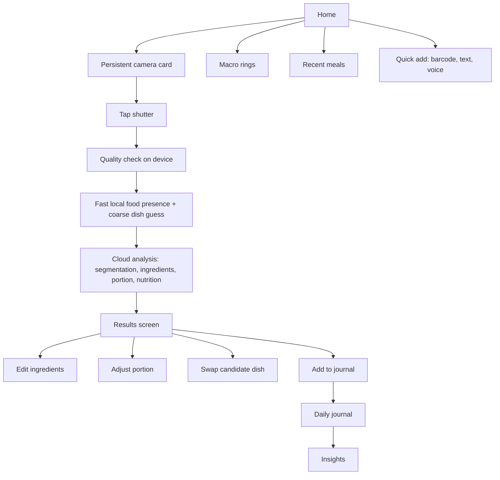
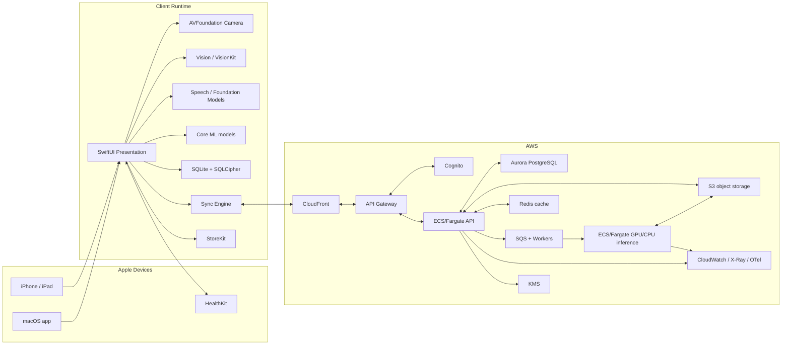
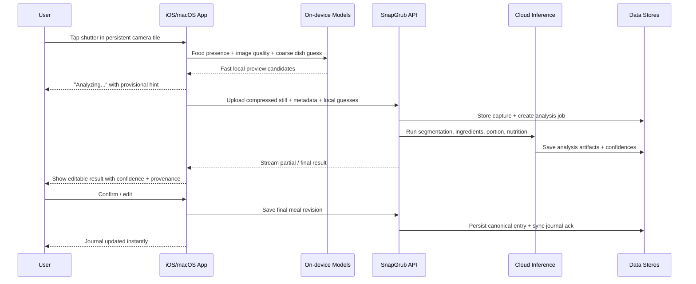
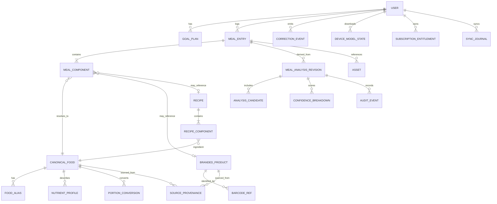

# SnapGrub Technical Architecture Report

## Executive summary

The calorie-tracking market has already moved beyond plain text logging. MyFitnessPal offers Premium “Meal Scan” and barcode logging, Cronometer emphasizes barcode-backed accuracy and micronutrients, MacroFactor supports barcode and label scanning, and newer entrants such as Lifesum, Yazio, and Noom now market multimodal logging that includes photo, text, voice, and barcode input. That means SnapGrub cannot win by adding “AI photo logging” alone; it has to win on a **camera-first interaction model, accuracy transparency, regional food coverage, offline resilience, and premium-quality native Apple UX**. citeturn8search0turn8search1turn8search5turn9search0turn9search1turn9search17

For a native iOS/macOS product, the strongest architectural direction is a **shared Swift codebase with Clean Architecture**, **Core ML for primary on-device inference**, **AVFoundation for the persistent home-camera surface**, **Vision and VisionKit for barcode/OCR**, **Speech for live dictation**, optional **Foundation Models** for structured parsing on supported Apple devices, and an **AWS backend** for sync, heavy inference, subscriptions, telemetry, and model operations. Core ML is explicitly designed for on-device inference and model customization; Vision supports text, barcode, and segmentation tasks; AVFoundation provides the capture architecture for custom camera UI; and Apple’s Foundation Models framework now supports structured output and tool calling on device. AWS gives SnapGrub a coherent server-side stack for authentication, APIs, storage, containerized inference, and key management. citeturn6search0turn6search1turn6search3turn18search9turn30search0turn30search6turn13search0turn27search5turn12search8turn13search11

SnapGrub’s data moat should come from a **hybrid nutrition knowledge graph**, not a single database. USDA FoodData Central is public domain and provides Foundation Foods, FNDDS, and branded-food access; the USDA Global Branded Food Products Database is maintained through a public-private partnership; France’s Ciqual is freely available; Germany’s BLS 4.0 is now open data under CC BY 4.0; and India’s IFCT is authoritative but explicitly not exhaustive for the diversity of Indian foods and appears to carry rights restrictions that require direct licensing review. Open Food Facts is extremely useful operationally, but because its database is under ODbL and share-alike conditions can attach when combined with other databases, it should be treated carefully in a premium proprietary architecture. GS1 Verified by GS1 is better used to verify GTIN identity than as a nutrition source. citeturn33search0turn33search3turn33search4turn33search14turn31search9turn31search10turn31search11turn31search15turn33search12turn33search15turn33search2turn33search13

The biggest technical risk is **portion estimation and mixed-dish decomposition**, especially for Indian and composite Western meals. Public research is improving, but food-portion estimation from a single image remains intrinsically hard; Nutrition5k and MetaFood3D are valuable training/evaluation assets, but neither alone gives enough cuisine breadth for a premium consumer product. The right response is a staged system: **on-device food-presence + coarse dish classification first**, then **cloud segmentation/ingredient reasoning/portion estimation**, and finally **a high-trust edit-and-confirm flow** that treats user correction as a product feature, not a fallback. citeturn25search5turn25search0turn5search0turn5search7turn26search5

The recommended roadmap is therefore: **MVP** focused on camera-first logging, barcode, manual/voice entry, macros, daily journal, core goals, and confidence-aware confirmation; **first release** adds better branded-food coverage, recipe save/reuse, HealthKit sync, and improved image models; **second release** adds richer insights, restaurant/meal templates, better Indian/European dish coverage, and adaptive goals; **third release** adds personalization, on-device language reasoning, and active-learning loops; **fourth release** adds clinician-grade exportability, partner APIs, and large-scale model optimization. The product should behave like a premium utility from day one: fast, calm, explainable, edit-friendly, and visually delightful.

## Roadmap and product differentiation

Based on the supplied mockups, the right product identity is clear: a soft, friendly visual system; minimal friction; and a **persistent “always-ready” camera section on the home screen** that makes snapping food the default behavior. That aligns with where the market is heading, but none of the major competitors combine that interaction model with high-trust auditability and explicitly strong US/Western/European/Indian food coverage.

**Where SnapGrub should beat the market**

| Competitive area | What the market already does | What SnapGrub should do instead |
|---|---|---|
| Photo logging | MyFitnessPal, Lifesum, Yazio, and Noom all market camera-based meal logging. citeturn8search0turn8search12turn9search0turn9search1turn9search17 | Make the camera a persistent home affordance, not a secondary tool. Keep a live preview always visible in a compact top card. |
| Barcode and packaged foods | Cronometer, MyFitnessPal, and MacroFactor all support barcode scanning; MacroFactor also falls back to label scanning. citeturn8search1turn8search3turn8search5turn8search14 | Barcode should resolve via GTIN verification plus product nutrition sources, and transparently show provenance and confidence. |
| Nutrition detail | Cronometer is strong on nutrient depth and trusted data. citeturn8search1turn8search4 | Match macro depth in MVP, then add “why this estimate” and “edited by user / from label / from canonical recipe” provenance. |
| Multimodal entry | Lifesum and Noom now emphasize photo, voice, and text input. citeturn9search0turn9search6turn9search17 | Add all three from the start, but bias the entire information architecture around the photo path. |
| Language and region coverage | MyFitnessPal Meal Scan is currently limited to English users in supported mobile OS versions. citeturn8search0turn8search12 | Build data and evaluation explicitly for American, Western/European, and Indian dishes, and treat region coverage as a first-class KPI. |
| Premium positioning | MacroFactor is fully paid and demonstrates willingness to pay for high-quality nutrition UX. citeturn8search2turn8search17 | Make SnapGrub premium from inception, but justify pricing with delight, speed, explainability, and lower logging burden. |

**Prioritized feature roadmap mapped to technical components**

| Release | Product scope | Core technical components |
|---|---|---|
| **MVP** | Persistent home camera tile; capture still photo; barcode scan; text entry; voice entry; meal confirmation; calories/protein/carbs/fat; daily journal; weight goal setup; streaks; local caching; basic sync; subscription purchase | AVFoundation capture layer, Vision barcode/OCR, Speech transcription, Core ML coarse dish model, SQLite + SQLCipher local store, Sync engine, API Gateway + ECS/Fargate + S3 backend, StoreKit subscriptions |
| **First release** | Better packaged-food resolution; recipe save/reuse; favorites/recent meals; HealthKit sync; improved mixed-dish recognition; nutrition-label OCR fallback; richer edit controls | GTIN product resolver, label OCR pipeline, canonical recipe service, HealthKit integration, improved segmentation/ingredient model, search index |
| **Second release** | Indian/European coverage expansion; restaurant-style meals; adaptive goals; macro adherence coaching; weekly/monthly insight cards | Regional ontology expansion, recipe normalization system, goal engine v2, analytics pipeline, experimentation platform |
| **Third release** | Personalized model ranking; on-device structured meal parsing; smarter suggestions; smartwatch/widget surfaces; stronger offline behavior | Foundation Models structured parsing on supported devices, personalization layer, ranking features, edge model download/compilation, deeper sync conflict handling |
| **Fourth release** | Enterprise/API surfaces; exportable nutrition reports; federated personalization experiments; coach/clinician sharing; partner ingestion APIs | Public partner API, deep audit trail, BAA-ready option if entering covered workflows, federated-learning research path, model governance and drift infrastructure |

**Key screen flow**



The home screen should never force users through a blank dashboard before action. The camera card is the product.

## Clean architecture and system design

The app should be organized as a **shared domain core** plus thin platform shells.

**Recommended module boundaries**

| Layer | Responsibilities |
|---|---|
| **Presentation** | SwiftUI views, navigation, state machines, accessibility, animations, progressive loading, subscription paywall surfaces |
| **Application / Use Cases** | Log meal from photo, log meal from barcode, parse text meal, transcribe voice meal, confirm meal, recalculate macros, sync drafts, compute daily progress |
| **Domain** | Entities such as Meal, MealComponent, FoodItem, Product, NutrientProfile, GoalPlan, ConfidenceScore, AuditEvent; repository protocols; business rules |
| **Data** | Repository implementations, local DB adapters, sync journal, API clients, asset storage, search index access |
| **ML Inference** | On-device model wrappers, batching/pre-processing, post-processing, confidence calibration, model versioning |
| **Infrastructure / Platform** | Camera capture, image compression, network monitoring, keychain, Secure Enclave, file protection, HealthKit, StoreKit, notifications |

This structure follows the spirit of Clean Architecture: business rules should not know whether the food came from AVFoundation, USDA, Open Food Facts, or a cloud model. The UI depends inward; data sources depend inward; and model orchestration remains replaceable.

**Recommended backend topology**

I recommend **AWS as the primary cloud provider** for SnapGrub. Cognito is designed for mobile/web sign-up and sign-in, API Gateway provides managed HTTP APIs with throttling/usage plans, S3 is the image/object store, Fargate runs containerized inference and APIs without cluster management, Aurora PostgreSQL handles transactional workloads, and KMS provides envelope-encryption patterns. AppSync is a viable alternative if the team wants managed GraphQL with offline sync, but for SnapGrub’s versioned meal-analysis flow, a custom REST + delta-sync design is easier to reason about and test. citeturn13search0turn13search1turn13search9turn12search15turn12search8turn12search11turn13search3turn13search18

GCP is a strong second choice if the team is unusually ML-heavy and wants to center the stack on Vertex AI online prediction and Identity Platform/Firebase Authentication. Azure is strongest when the company already has heavy Microsoft enterprise commitments and wants Azure ML managed online endpoints plus Entra/B2C-style identity flows. For an Apple-first premium consumer app, AWS is the most balanced choice. citeturn12search17turn28search8turn28search1turn12search6turn28search2turn28search6

**Deployment diagram**



**Primary capture sequence**



## Data platform and canonical schema

SnapGrub’s nutrition engine should treat foods as a **canonical graph** with four distinct data classes: **generic foods**, **branded products**, **recipes/composite meals**, and **user-authored variants**. The reality underneath current nutrition apps is that generic foods and branded foods obey very different data-quality rules, and recipes introduce a third layer of uncertainty.

**Recommended source strategy**

| Source | Best use | Licensing / acquisition view | Recommendation |
|---|---|---|---|
| **USDA FoodData Central** citeturn33search0turn33search3turn33search7turn33search20 | Generic foods, survey foods, branded linkage, API backbone | Public domain and API-accessible | Use as the foundational generic-food and US-centric baseline |
| **USDA GBFPD / Branded Foods** citeturn24search7turn33search4turn33search11turn33search14 | US and international branded packaged items | Public-private partnership; updated via API | Use as the primary branded-food seed in the US |
| **Open Food Facts** citeturn33search1turn33search12turn33search15 | Global fallback for branded products and barcode metadata | ODbL with attribution and share-alike; combining into a proprietary merged database is legally sensitive | Use as a **look-up/fallback layer**, not as the merged canonical database |
| **GS1 Verified by GS1** citeturn33search2turn33search13turn33search19 | GTIN identity verification | Helps answer “is this product what I think it is?”; not a nutrition database | Use to verify barcode identity and manufacturer provenance |
| **UK CoFID** citeturn1search5turn31search12turn31search16 | UK food composition baseline | Government publication context is favorable, but check dataset-specific reuse details | Use for UK terminology and generic-food normalization |
| **France Ciqual** citeturn31search5turn31search9turn31search17 | French foods and nutrient references | Freely available, but reuse conditions matter | Use through a source-preserving layer; do not silently rewrite or blend beyond permitted terms |
| **Germany BLS** citeturn31search2turn31search10 | German composition data | Now open data under CC BY 4.0 | Use directly, with attribution |
| **India IFCT** citeturn31search11turn31search15 | Indian food composition baseline | Authoritative but not exhaustive; rights review required | Use as an authoritative starting point, then extend with licensed/internal recipe curation |
| **FoodOn / LanguaL / FoodEx2** citeturn24search0turn24search1turn24search2turn24search10 | Taxonomy, synonyms, hierarchy, interoperability | Open standards/ontologies | Use to normalize naming, regions, preparation, and ingredient hierarchies |

**Acquisition strategy**

The cleanest legal strategy is:

- use **USDA + BLS + clearly reusable government/open sources** as the primary canonical substrate,
- keep **Open Food Facts** in a logically separate service or cache used for fallback resolution,
- negotiate or directly confirm reuse terms for **Ciqual** and **IFCT** before embedding transformed records into a paid, proprietary database,
- and fill major gaps with **internally created standard recipes, annotated meal images, and corrected user contributions**.

That matters because Indian and regional European coverage will not be solved by a single public table. IFCT itself notes that it is not exhaustive and that ethnic food composition remains inconsistent and fragmentary. citeturn31search11

**Canonical food schema**

At minimum, every resolved food object should carry:

- `canonical_food_id`
- `source_type` (`generic`, `branded`, `recipe`, `user_custom`)
- `source_system` and `source_record_id`
- `display_name`, `locale_name`, `aliases[]`
- `hierarchy` (`cuisine`, `course`, `dish family`, `ingredient lineage`)
- `preparation_state` (`raw`, `cooked`, `fried`, `baked`, `restaurant-style`, etc.)
- `portion_basis` (`100g`, `serving`, `cup`, `piece`, `medium roti`, `idli`, `katori`, etc.)
- `density_or_conversion_profile`
- `nutrients_per_100g`
- `nutrients_per_serving`
- `confidence` and `provenance`
- `regional_applicability`
- `image_embeddings`
- `barcode_refs[]`
- `recipe_links[]`
- `last_verified_at`

FoodOn, LanguaL, and FoodEx2 are valuable precisely because they give SnapGrub a principled vocabulary for attributes such as processing method, ingredients, food source, and hierarchical category relationships. That makes search, deduplication, and regional expansion materially easier. citeturn24search0turn24search1turn24search2turn24search10

**Recommended normalization pipeline**

1. **Ingest** source records into raw landing tables without destructive edits.  
2. **Standardize nutrients** into a canonical nutrient dictionary.  
3. **Normalize units** into grams-first internal storage, with serving conversion tables.  
4. **Resolve aliases** through synonym/phonetic/locale matching.  
5. **Cluster duplicates** across USDA, branded, and recipe records.  
6. **Assign canonical IDs** and maintain source lineage.  
7. **Generate retrieval assets**: lexical index, vector embeddings, barcode index, recipe graph.  
8. **Record confidence and freshness** on every normalized output.

**Entity-relationship diagram**



**Local persistence recommendation**

For SnapGrub, I would choose **SQLite plus SQLCipher** as the primary local store. SwiftData is attractive and built on proven Core Data technology, and it can sync through CloudKit; however, a camera-heavy nutrition product with custom sync, versioned AI revisions, and deterministic migrations benefits from explicit relational control. Realm’s device-sync path is now deprecated, which removes one of its historic advantages for this use case. Apple’s file protection, keychain, and Secure Enclave should protect local secrets and keys. citeturn14search1turn15search6turn15search2turn15search3turn14search11turn14search16turn21search14turn21search3turn15search11

## ML strategy

SnapGrub should use a **multi-stage model pipeline**, not a single giant end-to-end model. Food logging works best when the system decomposes the task into: presence detection, coarse dish classification, ingredient/region segmentation, portion estimation, OCR, and language parsing.

**Recommended model stack**

| Task | Recommended direction | Why |
|---|---|---|
| Food presence + coarse dish guess | Small on-device classifier using **MobileNetV4** or **MobileViT** converted to Core ML | Both are explicitly mobile-oriented; MobileNetV4 is optimized across mobile accelerators, and MobileViT was designed as a lightweight vision transformer for mobile devices. citeturn23search0turn23search8turn23search1turn23search5 |
| Fine-grained dish and candidate retrieval | Cloud model with food-domain pretraining and cuisine-aware ranking | Broader model capacity matters for visually similar dishes; user sees top candidates, not a single irreversible guess |
| Ingredient segmentation | Distilled segmentation model, optionally bootstrapped from **FoodSeg103** / related pretrained work | FoodSeg103 was built specifically for fine-grained food image segmentation with many ingredient classes. citeturn26search5turn26search13turn26search1 |
| Portion estimation | Cloud regression model using segmentation + monocular depth priors, trained with **Nutrition5k** and 3D assets such as **MetaFood3D** | Single-image portion estimation remains hard; these datasets add depth, weights, and nutrition-linked annotations. citeturn25search5turn25search2turn25search0turn25search18turn5search0 |
| Barcode and nutrition-label OCR | Native Apple barcode/OCR first, cloud fallback only when needed | Vision and VisionKit support barcode and text recognition on device, reducing latency and privacy exposure. citeturn18search1turn18search2turn18search9turn6search5 |
| Text / voice entry parsing | Apple Speech for transcription, then domain parser; optional Foundation Models structured output on supported devices; cloud ASR fallback if needed | Apple Speech supports live transcription and confidence/alternatives; Foundation Models supports structured output; Whisper remains a strong fallback/reference model. citeturn6search2turn30search0turn30search6turn16search0turn16search3turn16search5 |

**On-device versus cloud inference**

| Concern | On-device | Cloud |
|---|---|---|
| First paint / interaction | Best choice | Not suitable |
| Privacy | Best choice | Requires explicit consent and stronger controls |
| Offline availability | Best choice | Not available |
| Large mixed-dish reasoning | Limited | Best choice |
| Portion estimation accuracy | Limited unless heavily distilled | Stronger with larger models and multi-stage reasoning |
| Continuous improvement | Slower rollout | Faster model iteration |
| Battery / thermal | Can be constrained | Offloads compute |

The right product behavior is a **hybrid path**:

- **On-device in under ~300–500 ms**: image quality, food-presence check, coarse candidate dish, lightweight embeddings.
- **Cloud in ~1.5–3.0 s p95**: segmentation, ingredient candidates, portion estimation, recipe mapping, nutrition resolution.
- **User confirmation immediately after**: edit, approve, or retry.

Because SnapGrub is Apple-only, **Core ML should be the production inference target**. Apple documents on-device execution, model compression, and downloading/compiling models after install; this is ideal for keeping the binary lean while still evolving models. TFLite remains strong if an Android port becomes important later. PyTorch’s modern edge answer is **ExecuTorch**; the old PyTorch Mobile path is effectively deprecated. ONNX Runtime Mobile is useful as an interoperability bridge, but not the first choice for an Apple-only consumer app. citeturn6search0turn6search4turn6search12turn6search8turn7search0turn7search7turn7search2turn7search8turn7search9turn7search3turn7search6

**Recommended starting datasets and checkpoints**

| Asset | Use | Adoption note |
|---|---|---|
| **Food-101** citeturn32search2turn32search10 | Early food-domain classification benchmark | Good benchmark, not enough alone for commercial diversity |
| **Food2K** citeturn26search6turn32search5 | Large-scale food pretraining | Use only after licensing review; good for research and feature transfer |
| **Recipe1M+ / Recipe1M** citeturn2search14turn26search3turn26search15 | Image-to-recipe and cross-modal retrieval | Valuable for mapping recognized dishes to structured ingredients/recipes |
| **FoodSeg103** citeturn26search5turn26search13turn26search1 | Ingredient segmentation | Strong seed for composite-food segmentation |
| **Nutrition5k** citeturn25search5turn26search0turn26search4 | Portion/nutrition estimation | Commercially friendlier because data is released under CC BY 4.0 |
| **MetaFood3D** citeturn25search0turn25search1 | Portion/volume understanding | Good complement for 3D-aware training |
| **Khana** citeturn32search0turn32search4 | Indian cuisine classification/coverage benchmarking | Promising, but the project explicitly says it does not own image copyrights; legal review required |
| **UECFoodPix / UECFood256** citeturn32search7turn32search3 | Segmentation and mobile food-recognition references | Non-commercial research restrictions limit direct production use |

**Training pipeline**

A rigorous production pipeline should look like this:

- **Stage one**: bootstrap dish classifier from general image weights and food-domain pretraining.
- **Stage two**: fine-tune by region and cuisine family with hard-negative mining for visually similar dishes.
- **Stage three**: train segmentation and ingredient multi-label heads.
- **Stage four**: train portion regression using segmentation masks, depth priors, and nutritional supervision.
- **Stage five**: calibrate confidence, not just accuracy.
- **Stage six**: distill to on-device models and compress through quantization/palettization.

Evaluation should be segmented by **cuisine**, **lighting condition**, **device camera**, **homemade versus packaged**, and **single-item versus composite meal**. For a paid nutrition product, global top-line accuracy is less useful than **calorie MAE and percent error by meal type and cuisine**.

**Continuous learning loop**

User correction is the cornerstone of the ML system:

- every photo result stores candidate dishes, detected ingredients, inferred portion, and chosen final answer;
- every edit becomes a structured correction event;
- low-confidence/high-edit cases feed active-learning queues;
- newly trained models run as shadow/challenger models before promotion;
- calibration, drift, and correction-rate dashboards are reviewed weekly.

A privacy-preserving future path can include federated learning and secure aggregation. The classic federated-learning and secure-aggregation literature exists for exactly this kind of mobile-data setting, and Apple has published work on federated personalization and on-device personalization systems. I would treat this as **research track work**, not part of the first year’s core delivery. citeturn22search0turn22search1turn22search3

## Backend, sync, offline, and APIs

SnapGrub should be **offline-first**. A native camera-first product that fails when the network blips will feel cheap, not premium.

**Offline behavior should work like this**

- capture and provisional local prediction always work,
- meals can be saved locally as `draft`, `pending_analysis`, or `confirmed_local`,
- images upload opportunistically when on acceptable connectivity,
- server analysis can arrive later and reconcile into an existing local meal draft,
- all state transitions are journaled with idempotency keys.

This is a better fit for a custom sync engine than for direct CloudKit-only or no-sync local persistence. CloudKit is genuinely good at keeping private user data in sync across Apple devices, and SwiftData can integrate with it, but SnapGrub still needs server-side subscriptions, image processing, ranking, analytics, shared product references, and model orchestration. CloudKit works well as a secondary Apple-specific sync option, not as the whole backend. citeturn15search3turn15search7turn15search2turn15search6

**Local DB tables that matter most**

- `meal_capture`
- `analysis_request`
- `analysis_revision`
- `meal_entry`
- `meal_component`
- `canonical_food_cache`
- `barcode_cache`
- `portion_conversion`
- `goal_plan`
- `sync_journal`
- `correction_event`
- `subscription_entitlement`

**Conflict-resolution policy**

The most important rule is that **user-confirmed nutrition beats AI inference**. AI outputs should always remain an editable revision with lineage. If the server later produces a better analysis, the app should present it as “updated suggestion,” never silently overwrite a confirmed user meal.

**Barcode architecture**

Use **Vision/VisionKit** for live barcode capture on-device, then route the decoded GTIN into a resolver pipeline:

1. verify barcode identity with **GS1 Verified by GS1**,  
2. resolve nutrition from **USDA branded / approved source layers**,  
3. fall back to **Open Food Facts** or label OCR if no trusted product record exists,  
4. if all else fails, let the user create a custom product and mark it as user-authored. citeturn18search1turn18search9turn18search17turn33search2turn33search13turn33search4turn33search15

**Voice and text pipeline**

Use Apple Speech for live transcription; add a domain parser that converts utterances like “two idlis with sambar and coconut chutney” into structured slots. On newer Apple devices, Foundation Models can generate structured meal JSON on device; on older devices or low-confidence cases, the app should fall back to a cloud parser. Apple’s Speech framework and Foundation Models framework make this particularly attractive for a native iOS/macOS app. citeturn6search2turn6search14turn30search0turn30search6turn30search8

**Nutrition calculation engine**

The calculation engine must support:

- raw versus cooked variants,
- branded versus generic foods,
- recipe decomposition,
- unit normalization,
- regional household units,
- yield and retention factors,
- multi-serving recipes,
- and revision provenance.

For Indian foods in particular, the engine needs region-aware serving units such as roti, chapati, paratha, katori, ladle, idli, dosa, poori, bowl, and plate-size defaults. That logic belongs in the domain layer, not the UI.

**Goal engine**

The goal engine should support:

- weight loss
- maintenance
- muscle gain
- high-protein
- balanced eating
- non-weight-centric “eat healthier” mode

Use standard resting-energy equations as defaults, while clearly acknowledging that prediction equations are approximations and that measured expenditure is superior when available. The Mifflin–St Jeor equation is a reasonable default for general populations; athlete-specific and edge cases need more caution. The app should nudge users toward calibration using actual weight trends and adherence data instead of pretending the initial equation is ground truth. citeturn17search0turn17search2turn17search7

**Illustrative API contract**

```yaml
openapi: 3.1.0
info:
  title: SnapGrub API
  version: 1.0.0
paths:
  /v1/analyze/photo:
    post:
      summary: Create a meal analysis job from a captured image
  /v1/analyze/text:
    post:
      summary: Parse text or voice-transcribed meal descriptions
  /v1/products/lookup/{gtin}:
    get:
      summary: Resolve barcode to verified product and nutrition result
  /v1/meals:
    post:
      summary: Create or confirm a finalized meal entry
  /v1/meals/{mealId}:
    patch:
      summary: Edit a meal and create a new revision
  /v1/sync/push:
    post:
      summary: Push client-side journaled mutations
  /v1/sync/pull:
    get:
      summary: Pull deltas since last sync token
  /v1/subscriptions/entitlements:
    get:
      summary: Resolve paid-tier entitlements
  /v1/billing/app-store/notifications:
    post:
      summary: Receive App Store Server Notifications V2
```

## Security, privacy, observability, and monetization

SnapGrub is a consumer nutrition app, so it is **not automatically a HIPAA-covered application**. HIPAA obligations arise when a company acts as, or on behalf of, a covered entity or business associate handling protected health information. That means SnapGrub can launch as a consumer product without full HIPAA scope, but if it later offers clinician or employer integrations, the architecture should be able to evolve toward stronger compliance boundaries. GDPR still matters immediately for EU users because it grants rights such as erasure and portability. citeturn11search0turn11search4turn11search8turn11search13turn11search9

**Client security controls**

Use:

- **ATS / HTTPS everywhere**, because Apple’s App Transport Security requires secure network connections and enforces minimum security expectations,
- **Keychain** for tokens and small secrets,
- **Secure Enclave** for asymmetric keys where appropriate,
- **App Attest** for sensitive server endpoints such as image-analysis requests and entitlement refresh,
- **file protection** plus local DB encryption. citeturn21search1turn21search5turn21search6turn21search14turn21search3turn21search15turn21search0turn21search16turn14search16

**Server security controls**

Use:

- Cognito user pools for auth,
- API Gateway throttling and usage plans,
- KMS-backed envelope encryption,
- S3 bucket separation for raw uploads versus derived artifacts,
- PII minimization in logs,
- signed URLs for image upload/download,
- and short retention for unconfirmed raw images.

AWS’s API Gateway throttling and usage-plan features are relevant here, but AWS itself warns that usage plans should not be the sole cost-control mechanism; pair them with budgets and WAF/risk controls. citeturn13search1turn13search9turn13search13turn13search3turn13search11

**Privacy posture**

SnapGrub should default to:

- opt-in telemetry for meal-image retention beyond operational need,
- opt-in contribution of corrected meal pairs for model improvement,
- granular permissions for HealthKit reads/writes,
- easy export and deletion flows,
- no image use for training unless explicitly permitted,
- and an App Store privacy label that is conservative and continuously maintained. Apple requires accurate privacy-practice disclosures in App Store Connect. citeturn11search3turn11search7turn29search0turn29search2turn29search12

**Auditability and explainability UI**

Every result should show:

- dish confidence
- ingredient confidence
- portion confidence
- nutrient provenance
- source of truth (“from barcode label,” “from canonical recipe,” “estimated from image”)
- and an explicit “fix this” path

This is where SnapGrub can outperform competitors on trust.

**Observability**

Use OpenTelemetry for application instrumentation and export traces/metrics/logs into CloudWatch/X-Ray or your preferred backend. That lets the team connect mobile request flows to API traces and inference latency. For feature release control, use a feature-flag platform such as LaunchDarkly or PostHog. Both support feature flags; LaunchDarkly is stronger for mature staged rollouts, while PostHog is attractive for integrated product analytics and experimentation. citeturn19search0turn19search4turn19search16turn19search1turn19search5turn19search2turn19search10turn19search3turn19search11turn19search19

**CI/CD and release strategy**

For Apple delivery, use Xcode Cloud or an equivalent CI system to build, test, and distribute prerelease apps. TestFlight is the obvious beta path for iOS/macOS, and macOS binaries distributed outside the App Store must be notarized. For billing, use StoreKit auto-renewable subscriptions and App Store Server Notifications V2 on a TLS-secured endpoint. Test subscriptions in TestFlight’s sandbox-backed environment. citeturn20search2turn20search6turn20search10turn20search0turn20search4turn20search1turn20search5turn11search10turn11search14turn20search3turn20search11turn20search15turn20search19

## Delivery plan

**Cloud and inference cost guidance**

These are engineering estimates, not price quotes. AWS pricing is pay-as-you-go across Lambda, Fargate, S3, Cognito, API Gateway, Aurora, and OpenSearch, and AWS provides pricing pages plus a calculator to refine these scenarios. citeturn12search0turn12search3turn12search8turn12search11turn27search0turn27search1turn27search3turn27search14turn12search16

| Scenario | Assumptions | Estimated monthly cloud range | Main tradeoff |
|---|---|---:|---|
| **Low scale** | early beta / tens of thousands of users, modest image volume, mostly CPU inference | **low four figures USD** | Fine for MVP and first paid launch |
| **Medium scale** | strong paid traction, heavier branded-food usage, more photo analyses, partial GPU use | **mid four to low five figures USD** | Need cost controls on image retention and heavy-analysis frequency |
| **High scale** | large consumer app with frequent photo logging and high retention | **high five figures and above** | Cloud inference dominates unless more work shifts on device |

The biggest spend drivers will be:

- image storage and egress,
- heavy cloud inference,
- search/index infrastructure,
- and long retention of raw photo assets.

The best cost lever is a product decision: **only run expensive cloud analysis when the on-device pipeline cannot confidently resolve the meal**, and aggressively expire raw images once the final meal revision is confirmed unless the user explicitly opts in to keep them.

**First six months**

| Sprint window | Deliverables |
|---|---|
| **Month one** | finalize domain model; build camera-first shell; local DB schema; meal entities; basic AVFoundation capture; subscription shell |
| **Month two** | persistent camera home card; local meal drafts; barcode scanning; manual text entry; journal/day summary; backend skeleton |
| **Month three** | photo upload pipeline; coarse on-device classifier; first cloud analysis service; editable confirmation screen; sync journal |
| **Month four** | branded-food resolver; USDA ingestion; macro engine; goal engine; retries/caching/offline support; TestFlight alpha |
| **Month five** | voice transcription; OCR label fallback; first confidence/provenance UI; analytics and feature flags; HealthKit read/write |
| **Month six** | performance pass; subscription entitlements; security hardening; end-to-end tests; beta release; first regional food expansion batch |

**Twelve- to eighteen-month roadmap**

- **Months seven through nine**: improve mixed-dish recognition, favorites, saved meals, recent meals, better product matching, richer insights, stronger macOS polish.
- **Months ten through twelve**: expand Indian and European food coverage; add restaurant-style composite meal handling; calibrate goal engine using weight trends; introduce challenger models and drift dashboards.
- **Months thirteen through eighteen**: on-device structured language parsing with Foundation Models where available; deeper personalization; watch/widget surfaces; export/reporting; partner or clinician workflows if strategy justifies them.

**Open questions / limitations**

- The exact legal reuse posture for some external food-composition sources, especially **IFCT** and transformed reuse of **Ciqual**, should be confirmed directly before commercial embedding. citeturn31search15turn31search17
- Several useful image datasets, including **Khana** and some older food datasets, are excellent for research but not obviously production-safe for commercial model training without rights review. citeturn32search0turn32search7
- Portion estimation for mixed dishes remains the hardest ML problem in the stack; SnapGrub should plan product UX around correction and confidence rather than assume camera-only perfection. citeturn25search5turn25search0turn5search7

The most important single decision is this: **build SnapGrub as a fast, camera-first, revision-based nutrition system, not as a single-shot AI guessing app**. If the architecture preserves provenance, confidence, local-first responsiveness, and a clean canonical food graph, the product can improve continuously without eroding trust.