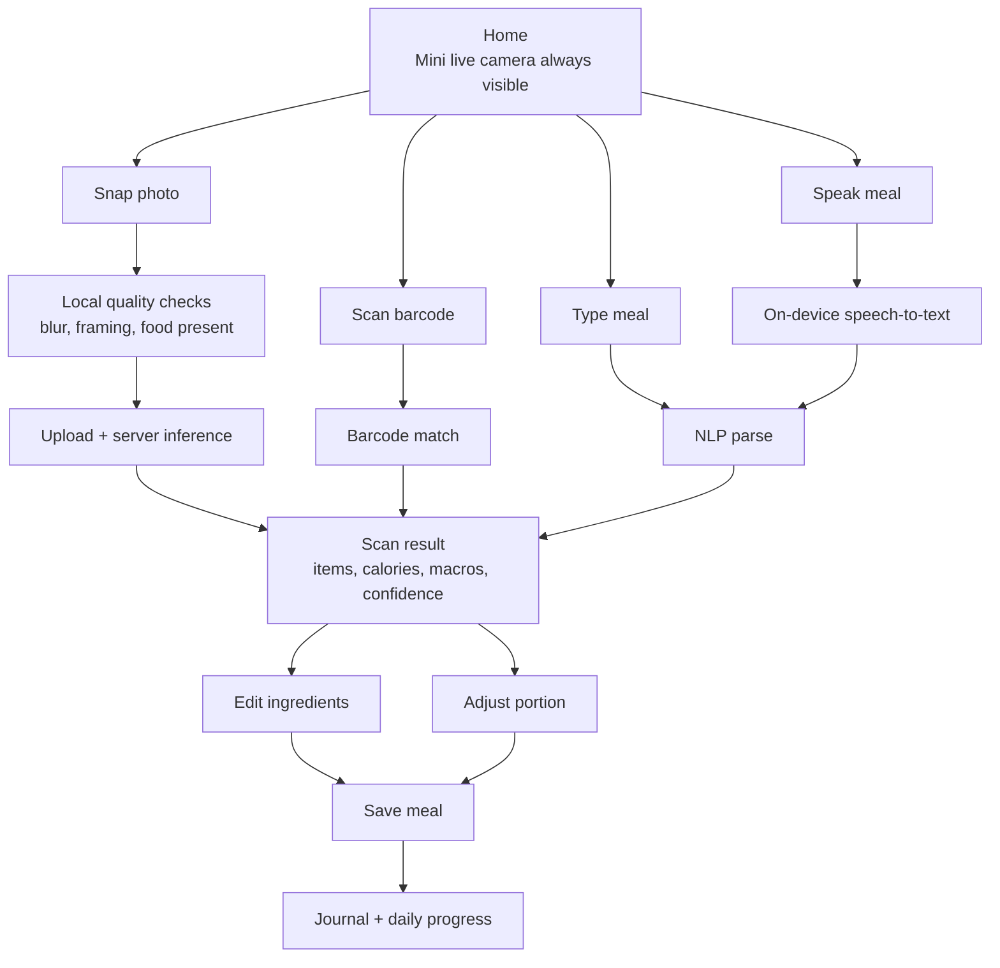
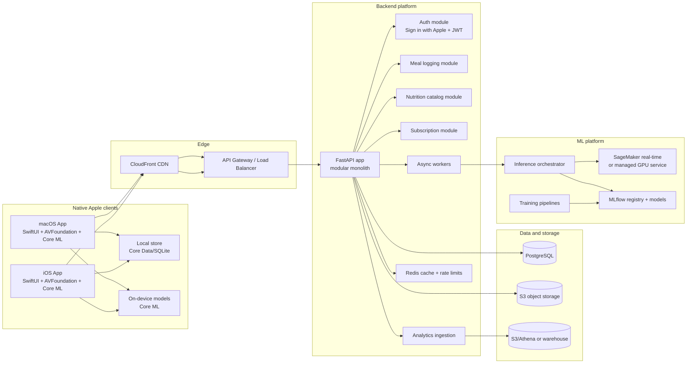
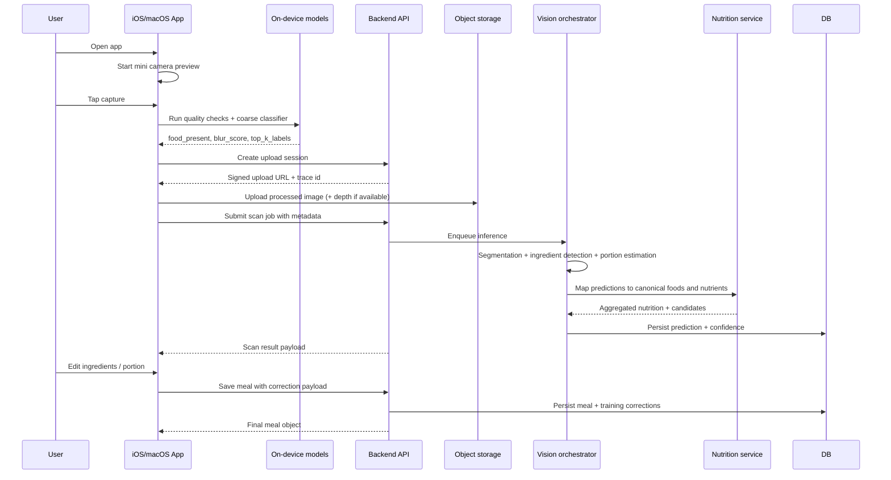
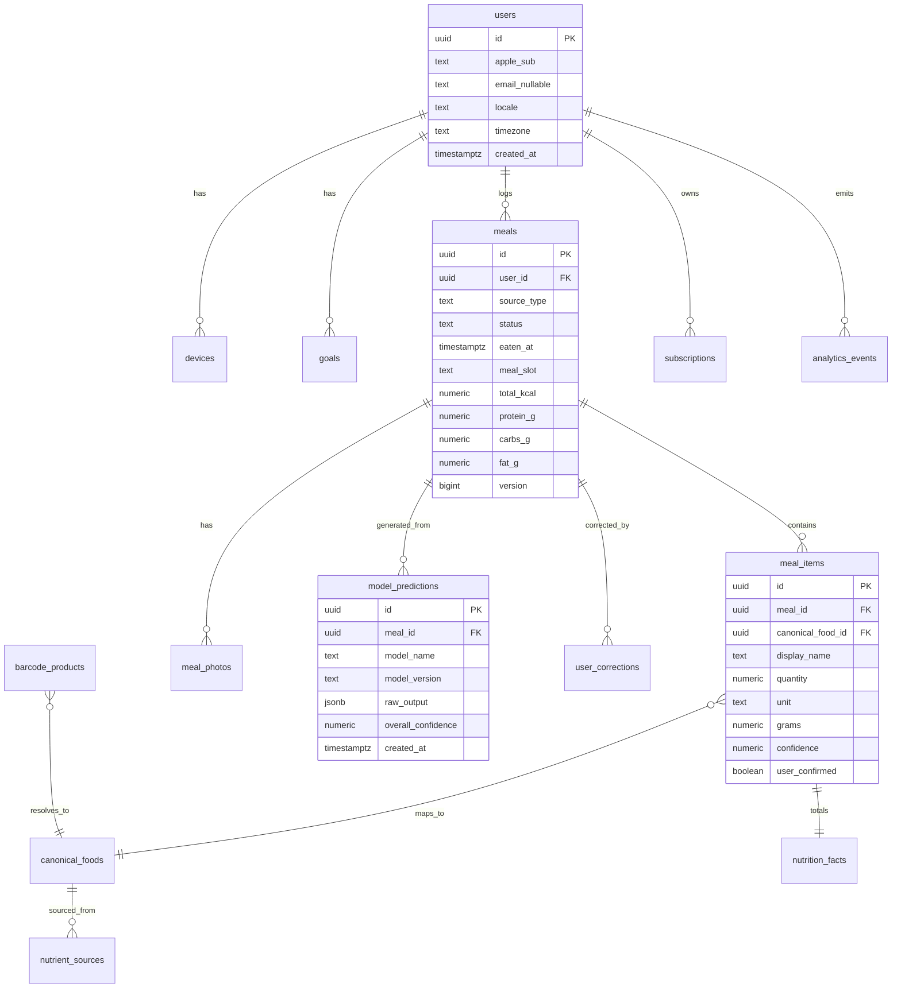

# SnapGrub technical solution architecture

## Executive summary

SnapGrub should be built as a **camera-first, premium, native Apple app** whose core promise is not merely “track calories,” but **log meals faster than manual competitors while being more trustworthy about ingredients, portions, and uncertainty**. The right architectural posture is a **cleanly modular native iOS/macOS app** with **offline-first local persistence**, **on-device pre-inference for responsiveness and privacy**, and **server-side vision + nutrition orchestration for final accuracy**. The fastest way to ship with a small core team is a **modular monolith backend** with hard service boundaries, not a full microservice estate on day one. citeturn43search10turn43search13turn21search2turn21search14turn14search0

The single most important product decision is to make the **home screen permanently camera-available**: a live mini-camera panel at the top, with one-tap capture as the default action. Barcode, text, and voice should be treated as **fallbacks**, not peers. That UX is feasible on Apple platforms with `AVFoundation` and `VisionKit` barcode/text scanning, while speech fallback can stay private by requesting on-device recognition where supported. citeturn22search1turn22search3turn22search0turn23search0turn23search4turn23search16

For machine learning, the winning approach is **hybrid inference**. On device, run lightweight models and heuristics for: food-vs-nonfood gating, framing quality, blur/lighting checks, coarse food suggestions, barcode scanning, and voice transcription. On the server, run the heavier pipeline for: multi-food segmentation, ingredient detection, portion estimation, nutrition matching, and confidence scoring. Apple’s Core ML stack is the primary on-device runtime; train mainly in PyTorch or TensorFlow, then convert to Core ML using `coremltools`. Turi Create is useful for fast prototyping, but it should not be the long-term training backbone for SnapGrub’s full food-understanding stack. ExecuTorch and TFLite are useful for experiments or portability, but for a native Apple app, Core ML should remain the production runtime. citeturn43search0turn43search4turn43search9turn43search21turn8search2turn8search5turn8search11turn8search3turn9search0turn9search6

For nutrition data, **USDA FoodData Central** should be the canonical base for U.S. generic foods and many branded foods because it is public-domain, official, downloadable, and API-accessible. **Open Food Facts** should be the primary global packaged-food supplement because of broad barcode coverage, but its data is user-contributed and explicitly not guaranteed accurate, so SnapGrub needs trust scoring and reconciliation logic. For Europe, **EuroFIR/FoodEXplorer** is the strongest official food-composition option, but it is membership/licensing based. For India, the **Indian Food Composition Tables** are authoritative, but the ecosystem is fragmented and official digital/commercial reuse details need legal confirmation; image datasets for Indian dishes still lag behind Western/Japanese datasets, so SnapGrub should plan a proprietary data-collection and correction loop from the beginning. citeturn25view0turn32search0turn32search7turn24view0turn24view1turn28view0turn24view4turn27view0turn7search13turn36search3turn36search4turn36search7

The hardest technical problem is **portion estimation**, not classification. Google’s Nutrition5k results make the tradeoff clear: predicting calories per gram is much easier than predicting total calories from a dish image, and adding depth materially improves error. That strongly argues for a staged product: ship MVP with **confidence-aware server-side estimates plus fast user correction UX**, then improve accuracy with **depth capture where available**, **user corrections as labels**, and **active-learning retraining**. citeturn42view1turn42view4turn10search18turn10search3

My strongest recommendation is this: **build an opinionated MVP that wins on speed, confidence, and editability**. Do not try to “solve food” in v1. Build the correction loop, data contracts, model registry, and measurement system first. Those will be the durable moat.

## Product roadmap and user flows

### Roadmap priorities

The premium positioning only works if the MVP already feels dramatically better than manual trackers. That means the MVP should optimize for **speed to first log**, **clarity of uncertainty**, **low-friction corrections**, and **beautiful progress feedback**. Features that create sprawl without improving the core loop, such as social feeds, coaching chat, or meal plans, should wait. Barcode, voice, and text entry belong in MVP, but only as fallback paths that preserve the camera-first mental model. The nutrition stack also needs to visibly support American, Western/European, and Indian foods from the start, even if the confidence distribution differs by cuisine. citeturn25view0turn24view0turn28view0turn27view0turn36search3turn36search4

| Release | What to ship | Why this release exists | Must win metric |
|---|---|---|---|
| **MVP** | Camera-first home, photo meal capture, barcode scan, text entry, voice entry, server-side meal understanding, ingredient edit, portion adjust, daily calorie/macros, journal/history, goals, subscriptions, offline queue, confidence disclosure | Prove the core loop works and users trust the result enough to pay | Median time from app open to saved meal under 12 seconds |
| **v1** | Better packaged food matching, favorite meals, meal templates, restaurant dish search, HealthKit weight/activity import, deeper correction UI, better Indian/European aliasing, background model updates | Improve retention and trust | Week-4 retention and correction rate down |
| **v2** | Depth-assisted portion estimation where supported, macOS power-journal mode, recipe import, photo library backfill, weekly micro-insights, habit streaks | Increase estimation quality and premium feel | Calorie MAE improvement on verified sets |
| **v3** | Personalized nutrition engine, meal suggestions, pantry/recipe intelligence, expanded restaurant/menu parser, coach summaries | Add differentiated intelligence after reliable logging exists | Subscription conversion uplift |
| **v4** | Real-time video logging, shared family accounts, clinician/export mode, advanced anomaly detection, more on-device inference | Scale into “ultimate tracker” territory | Power-user retention and enterprise/coach use cases |

### Core user flows

The primary flow should be: open app → live camera visible immediately → snap meal → see recognized ingredients, portion estimate, calories/macros, and confidence → optionally edit ingredients or adjust portion → save. The UI should never force the user into a full-form data entry state unless recognition fails. That is the feature moat. Apple’s capture frameworks support a polished live-camera entrance, while barcode and text scanning are available through the same camera surface when needed. citeturn22search1turn22search3turn22search17

The secondary flows are fallback flows, but they must still feel premium. Barcode flow: open camera, move to package, detect UPC/EAN, match against packaged-food databases, then normalize nutrients per serving and per 100 g. Text/voice flow: user types or speaks “2 rotis, dal, paneer tikka” and the parser resolves entities, units, and likely preparation form, then shows an editable ingredient list before save. Because Edamam and Nutritionix both support food NLP/logging-style requests, they are useful as selective backstops, but their licensing and caching restrictions make them poor choices as the canonical long-term datastore. citeturn24view6turn24view7turn24view5turn29search1turn29search0

The trust-building flow is the differentiator after the first week of use. Every recognition result should carry a compact confidence explanation such as “high confidence on grilled chicken; medium confidence on sauce; portion estimated visually.” Users should be able to tap into ingredient rows, change the mapped food, adjust grams/servings, or split merged items. Every confirmed correction should feed a structured correction event to the backend for active learning. Nutrition5k’s findings are a reminder that portion is the unstable variable; SnapGrub should therefore optimize correction UX as seriously as model quality. citeturn42view1turn42view4turn41view0

### Wireframe flow guidance



## System architecture

### Recommended architecture shape

For MVP and early scale, the right backend shape is a **modular monolith** with strong internal boundaries, backed by asynchronous inference jobs. That keeps cognitive load, deployment complexity, and incident surface area reasonable for a six-person core team. The modules should be separated by package boundaries and API contracts, so the vision inference path, nutrition catalog path, subscription path, and meal-log path can later be extracted if traffic or team structure demands it. FastAPI is a strong fit because it generates OpenAPI definitions natively, has first-class type-driven request models, and includes standard OAuth2/JWT patterns. citeturn13search24turn13search0turn14search12turn14search2

For cloud, AWS is the strongest default recommendation for this app because the required primitives line up cleanly: S3 for images, CloudFront for CDN, RDS PostgreSQL for canonical data, Redis for cache/rate-limits, ECS or EKS for the API, and SageMaker for managed model hosting. SageMaker gives three useful hosting modes: real-time endpoints for low-latency inference, serverless inference for spiky workloads that can tolerate cold starts, and asynchronous patterns for large payloads. Vertex AI and Azure ML are both viable, but with this team and this product, AWS reduces integration fragmentation. citeturn21search2turn21search5turn21search14turn21search3turn21search12turn21search1turn21search4

### High-level component diagram



### Photo logging sequence



### Data model



### On-device versus server inference

On-device inference should be used whenever the purpose is **immediate UX feedback, privacy preservation, or offline continuity**. Server inference should be used whenever the purpose is **higher accuracy, cross-model orchestration, or access to larger nutrition graphs**. In practical terms, that means: on device for preview and cheap classifiers; server for the final meal object. A useful mental model is “the phone makes the UI feel instant; the server makes the log trustworthy.” Apple’s stack is explicitly optimized for fast on-device inference, while Core ML Tools supports direct conversion from both PyTorch and TensorFlow. citeturn43search10turn43search9turn43search0turn43search4

The biggest tradeoff is latency versus privacy versus accuracy. Sending every full-resolution food photo to the server will improve model flexibility, but it creates privacy and cost pressure. Keeping everything on-device would be ideal in theory, but today’s portion-estimation and multi-food understanding problem is still substantially easier with richer server models and canonical nutrition services. The balanced strategy for SnapGrub is: strip EXIF, crop aggressively, downscale before upload, upload only when needed, and allow users to opt out of cloud photo retention. For supported iPhones, depth-assisted capture should be requested opportunistically; otherwise the server should treat portion as a confidence-weighted estimate and encourage quick correction. citeturn10search18turn10search3turn42view4

## Data platform and machine learning

### Nutrition, barcode, and recipe data sources

The production data stack should be layered rather than singular. No single source will give SnapGrub reliable coverage across generic foods, packaged barcodes, restaurant dishes, Western/European variants, and Indian household foods. USDA should be the official base layer for U.S. foods, Open Food Facts should fill global packaged-food gaps, EuroFIR should fill validated European composition gaps if licensing permits, and Indian composition data should be normalized from ICMR-NIN sources with an explicit alias/cooking-yield layer on top. Commercial APIs are best used as targeted fallback services, not as the canonical master database. citeturn25view0turn32search0turn24view0turn28view0turn27view0

| Source | Best use | License / terms | Coverage notes | Quality risks | Recommendation |
|---|---|---|---|---|---|
| **USDA FoodData Central** | Canonical U.S. generic foods; many branded foods; API + downloadable snapshots | Public domain, CC0; API key required; default 1,000 req/hour/IP citeturn25view0turn32search2 | Five data types: Foundation, Experimental, FNDDS, Branded, SR Legacy citeturn32search0turn32search7 | Branded freshness varies; regional home-cooked dishes limited | **Primary canonical nutrition source** |
| **Open Food Facts** | Global barcode/package fallback; community enrichment | ODbL/database contents licenses; images CC BY-SA; user-contributed data with no accuracy guarantee citeturn24view0 | 1.7M+ products, 150 countries, 25k+ contributors citeturn24view1 | Data completeness and correctness uneven | **Primary packaged-food supplement** |
| **EuroFIR / FoodEXplorer** | Validated European food composition data | Membership / annual licensing fees; commercial use supported through licensing citeturn28view0turn24view4 | 28 countries, 52k+ products in harmonized datasets citeturn28view0 | Licensing friction; not a drop-in open API | **Strong option for European expansion** |
| **Indian Food Composition Tables** | Canonical Indian ingredient and food composition mapping | Official publication; digital/commercial embedding details need legal confirmation citeturn27view0turn7search13 | Official sources cite either 528 key foods or 586 varieties citeturn7search13turn7search3 | Digital reuse ambiguity; recipe coverage still requires derivation | **Use as authoritative Indian base after legal review** |
| **Nutritionix Track API** | U.S. fallback for consumer food logging/search | Commercial API; Track API aimed at logging use cases citeturn24view5 | Good packaged and restaurant support | Vendor lock-in, cost, limited control | **Selective fallback only** |
| **Edamam Food DB + Nutrition Analysis** | Recipe parsing, NLP fallback, food search, UPC fallback | Commercial; attribution required; restrictive caching terms; only limited cached fields on some paid plans citeturn24view6turn24view7turn29search1turn29search0 | ~900k foods, 615k UPCs; supports NLP and vision-based endpoints citeturn29search1 | Cannot become your durable canonical DB | **Recipe/NLP fallback, not core master** |

The preprocessing pipeline for these sources should normalize everything into a **canonical food graph** keyed by internal IDs, not external provider IDs. All nutrient values should be stored on a **per-100 g basis** plus provider-native serving mappings. Units, aliases, cooking states, and regional names should be normalized early. Open Food Facts products should carry trust labels based on completeness, last-updated recency, label-image availability, and agreement with USDA or brand labels where overlap exists. Indian dishes should use a recipe-derived layer that maps household dish names to common ingredient compositions and yields, because official tables focus more on ingredients and discrete foods than the full long tail of regional prepared dishes. citeturn24view0turn25view0turn27view0turn28view0

### Vision datasets

The training data should be deliberately mixed, because food understanding is really four tasks: **classification, localization, segmentation, and nutrition/portion regression**. No one dataset solves all four. Food-101 is still useful for broad visual pretraining; UEC datasets remain useful for localization and segmentation; Nutrition5k is the most important open dataset for nutrition/portion work; Recipe1M+ is valuable for language and multimodal priors; Indian coverage still requires deliberate supplementation and eventually first-party data collection. citeturn33view4turn38view0turn34view0turn33view5turn36search3turn36search4turn36search7

| Dataset | What it gives you | Size / annotation | License / access | Notes for SnapGrub |
|---|---|---|---|---|
| **Food-101** | Broad food classification pretraining | 101,000 images across 101 classes; noisy training set, clean test set citeturn33view4turn6search16 | Public download; terms are research-oriented, commercial posture should be reviewed | Best as initial classifier pretraining, not portion ground truth |
| **UEC-Food256** | Multi-food localization priors | 256 classes; each class has >100 images; bounding boxes available citeturn37search4turn37search5 | Dataset page should be reviewed for usage terms | Useful for multi-item plate detection priors |
| **UECFoodPix / UECFoodPixComplete** | Pixel masks for food segmentation | 10,000 images total, 103 class labels, segmentation masks; reported mIoU baseline up to 0.555 on Complete citeturn38view0 | **Non-commercial research only** citeturn38view0 | Good for internal research prototypes; legal review required before production training usage |
| **FoodSeg103 / FoodSeg154** | Ingredient-level segmentation | Repo says 7,118 images / 104 classes for FoodSeg103; project page notes 9,490 images / 154 classes with extension dataset citeturn33view1turn33view0 | Repo under Apache 2.0 citeturn33view1 | Best open fine-grained ingredient segmentation starting point |
| **Nutrition5k** | RGB-D + ingredient masses + macros | 5,006 plates; four side videos; overhead RGB-D; 181.4 GB download citeturn34view0 | CC BY 4.0, commercially reusable with attribution citeturn34view0 | Best open source for portion/nutrition regression; western cafeteria bias |
| **Recipe1M+** | Recipe-language and multimodal priors | >1M recipes and 13M food images citeturn35search2 | Access-controlled; repo says dataset access granted only for research purposes to universities/research institutions citeturn33view5 | Strong for research pretraining; not a production content store |
| **IndianFood10 / IndianFood20** | Detection/localization for common Indian platter foods | 12k+ images for 10 classes, extended by 10 more classes citeturn36search7 | Paper/resource terms must be checked | Useful bootstrap, narrow class coverage |
| **IndianFoodNet** | Indian multi-food detection/classification | 5,500+ images, 30 classes, 5,000+ annotations citeturn36search4 | Paper-level availability; commercial status unclear | Useful but small for production-grade generalization |
| **Khana** | Newer broad Indian benchmark | ~131k images, 80 labels, Indian cuisine taxonomy citeturn36search3 | Research-paper benchmark; production licensing must be verified | Promising Indian expansion source |

The gap is obvious: the open data stack is strongest for generic Western/Japanese food recognition and much weaker for **Indian prepared dishes**, highly regional dishes, mixed gravies, and home-cooked serving variation. That means SnapGrub should treat user corrections as a first-class proprietary asset. The product must capture corrected ingredient substitutions, portion changes, and accepted confidence bands in a way that can be fed back into training. That is how the app stops being a “thin wrapper on public data” and becomes its own system. citeturn36search3turn36search4turn36search7turn41view0

### Model stack

The model stack should be split into four production models and one utility layer.

| Layer | MVP recommendation | Why |
|---|---|---|
| **On-device quality / coarse recognition** | MobileNetV3 or EfficientNet-Lite classifer converted to Core ML; small food/non-food and top-k dish model | Fast enough for preview, can be quantized/pruned, good UX gate |
| **Server dish detection / segmentation** | Transformer or hybrid segmentation model fine-tuned from FoodSeg103 / UEC / proprietary data | Better handling of mixed plates and occlusion |
| **Ingredient + food mapping** | Multi-label classifier plus canonical-food resolver | Separates visual recognition from nutrition identity |
| **Portion estimation** | Depth-assisted regressor when depth exists; monocular-depth + size priors + uncertainty when it does not | Portion is the real hard problem |
| **Text/voice parser** | Rule + NLP hybrid using canonical food graph; optional Edamam/Nutritionix fallback | Robust handling of “2 rotis, dal, paneer” style inputs |

For training frameworks, use **PyTorch** as the primary research/training framework, optionally TensorFlow for teams already using TF vision tooling, and then convert final Apple-serving models to Core ML with `coremltools`. Apple’s conversion path explicitly supports direct conversion from PyTorch and TensorFlow. Turi Create is best reserved for quick internal prototypes or very small custom tasks. PyTorch’s current edge story is ExecuTorch, but for a native Apple app, Core ML remains the better production runtime because it is the OS-native path. citeturn43search0turn43search4turn43search9turn43search21turn8search3turn8search12turn8search11

For optimization, quantize aggressively on device, but do it selectively. Post-training quantization is appropriate for preview classifiers; quantization-aware training is appropriate for the food/non-food gate and compact coarse classifier if accuracy loss is noticeable. TensorFlow’s model optimization docs and Apple’s Core ML guidance both support the general pattern of compressing for size, latency, and power. For SnapGrub, the practical target should be: preview model package under ~20–30 MB; inference budget under ~100–150 ms for the gate model on modern iPhones; and all capture-time inference running on throttled frame sampling rather than every frame. citeturn9search3turn9search11turn9search13turn43search15turn43search19

### Expected performance targets

The public research baseline sets realistic expectations. Nutrition5k shows that **portion-independent** calorie prediction can be much more accurate than **direct total-calorie** prediction, and that adding depth substantially improves direct prediction. In their published baseline, direct 2D calorie prediction had 26.1% MAE, while adding depth cut that to 18.8%; a volume-scalar variant reached 16.5% calorie MAE. Human visual portion estimation was also poor, with non-nutritionists averaging 53% error and nutritionists 41% in their study. Those numbers are not direct SnapGrub targets, but they are the best public evidence for why your UX must expose uncertainty and support correction. citeturn42view1turn42view2turn42view4

A sensible internal launch target for SnapGrub is not a single universal number. It should be tiered. For single-item clear meals, aim for **high-confidence ingredient detection and low edit rate**. For mixed salads, curries, biryanis, casseroles, and sauced dishes, aim for **reasonable first estimate + excellent correction UX**. Measured product targets should therefore include: accepted-without-edit rate, average number of edits per saved meal, correction type distribution, calibration error by cuisine, and cuisine-specific calorie MAE on verified holdout sets.

### ML pipeline and feedback loop

The training system should be formalized from day one. Use **MLflow** for experiment tracking and model registry, and use **DVC** if the team wants Git-adjacent data and pipeline versioning. MLflow already gives experiment tracking, model packaging, lineage, and model registry primitives; DVC is particularly useful if your team prefers data and pipeline definitions living close to source control and S3-backed remotes. citeturn16search3turn16search0turn16search21turn20view0

The production feedback loop should look like this:

1. Capture prediction and confidence with every scan.
2. Capture all user corrections in structured form.
3. Route low-confidence or high-disagreement examples into a review queue.
4. Sample underrepresented cuisines and classes for annotation.
5. Retrain weekly or biweekly from versioned datasets.
6. Shadow-test new models on replay traffic and fixed holdout sets.
7. Roll forward only if both model metrics and product metrics improve.
8. Keep rollback immediate via pinned model versions.

Drift monitoring should be based on **correction rates, schema-validity rates, class-frequency shifts, confidence calibration shifts, and cuisine mix drift**. Traditional accuracy metrics alone are not enough because the business outcome is user trust.

## Apple app clean architecture

### Architectural stance for iOS and macOS

Use a **single shared domain/data codebase** with separate iOS and macOS presentation shells. SwiftUI is the correct UI layer for both platforms, but the app should lean on **Swift Concurrency** for almost all new async logic. Use Combine sparsely, mainly at integration boundaries where Apple frameworks still expose publisher-style streams or when bridging into legacy reactive flows. The codebase should favor explicit dependency injection, immutable domain models, use-case objects, repository protocols, and isolated actors for stateful services such as camera capture, sync queues, and upload managers. citeturn43search22turn43search13

The local storage choice should be **Core Data backed by SQLite**, not Realm, for this app. The reason is not philosophical. It is operational: Core Data integrates cleanly into Apple platforms, supports mature background persistence patterns, and has a first-party sync bridge to CloudKit if you ever need it. But for SnapGrub, I would **not** make CloudKit the canonical sync mechanism in MVP. Apple’s container mirrors Core Data stores into a private CloudKit database, which is excellent for Apple-only personal sync, but it becomes a poor fit once you also have a server-side truth for subscriptions, analytics, model feedback, and server-generated meal understanding. In other words: use Core Data locally, server sync as the canonical cross-device sync, and keep CloudKit off the critical path initially. citeturn10search0turn10search22turn10search4

### Recommended project structure

```text
SnapGrub/
  Apps/
    SnapGrubiOS/
      App/
      Resources/
      Config/
    SnapGrubMac/
      App/
      Resources/
      Config/

  Packages/
    AppComposition/
      Sources/
        CompositionRoot/
        Environment/
        FeatureFlags/

    DesignSystem/
      Sources/
        Theme/
        Components/
        Tokens/
        Icons/
        Motion/

    Platform/
      CameraKit/
      BarcodeKit/
      VoiceKit/
      VisionInference/
      Networking/
      Persistence/
      SyncEngine/
      SecurityKit/
      AnalyticsKit/

    Domain/
      Core/
        Entities/
        ValueObjects/
        Errors/
      Auth/
        UseCases/
        Repositories/
      MealLogging/
        UseCases/
        Repositories/
      Nutrition/
        UseCases/
        Repositories/
      Journal/
      Insights/
      Subscription/

    Data/
      AuthData/
        Remote/
        Local/
        RepositoryImpl/
      MealData/
        Remote/
        Local/
        RepositoryImpl/
      NutritionData/
        Remote/
        Local/
        RepositoryImpl/
      SubscriptionData/
      AnalyticsData/

    Features/
      HomeCamera/
        Presentation/
        ViewModels/
        Views/
      ScanResult/
      MealEditor/
      Journal/
      Insights/
      Onboarding/
      SubscriptionPaywall/
      Settings/

  Tests/
    Unit/
    Integration/
    UITests/
    Snapshot/
```

### Layering and conventions

The presentation layer should depend on **use cases**, not repositories. Use-case names should be verb-first and explicit: `CaptureMealPhoto`, `RunLocalFoodPreview`, `SubmitScanJob`, `ConfirmMealEdits`, `SyncPendingOperations`. Repository protocols should live in Domain; implementations live in Data. Infrastructure adapters stay in Platform or Data, never in Feature modules. View models should be feature-scoped and thin. Domain entities should be plain Swift value types where possible. Mutable workflow state belongs in view models or actors, not in domain entities.

Naming should be consistent and boring:

- `MealEntry`, `MealItem`, `NutritionSummary`, `ScanSession`, `PredictionConfidence`
- `MealRepository`, `NutritionCatalogRepository`, `SubscriptionRepository`
- `UploadPhotoUseCase`, `ResolveBarcodeUseCase`, `CreateMealUseCase`
- `MealDTO`, `MealEntity`, `MealManagedObject`

That monotony is a feature, not a bug.

### Dependency injection

Avoid a heavy DI framework. Use a simple composition root that constructs feature dependencies at app launch. Protocol-driven injection is enough. For example:

```swift
protocol MealRepository {
    func createMeal(_ draft: MealDraft) async throws -> MealEntry
    func updateMeal(_ id: UUID, patch: MealPatch) async throws -> MealEntry
}

struct CreateMealUseCase {
    let repo: MealRepository
    func callAsFunction(_ draft: MealDraft) async throws -> MealEntry {
        try await repo.createMeal(draft)
    }
}
```

Concrete dependencies should be assembled per environment: local mocks in previews/tests, staging implementations in debug/TestFlight, production implementations in release.

### Camera-first home screen pseudocode

The home screen should keep the camera preview alive as long as the tab is visible. On iOS, embed `AVCaptureVideoPreviewLayer` in SwiftUI using `UIViewRepresentable`; on macOS use `NSViewRepresentable`. Preview inference should sample frames every N frames and pause automatically when the app enters a heavy capture or result-edit state. Barcode mode can share the same underlying session. Apple provides barcode symbology support through `AVCaptureMetadataOutput`, and `DataScannerViewController` can be used where its UX constraints fit the product. citeturn22search0turn22search1turn22search3turn22search4

```swift
import SwiftUI
import AVFoundation
import VisionKit

@MainActor
final class HomeCameraViewModel: ObservableObject {
    @Published var previewHints: [String] = []
    @Published var latestPreview: PreviewSuggestion?
    @Published var isCapturing = false

    private let cameraService: CameraService
    private let previewModel: LocalPreviewInference
    private let uploadMealPhoto: UploadMealPhotoUseCase
    private let createScanJob: CreateScanJobUseCase

    init(
        cameraService: CameraService,
        previewModel: LocalPreviewInference,
        uploadMealPhoto: UploadMealPhotoUseCase,
        createScanJob: CreateScanJobUseCase
    ) {
        self.cameraService = cameraService
        self.previewModel = previewModel
        self.uploadMealPhoto = uploadMealPhoto
        self.createScanJob = createScanJob
    }

    func onAppear() async {
        try? await cameraService.startPreview()
        await samplePreviewFrames()
    }

    func onDisappear() {
        cameraService.stopPreview()
    }

    private func samplePreviewFrames() async {
        for await frame in cameraService.previewFrames(sampleEvery: 5) {
            guard !isCapturing else { continue }
            let output = await previewModel.run(frame)
            latestPreview = output.suggestion
            previewHints = output.hints   // e.g. "move closer", "too blurry"
        }
    }

    func captureTapped() async {
        isCapturing = true
        defer { isCapturing = false }

        do {
            let still = try await cameraService.captureStillImage(includeDepthIfAvailable: true)
            let processed = try ImagePreprocessor.prepareForUpload(still)
            let uploaded = try await uploadMealPhoto(processed)
            _ = try await createScanJob(
                photoID: uploaded.photoID,
                localTopK: latestPreview?.topLabels ?? [],
                deviceMetadata: cameraService.captureMetadata
            )
        } catch {
            // surface recoverable error
        }
    }
}

struct HomeCameraScreen: View {
    @StateObject var vm: HomeCameraViewModel

    var body: some View {
        ScrollView {
            VStack(spacing: 16) {
                CameraPreviewView(session: vm.cameraSession)
                    .frame(height: 220)
                    .clipShape(RoundedRectangle(cornerRadius: 24))
                    .overlay(alignment: .bottomLeading) {
                        PreviewOverlay(hints: vm.previewHints, suggestion: vm.latestPreview)
                    }

                QuickEntryRow(
                    onSnap: { Task { await vm.captureTapped() } },
                    onBarcode: { /* barcode mode */ },
                    onVoice: { /* voice mode */ },
                    onText: { /* text mode */ }
                )

                TodayProgressCard()
                RecentMealsSection()
            }
            .padding()
        }
        .task { await vm.onAppear() }
        .onDisappear { vm.onDisappear() }
    }
}
```

### Local model inference and voice fallback pseudocode

```swift
import CoreML
import Vision
import Speech

actor LocalPreviewInference {
    private let classifier: VNCoreMLModel

    init() throws {
        let model = try FoodPreviewClassifier(configuration: .init()).model
        self.classifier = try VNCoreMLModel(for: model)
    }

    func run(_ frame: CVPixelBuffer) async -> PreviewInferenceOutput {
        let request = VNCoreMLRequest(model: classifier)
        let handler = VNImageRequestHandler(cvPixelBuffer: frame, orientation: .up)
        do {
            try handler.perform([request])
            let results = (request.results as? [VNClassificationObservation]) ?? []
            return PreviewInferenceOutput.from(results)
        } catch {
            return .empty
        }
    }
}

@MainActor
final class VoiceEntryService {
    func transcribeOnDevice() async throws -> String {
        let recognizer = SFSpeechRecognizer(locale: Locale.current)!
        guard recognizer.supportsOnDeviceRecognition else {
            throw VoiceError.onDeviceUnavailable
        }

        let request = SFSpeechAudioBufferRecognitionRequest()
        request.requiresOnDeviceRecognition = true

        // Start AVAudioEngine, append buffers, await result...
        return "2 rotis, dal, paneer tikka"
    }
}
```

### Barcode scanning integration pseudocode

```swift
final class BarcodeScannerCoordinator: NSObject, AVCaptureMetadataOutputObjectsDelegate {
    let onCode: (String) -> Void

    init(onCode: @escaping (String) -> Void) {
        self.onCode = onCode
    }

    func metadataOutput(
        _ output: AVCaptureMetadataOutput,
        didOutput metadataObjects: [AVMetadataObject],
        from connection: AVCaptureConnection
    ) {
        guard let obj = metadataObjects.first as? AVMetadataMachineReadableCodeObject,
              let value = obj.stringValue else { return }
        onCode(value)
    }
}
```

### Secure upload pseudocode

```swift
struct UploadMealPhotoUseCase {
    let api: UploadAPI
    let keychain: TokenStore

    func callAsFunction(_ image: PreparedImage) async throws -> UploadedPhoto {
        let accessToken = try keychain.validAccessToken()
        let session = try await api.createUploadSession(
            contentType: image.mimeType,
            sha256: image.sha256,
            authToken: accessToken
        )

        try await URLSession.shared.upload(
            to: session.signedURL,
            data: image.data,
            headers: ["Content-Type": image.mimeType]
        )

        return try await api.finalizeUpload(
            uploadID: session.uploadID,
            authToken: accessToken
        )
    }
}
```

## Backend architecture and API contracts

### Backend stack recommendation

Use **Python + FastAPI + Pydantic + SQLAlchemy 2.x + Alembic** for the API layer, and run the service in containers on ECS Fargate or Kubernetes only if you already have a platform team. For the small team in the prompt, ECS/Fargate is the better fit. Use PostgreSQL as the canonical store, Redis for rate limiting and caching, S3 for image and artifact storage, and SQS-backed workers for async inference jobs. PostgreSQL row-level security can be used selectively for defense in depth, though app-layer tenant isolation will still be the main pattern. citeturn13search24turn13search0turn13search1

The “modular monolith” should be organized as:

```text
backend/
  app/
    main.py
    api/
      v1/
        auth.py
        scans.py
        meals.py
        foods.py
        journal.py
        subscriptions.py
        webhooks.py
    domain/
      auth/
      meals/
      nutrition/
      scans/
      subscriptions/
      analytics/
    services/
      auth_service.py
      scan_orchestrator.py
      nutrition_matcher.py
      barcode_resolver.py
      subscription_service.py
    repositories/
      user_repo.py
      meal_repo.py
      prediction_repo.py
      food_repo.py
    workers/
      run_scan_job.py
      recalc_nutrition.py
      nightly_reconciliation.py
      drift_metrics.py
    infra/
      db/
      cache/
      s3/
      queue/
      observability/
```

### Auth, tokens, and subscriptions

Use **Sign in with Apple** as the primary authentication entry. The client obtains Apple credentials; the backend validates the authorization code and/or identity token with Apple, then issues SnapGrub’s own short-lived JWT access token and rotating refresh token. For higher assurance, validate app integrity with **App Attest** or DeviceCheck-backed flows before allowing high-volume scan submission from a device. Passkeys can be layered in later for web/admin surfaces or account recovery. citeturn15search0turn15search3turn15search9turn15search14turn15search5turn15search4

For payments, use **StoreKit 2 + App Store Server Notifications** directly before introducing a revenue abstraction layer. Since this product is Apple-only, there is limited value in adding cross-platform subscription middleware at MVP. Keep a webhook endpoint that ingests signed App Store subscription events and updates entitlement state idempotently. If you later add web checkout or non-Apple platforms, that is the moment to revisit an abstraction layer. citeturn0search3

### API surface

Use OpenAPI 3.1 for the published API contract even though 3.2 now exists, because 3.1 still has the broadest ecosystem maturity for generators, validators, and docs. The spec should be the source of truth for mobile SDK generation, contract tests, and staging validation. citeturn14search10turn14search2turn14search14

Representative endpoints:

| Method | Path | Purpose |
|---|---|---|
| `POST` | `/v1/auth/apple` | Exchange Apple credentials for SnapGrub tokens |
| `POST` | `/v1/uploads` | Create signed image upload session |
| `POST` | `/v1/scans` | Submit scan job after upload |
| `GET` | `/v1/scans/{id}` | Poll scan result |
| `POST` | `/v1/meals` | Create confirmed meal |
| `PATCH` | `/v1/meals/{id}` | Update meal/ingredients/portion |
| `GET` | `/v1/meals` | Paginated journal/history |
| `GET` | `/v1/foods/search` | Search canonical foods |
| `POST` | `/v1/barcodes/resolve` | Resolve UPC/EAN |
| `GET` | `/v1/insights/daily` | Daily progress summary |
| `POST` | `/v1/webhooks/app-store` | App Store Server Notifications |
| `POST` | `/v1/analytics/events` | Minimal telemetry ingestion |

Rate limits should be product-aware, not generic. Example policy:

- `/auth/*`: 10 requests per minute per IP/device
- `/uploads` and `/scans`: 30 requests per minute per user, 5 concurrent scan jobs
- `/foods/search`: 60 requests per minute per user
- `/analytics/events`: batched, 5 MB max payload
- `/webhooks/app-store`: no user rate limit, but strict signature verification and idempotency

### Example request/response shapes

```yaml
openapi: 3.1.0
info:
  title: SnapGrub API
  version: 1.0.0

paths:
  /v1/scans:
    post:
      summary: Submit an image scan job
      security:
        - bearerAuth: []
      requestBody:
        required: true
        content:
          application/json:
            schema:
              type: object
              required: [photo_id, source]
              properties:
                photo_id:
                  type: string
                  format: uuid
                source:
                  type: string
                  enum: [camera, photo_library, barcode, text, voice]
                local_top_k:
                  type: array
                  items:
                    type: object
                    properties:
                      label: { type: string }
                      confidence: { type: number }
                depth_available:
                  type: boolean
      responses:
        "202":
          description: Accepted
```

Example result payload:

```json
{
  "scan_id": "0efb5a7d-2b5a-4d8d-9547-91c6224f9f7c",
  "status": "completed",
  "meal_candidate": {
    "display_name": "Chicken quinoa bowl",
    "total_kcal": 560,
    "protein_g": 45,
    "carbs_g": 62,
    "fat_g": 18,
    "confidence": {
      "overall": 0.84,
      "portion": 0.68,
      "ingredients": [
        {"name": "grilled chicken breast", "confidence": 0.94},
        {"name": "quinoa", "confidence": 0.88},
        {"name": "avocado", "confidence": 0.79}
      ]
    },
    "items": [
      {"canonical_food_id": "food_123", "display_name": "grilled chicken breast", "grams": 150},
      {"canonical_food_id": "food_456", "display_name": "quinoa", "grams": 120},
      {"canonical_food_id": "food_789", "display_name": "avocado", "grams": 70}
    ]
  }
}
```

Error model:

```json
{
  "error": {
    "code": "SCAN_MODEL_TIMEOUT",
    "message": "Scan is taking longer than expected.",
    "retryable": true,
    "trace_id": "a4f48271dc0f4f7e"
  }
}
```

### Backend inference orchestration pseudocode

```python
# FastAPI handler
@router.post("/v1/scans", status_code=202)
async def submit_scan(payload: SubmitScanRequest, user=Depends(auth_user)):
    scan = await scan_service.create_scan(user.id, payload)
    await queue.publish("scan_jobs", {"scan_id": str(scan.id)})
    return {"scan_id": str(scan.id), "status": "accepted"}


# Worker
async def run_scan_job(scan_id: str):
    scan = await scan_repo.get(scan_id)
    image = await object_store.fetch(scan.photo_path)
    depth = await object_store.fetch_optional(scan.depth_path)

    # 1. preprocess
    img = preprocess_image(image)

    # 2. vision inference
    seg = await vision_models.segment(img)
    cls = await vision_models.classify_regions(img, seg.regions)

    # 3. portion estimation
    if depth is not None:
        portion = await portion_model.estimate_with_depth(img, depth, seg)
    else:
        portion = await portion_model.estimate_monocular(img, seg)

    # 4. nutrition mapping
    mapped_items = await nutrition_matcher.resolve(
        predictions=cls.items,
        region_stats=seg.region_stats,
        portion_estimate=portion
    )
    nutrition = aggregate_nutrition(mapped_items)

    # 5. persist
    await prediction_repo.save(
        scan_id=scan.id,
        model_version=vision_models.version_bundle(),
        raw_prediction={
            "segmentation": seg.to_json(),
            "classification": cls.to_json(),
            "portion": portion.to_json()
        },
        nutrition=nutrition
    )

    await scan_repo.mark_completed(scan.id)
```

### SQL schema

```sql
create table users (
    id uuid primary key,
    apple_sub text unique not null,
    email text,
    locale text not null default 'en-US',
    timezone text not null,
    created_at timestamptz not null default now(),
    deleted_at timestamptz
);

create table devices (
    id uuid primary key,
    user_id uuid not null references users(id),
    platform text not null check (platform in ('ios','macos')),
    app_version text not null,
    device_model text,
    app_attest_key_id text,
    last_seen_at timestamptz not null default now()
);

create table goals (
    id uuid primary key,
    user_id uuid not null references users(id),
    goal_type text not null check (goal_type in ('lose_weight','maintain','gain_weight','healthy_eating')),
    daily_kcal_target numeric,
    protein_g_target numeric,
    carbs_g_target numeric,
    fat_g_target numeric,
    weight_kg_target numeric,
    active_from timestamptz not null,
    active_to timestamptz
);

create table meals (
    id uuid primary key,
    user_id uuid not null references users(id),
    source_type text not null check (source_type in ('camera','barcode','text','voice','manual')),
    meal_slot text check (meal_slot in ('breakfast','lunch','dinner','snack')),
    eaten_at timestamptz not null,
    status text not null check (status in ('draft','confirmed','deleted')),
    total_kcal numeric not null default 0,
    protein_g numeric not null default 0,
    carbs_g numeric not null default 0,
    fat_g numeric not null default 0,
    fiber_g numeric,
    sodium_mg numeric,
    version bigint not null default 1,
    created_at timestamptz not null default now(),
    updated_at timestamptz not null default now()
);

create table meal_photos (
    id uuid primary key,
    meal_id uuid references meals(id),
    user_id uuid not null references users(id),
    object_key text not null,
    thumbnail_key text,
    width int,
    height int,
    has_depth boolean not null default false,
    retained_until timestamptz,
    created_at timestamptz not null default now()
);

create table canonical_foods (
    id uuid primary key,
    display_name text not null,
    cuisine_region text,
    food_group text,
    density_g_per_ml numeric,
    default_serving_grams numeric,
    is_packaged boolean not null default false,
    created_at timestamptz not null default now()
);

create table nutrient_sources (
    id uuid primary key,
    canonical_food_id uuid not null references canonical_foods(id),
    source_name text not null,
    source_ref text not null,
    license_type text,
    trust_score numeric not null default 0.5,
    raw_payload jsonb not null
);

create table nutrition_facts (
    id uuid primary key,
    canonical_food_id uuid not null references canonical_foods(id),
    basis text not null check (basis in ('100g','serving')),
    basis_amount numeric not null,
    kcal numeric not null,
    protein_g numeric not null,
    carbs_g numeric not null,
    fat_g numeric not null,
    fiber_g numeric,
    sugar_g numeric,
    sodium_mg numeric,
    micronutrients jsonb
);

create table meal_items (
    id uuid primary key,
    meal_id uuid not null references meals(id) on delete cascade,
    canonical_food_id uuid references canonical_foods(id),
    display_name text not null,
    quantity numeric,
    unit text,
    grams numeric,
    kcal numeric not null default 0,
    protein_g numeric not null default 0,
    carbs_g numeric not null default 0,
    fat_g numeric not null default 0,
    confidence numeric,
    user_confirmed boolean not null default false
);

create table barcode_products (
    gtin text primary key,
    canonical_food_id uuid references canonical_foods(id),
    brand_name text,
    product_name text,
    source_name text not null,
    source_last_seen_at timestamptz,
    label_image_key text
);

create table model_predictions (
    id uuid primary key,
    meal_id uuid references meals(id),
    photo_id uuid references meal_photos(id),
    model_name text not null,
    model_version text not null,
    overall_confidence numeric,
    raw_output jsonb not null,
    latency_ms int,
    created_at timestamptz not null default now()
);

create table user_corrections (
    id uuid primary key,
    meal_id uuid not null references meals(id),
    prediction_id uuid references model_predictions(id),
    correction_type text not null,
    before_value jsonb,
    after_value jsonb,
    created_at timestamptz not null default now()
);

create table subscriptions (
    id uuid primary key,
    user_id uuid not null references users(id),
    provider text not null check (provider in ('app_store')),
    original_transaction_id text unique not null,
    product_id text not null,
    status text not null,
    current_period_end timestamptz,
    entitlement_active boolean not null default false,
    latest_payload jsonb not null,
    updated_at timestamptz not null default now()
);

create table analytics_events (
    id uuid primary key,
    user_id uuid references users(id),
    device_id uuid references devices(id),
    event_name text not null,
    event_time timestamptz not null,
    properties jsonb not null
);
```

## Security, operations, and delivery

### Privacy and compliance posture

SnapGrub processes **food photos**, **dietary logs**, and potentially **health-adjacent information**, so the privacy bar should be high even if the app is not operating as a HIPAA-covered service. Under GDPR, health data can be sensitive depending on use and context; at minimum, the app should behave as if dietary logs deserve special care. The compliance design should follow minimization, transparency, purpose limitation, access controls, encryption, retention limits, and deletion/export rights. GDPR Articles 5 and 32 are the right baseline; CCPA/CPRA similarly requires notice at collection, proportional use/retention, and user rights handling. citeturn12search0turn12search3turn12search4turn12search15turn12search2turn12search5turn12search8

Concretely, that means:

- Process preview inference on device by default.
- Strip EXIF and unnecessary metadata before upload.
- Let users choose whether meal photos are retained after nutrition extraction.
- Encrypt tokens in Keychain and sensitive cached assets with app-managed keys.
- Use TLS everywhere, signed upload URLs, and server-side object encryption.
- Keep telemetry minimal and event-based; do not ship session replay.
- Provide in-app export/delete flows for meals, photos, and account data.
- Store all model-training inclusion decisions explicitly and make opt-out possible.

Apple’s security platform gives good client-side primitives here: Secure Enclave-backed flows, Keychain, Sign in with Apple, App Attest, and passkeys. citeturn10search1turn15search4turn15search5turn15search14turn15search23

### Offline-first behavior and sync

SnapGrub should work offline for the parts users notice: viewing history, seeing targets, creating draft meals, using barcode scan if the product is already cached, and entering meals by text/voice/manual edit. Photo recognition can degrade gracefully offline: capture the photo, create a local draft meal, queue upload/inference, and tell the user “we’ll finish analyzing this when you’re back online.” That behavior preserves trust better than a failed capture. citeturn23search0turn23search4turn10search0

The sync model should use a local **outbox / command queue**. Each mutation gets an idempotency key and a local version. The server returns authoritative meal versions. Conflict resolution rules should be field-aware:

- Non-overlapping field edits merge automatically.
- If both devices edit ingredient composition, prefer explicit user-confirmed edit over machine prediction.
- If totals conflict with items, recalculate totals from items server-side.
- If a deleted meal is edited on another device, surface a recoverable conflict.
- Server-generated nutrition is authoritative unless the user explicitly overrides.

### Model delivery and updates

Ship baseline Core ML models in the app bundle so first-launch experience does not depend on connectivity. For later model updates, do **not** depend on `MLModelCollection` as a long-term strategy; current Apple documentation indicates that API is unavailable and recommends Background Assets or `URLSession` instead. In practice, the right production pattern is a signed manifest + background download + compile-on-device + runtime version swap. citeturn43search1turn43search20turn43search23

### CI/CD and deployment

For client CI, use **Xcode Cloud or GitHub Actions on macOS runners**. For release automation, `fastlane` remains useful for TestFlight uploads, metadata, and App Store automation. For backend CI/CD, use GitHub Actions with image builds, contract tests, migration tests, and staged deployment to ECS. For macOS distribution, if you ever ship outside the Mac App Store, Apple requires notarization; use `notarytool`, not legacy `altool`. citeturn11search1turn11search3turn11search8turn11search2turn11search4turn11search0turn11search18turn11search20turn11search21

Recommended release lanes:

- `pr`: lint, unit tests, contract tests, snapshot tests
- `develop`: internal TestFlight + staging backend deploy
- `release/*`: external beta + staging model bundle
- `main`: production App Store / Mac App Store release, production backend deploy, production model manifest pin

### Testing plan

The testing pyramid needs one extra side: **model validation**.

- **Unit tests**: use cases, repositories, local parsers, nutrient math, sync merge logic.
- **Integration tests**: API handlers + DB + S3 emulator + queue.
- **UI tests**: onboarding, camera permissions, scan happy path, correction flow, offline queue replay.
- **Contract tests**: generated from OpenAPI.
- **Model validation**: holdout sets by cuisine, meal complexity, lighting condition, packaging type, and Indian/European subsets.
- **Calibration tests**: whether confidence scores align with actual correction likelihood.
- **Replay tests**: run new models against historical anonymized scans and compare accepted-without-edit rate.
- **Performance tests**: launch time, camera warm time, preview inference latency, upload latency, scan roundtrip latency.

### Cost scenarios

These are **directional estimates**, not a substitute for a cloud calculator. They assume AWS-style managed services, one canonical Postgres cluster, Redis, S3/CloudFront, and model serving that shifts from minimal always-on to autoscaled GPU-backed inference as usage grows. The main cost driver is model serving, not storage or the relational database. USDA and Open Food Facts materially reduce third-party API spending; heavy reliance on Edamam or Nutritionix raises both cost and long-term data-control risk. This is an inference from current managed-service pricing models and the published characteristics of SageMaker deployment modes, not a vendor quote. citeturn21search2turn21search14turn25view0turn24view0turn29search1

| Scenario | Monthly estimate | Main cost drivers |
|---|---:|---|
| **Prototype / private beta** | **$3k–$8k** | 1 small API footprint, 1 Postgres instance, S3, CDN, one modest inference setup, CI, monitoring |
| **10k MAU** | **$8k–$20k** | Always-on inference, image storage, bandwidth, staging + prod environments |
| **100k MAU** | **$35k–$90k** | Multiple inference replicas, larger DB, higher CDN/object traffic, richer analytics |
| **1M MAU** | **$250k–$700k** | GPU inference fleet, large object/CDN traffic, data warehouse, annotation ops, enterprise observability |

A rough operational rule: if you can move even part of the “is there food and what is it likely to be?” path onto the device, you reduce both cost and p95 latency materially. If you keep every step server-side, premium UX gets more expensive very quickly.

## Wireframes and handoff plan

### Key screen wireframes

The layouts below are intentionally simple, but they reflect the product architecture recommended above.

**Home camera-first**

```text
┌──────────────────────────────────────────────┐
│ Good morning, Alex                           │
│                                              │
│ ┌──────────────────────────────────────────┐ │
│ │  LIVE MINI CAMERA PREVIEW                │ │
│ │  [ framing guide ]                       │ │
│ │  hint: center your meal                  │ │
│ └──────────────────────────────────────────┘ │
│                                              │
│ [ Snap ]   [ Barcode ]   [ Voice ] [ Text ] │
│                                              │
│ Today: 1420 / 2000 kcal                      │
│ Protein 95 / 150   Carbs 142 / 225          │
│ Fat 48 / 67                                   │
│                                              │
│ Recent meals                                 │
│ - Greek yogurt bowl                          │
│ - Chicken quinoa bowl                        │
└──────────────────────────────────────────────┘
```

**Scan result**

```text
┌──────────────────────────────────────────────┐
│ [photo]                                      │
│ Chicken quinoa bowl                          │
│ 560 kcal   P 45g   C 62g   F 18g             │
│ Confidence: high on chicken, med on portion  │
│                                              │
│ Items                                         │
│ • Grilled chicken breast   150 g   edit >    │
│ • Quinoa                   120 g   edit >    │
│ • Avocado                   70 g   edit >    │
│ • Cherry tomatoes           45 g   edit >    │
│                                              │
│ Portion [ - ] 1.0 serving [ + ]              │
│                                              │
│ [ Save meal ]                                │
└──────────────────────────────────────────────┘
```

**Edit ingredients**

```text
┌──────────────────────────────────────────────┐
│ Edit ingredient                              │
│ Search food _________________________        │
│                                              │
│ Matches                                      │
│ • Chicken breast, grilled                    │
│ • Chicken thigh, grilled                     │
│ • Chicken tikka                              │
│                                              │
│ Quantity: 150 g                              │
│ Serving measure: grams / cup / piece         │
│                                              │
│ [ Update item ]                              │
└──────────────────────────────────────────────┘
```

**Journal**

```text
┌──────────────────────────────────────────────┐
│ Journal                                      │
│ Today                                        │
│ Breakfast  420 kcal                          │
│ Lunch      560 kcal                          │
│ Dinner      --                               │
│ Snacks     210 kcal                          │
│                                              │
│ Week view  [trend chart]                     │
└──────────────────────────────────────────────┘
```

**Insights**

```text
┌──────────────────────────────────────────────┐
│ Insights                                     │
│ 7-day calorie trend [chart]                  │
│ Macro consistency  Protein 92%               │
│ Streak: 12 days                              │
│                                              │
│ Insight                                      │
│ You hit your protein goal 5 of 7 days.       │
│ Lunch is your highest-variance meal.         │
└──────────────────────────────────────────────┘
```

### Three-month MVP sprint plan

With the assumed team, six two-week sprints are realistic if scope discipline is maintained.

| Sprint | Primary output | Acceptance criteria |
|---|---|---|
| **Sprint A** | Foundations: app shell, design system, auth skeleton, camera preview, backend scaffold, DB migrations | App launches on iOS/macOS, Sign in with Apple test login works, camera preview runs, backend health + auth endpoints pass CI |
| **Sprint B** | Local persistence, home screen, barcode/text/voice scaffolding, upload session flow, S3 pipeline | User can capture image, save local draft, upload image, resolve barcode in test path |
| **Sprint C** | Server inference prototype, scan result UI, canonical food graph v1, USDA + Open Food Facts ingestion | Photo can roundtrip to scan result, packaged food resolution works, correction UI functional |
| **Sprint D** | Meal save/edit/journal, goals, daily progress, offline queue, sync engine | Drafts sync correctly after reconnect, meal edits persist, daily totals recalc correctly |
| **Sprint E** | Subscriptions, App Store server notifications, analytics, observability, error handling, privacy controls | Premium paywall works in sandbox, entitlement updates correctly, privacy settings and delete/export stubs exist |
| **Sprint F** | Hardening: performance, model calibration, holdout validation, QA, TestFlight beta, App Store prep | p50 photo-to-result latency target met, critical flows stable, beta-ready release candidate shipped |

### Developer deliverables

Your developers should receive these artifacts, not just a prose document:

- Architecture decision records for the major tradeoffs.
- OpenAPI spec checked into source control.
- DB schema and migration plan.
- Canonical food graph schema and ingestion jobs.
- iOS/macOS package layout and DI conventions.
- Camera pipeline and scan orchestration sequence diagrams.
- Model version manifest format.
- Correction-event schema for active learning.
- Privacy data inventory and deletion/export workflow spec.
- Release checklist for TestFlight, App Store, and macOS notarization pathways.

### Open questions and limitations

A few things remain genuinely uncertain and should be treated as explicit decisions rather than silent assumptions.

The first is **licensing and digital reuse rights for Indian nutrition datasets**. Official Indian food composition sources are authoritative, but commercial embedding, repackaging, and redistribution need legal confirmation beyond citation-level visibility. The second is **production usability of some research datasets**. UECFoodPixComplete, for example, is explicitly non-commercial research only, which makes it suitable for internal experimentation but not automatically safe for production training. The third is **Indian prepared-food coverage**: even with recent benchmarks like Khana and IndianFoodNet, the open ecosystem still does not match the breadth of Western/Japanese food datasets, so proprietary correction data will be essential. citeturn27view0turn38view0turn36search3turn36search4

The final limitation is architectural: this report recommends a strong direction, but the exact cloud bill, model latency, and annotation load will be highly sensitive to one product assumption you have not fixed yet—**average photo-logging frequency per subscriber**. Once you estimate logs per user per month and your target p95 scan latency, the infra sizing can be narrowed considerably.