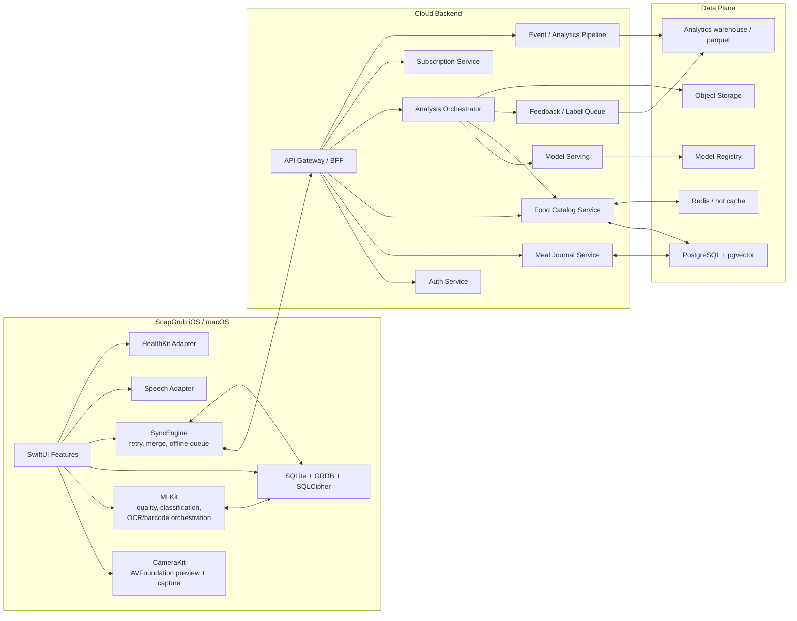
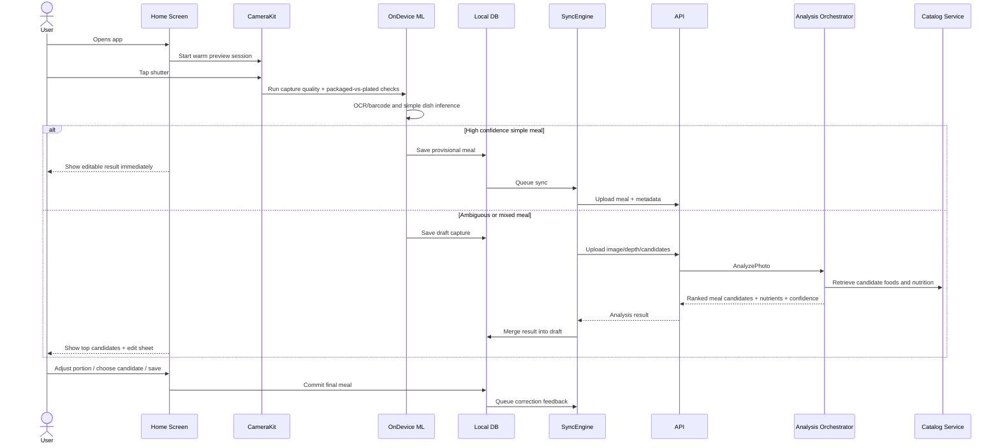
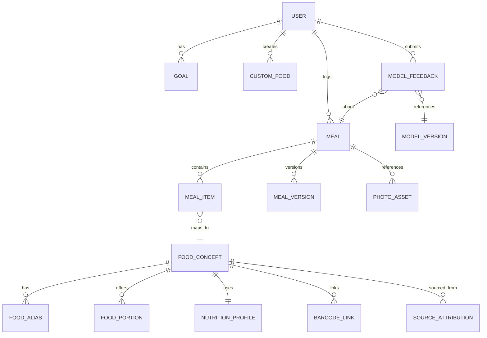

# SnapGrub Technical Architecture and Implementation Plan

## Executive summary

SnapGrub should be built as a **camera-first, premium, native Apple-platform product** whose main interaction is faster than incumbents, not merely feature-parity with them. Public product pages show that current leaders already offer strong building blocks: MyFitnessPal has barcode scan and premium Meal Scan, Lose It! offers photo meal logging and voice logging, MacroFactor offers AI photo logging, barcode scan, label scan, smart history, and coaching, and Cronometer differentiates on data quality and micronutrient depth. The opportunity is to make the **camera the default home action**, keep it warm, minimize taps, handle ambiguous meals gracefully, and provide materially better coverage for Indian and mixed home-cooked meals while preserving the trust users expect from premium nutrition apps. citeturn20view10turn20view11turn21view0turn21view3turn20view9turn21view2

The core architectural recommendation is a **hybrid on-device + cloud system**. Use Apple-native frameworks first: AVFoundation for capture, Vision for OCR and barcode detection, and Core ML as the primary local inference runtime because Apple explicitly positions it for on-device performance, privacy, low memory footprint, and efficient use of Apple silicon. The result should be a “fast path” that handles simple meals locally and a “hard-case path” that escalates mixed plates, occluded foods, and uncertain portion estimates to cloud inference. This delivers better latency, privacy, and cost control than a cloud-only design. citeturn13search6turn13search10turn18search2turn22view4turn18search3turn18search4

The biggest non-obvious product risk is **data licensing and provenance**. For U.S. foods, USDA FoodData Central is an excellent canonical source because it offers REST access, is in the public domain under CC0, and includes Foundation Foods, FNDDS, and Branded Foods, though it rate-limits by default to 1,000 requests per hour per IP. For India, the Indian Food Composition Tables 2017 and the open Indian Nutrient Databank are essential for raw foods and common recipes. For broader Western and European coverage, official sources such as CoFID, NEVO, the Canadian Nutrient File, and Frida are valuable. Open Food Facts is useful for global packaged-food fallback, but its API docs explicitly warn that data is user-contributed and not guaranteed accurate, and its database is under ODbL with share-alike obligations. For a closed premium product, that means legal review is mandatory before using Open Food Facts as part of a merged canonical proprietary database. citeturn20view0turn20view1turn20view5turn20view6turn28search0turn28search1turn28search6turn28search3turn20view2turn27search0turn27search3

The recommended launch plan is to ship an **MVP that wins on speed, editability, and trust**: always-on mini camera on the home screen; photo-first meal capture; barcode and text/voice fallbacks; a strong edit sheet; meal journal; goals; daily progress; offline queueing; and subscriptions. Then add nutrition label OCR, HealthKit sync, favorites and recurring meals, stronger coaching, restaurant/menu intelligence, and eventually personalized models and human-in-the-loop learning. Budget, MAU targets, and regulatory footprint are open in your prompt, so the sizing and cost numbers below assume a startup-stage launch targeting iPhone first, macOS companion second, and U.S. plus India as the first two “must-win” food domains. citeturn35search0turn35search2turn32search6turn32search0turn32search1

## Product strategy and roadmap

### Where SnapGrub can beat the market

The premium competitors are converging on the same feature set: barcode scan, photo logging, voice logging, search, journaling, coaching, and premium insights. The public product material also reveals a shared UX pattern: capture is usually an **add flow** rather than the app’s default state. MyFitnessPal instructs users to tap the bottom “+” and then choose Barcode Scan or Meal Scan; Lose It! markets Snap It and AI Voice as features; MacroFactor lists AI photo logging, label scan, and speech-to-text alongside conventional logging tools; Cronometer emphasizes curated and multi-source nutrition accuracy. That creates room for SnapGrub to differentiate with a **persistent capture surface**, far lower friction, and a cleaner, calmer, more explainable editing flow. citeturn21view3turn20view11turn21view0turn20view10turn20view9turn21view2

A second gap is **cuisine realism**. Public research datasets and current production databases are much stronger for generic Western foods than for Indian composite meals. Food-101 is Western-heavy; IndianFoodNet is comparatively small; IFCT and INDB are critical for India but are underused in consumer apps. That means SnapGrub can form a moat by investing early in Indian aliases, recipe decomposition, thali-aware editing, and serving-unit intelligence such as roti count, idli count, bowl size, spoonfuls, cups, and “half plate / full plate” shortcuts. citeturn9search0turn24view6turn20view5turn20view6

### Recommended feature roadmap

| Release | Goal | What ships | Why it matters |
|---|---|---|---|
| **MVP** | Win on speed and trust | Always-on mini camera on home; shutter-to-result flow; simple on-device meal recognition; barcode scan; text entry; voice entry; edit-result sheet; portion adjuster; meal journal; calorie/macros/day progress; custom foods; goal setup; offline queue; Sign in with Apple; paid subscription via App Store | This is the smallest version that still feels premium and materially better than search-first trackers. Apple’s platform stack supports the necessary building blocks natively. citeturn13search6turn18search2turn22view4turn32search6turn32search0 |
| **V1.1** | Raise trust on packaged and ambiguous foods | Nutrition-label OCR; top-3 candidate chooser; favorites; recent meals; HealthKit read/write for body mass and dietary quantities; confidence badges; photo-history and re-edit | This release improves perceived accuracy and habit retention. HealthKit exposes nutrition-related identifiers and body mass data under user control. citeturn33search3turn33search1turn33search0turn33search23 |
| **V2** | Become the best premium logger for mixed real-world meals | Better segmentation for multi-item plates; Indian thali mode; regional alias library; recipe import; stronger restaurant/menu coverage via commercial nutrition provider; trend insights; smart reminders; Apple Health and widget polish | This is where SnapGrub moves from “fast logger” to “daily habit product.” Public datasets such as FoodSeg103 and Nutrition5k support the move toward mixed-meal robustness. citeturn24view4turn24view1turn8search0turn8search1turn8search2 |
| **V3** | Build defensible intelligence | Personalized priors by user habits; adaptive calorie/macro coaching; correction-driven active learning; opt-in federated personalization experiments; multi-device continuity; richer macOS analytics workspace | This is the moat layer. Federated learning is feasible later, but the research and framework ecosystem still makes it a deliberate post-MVP investment, not a day-one feature. citeturn23view9turn23view10turn23view11 |

### Critical edge cases that must shape the roadmap

Portion estimation is the hardest part of photo logging. Nutrition5k makes the problem explicit: real dishes are occluded, ingredient-mixed, and hard to resolve visually; the dataset adds depth images and component weighing precisely because visual estimation alone is limited. Current commercial apps acknowledge this UX reality too; for example, MyFitnessPal’s Meal Scan walkthrough encourages users to keep steady and focus on one item. SnapGrub should therefore be opinionated: **simple meals can be auto-accepted, but mixed or low-confidence meals must be editable in seconds**. citeturn24view1turn20view11

The must-handle edge cases for MVP are: mixed plates, liquid calories, transparent containers, hidden oils and sauces, multiple plates in one frame, barcodes that resolve to the wrong product, camera permission denied, offline capture, non-food photos, and regional dish aliases. For India specifically, assume users will enter transliterated English phrases rather than standardized Hindi or regional scripts at launch: “dal,” “rajma chawal,” “paneer butter masala,” “poha,” “idli,” “dosa,” “upma,” “thepla,” and “khichdi,” often with mixed spellings. The architecture and schemas below treat aliases, provenance, and uncertainty as first-class citizens because that is the only practical path to premium trust. citeturn24view6turn20view6turn20view2

## Core user flows and wireframes

### UX principles

The app should feel like a premium camera utility that happens to produce nutrition, not a spreadsheet with a camera attached. The strongest UX principle is: **snap first, repair second, search last**. The home screen should always expose a live camera surface when available, summary rings or bars for calories and macros, and one-tap access to recent meals. Barcode, typing, and voice should exist as explicit fallbacks, not peers to the camera. That design direction directly exploits the gap between existing “tap add, then choose a logger” products and a true capture-first interface. citeturn21view3turn20view10turn21view0

### Annotated wireframes

```text
HOME
┌─────────────────────────────────────────────┐
│ Good morning, Alex                          │
│ Goal: 1,900 kcal   Protein 150g            │
│                                             │
│ ┌──────── Live Camera Mini Preview ───────┐ │
│ │ [always-on preview]                     │ │
│ │ Hint: Center a meal and tap to snap     │ │
│ │  ○ shutter    ▣ barcode    🎤 voice      │ │
│ └─────────────────────────────────────────┘ │
│                                             │
│ Calories    Remaining   Protein  Carbs Fat  │
│ 1,245       655         92/150   135/220... │
│                                             │
│ Recent meals                                │
│ • Greek yogurt bowl                         │
│ • Chicken quinoa bowl                       │
│ • Paneer roti lunch                         │
└─────────────────────────────────────────────┘
```

```text
SNAP FLOW
┌─────────────────────────────────────────────┐
│ < Back                     Capture Meal     │
│                                             │
│        [full-screen camera view]            │
│     ┌───────────────────────────────┐       │
│     │  framing guide / plate proxy  │       │
│     └───────────────────────────────┘       │
│ Hint: hold steady • one plate if possible   │
│                                              │
│ Gallery      Voice fallback      Barcode     │
│                   ◎ shutter                 │
└─────────────────────────────────────────────┘
```

```text
EDIT RESULTS
┌─────────────────────────────────────────────┐
│ Meal result                    Confidence 83│
│ [photo thumbnail]                            │
│ Top guess: Chicken Quinoa Bowl              │
│ Alternatives: Salad Bowl | Burrito Bowl     │
│                                             │
│ Detected items                              │
│ • Chicken breast       150 g    240 kcal    │
│ • Quinoa               1 cup    222 kcal    │
│ • Avocado              1/2 med  120 kcal    │
│ • Mixed greens         1 cup     20 kcal    │
│                                             │
│ Calories 602   P 43g   C 52g   F 19g        │
│ [Edit items] [Adjust portion] [Save meal]   │
└─────────────────────────────────────────────┘
```

```text
PORTION ADJUST
┌─────────────────────────────────────────────┐
│ Portion adjust                              │
│ Serving style                               │
│ ( ) grams   ( ) cups   (•) plate fraction   │
│                                             │
│ Plate fraction:  [ 1/4 | 1/2 | 3/4 | full ] │
│ Piece count:     Roti [-] 2 [+]             │
│ Bowl size:       Small / Medium / Large     │
│ Sauce/oil extra: None / Light / Normal / Hi │
│                                             │
│ Updated totals                              │
│ Calories 712   Protein 44g  Carbs 61g ...   │
│ [Apply]                                     │
└─────────────────────────────────────────────┘
```

```text
BARCODE / TEXT / VOICE
┌──────────── Barcode ────────────┐
│ live barcode frame              │
│ hit → product + source + match  │
│ if mismatch: “find better match”│
└─────────────────────────────────┘

┌──────────── Text or Voice ──────┐
│ “2 rotis, dal tadka, paneer”    │
│ Parsed items                    │
│ • chapati x2                    │
│ • dal tadka 1 bowl              │
│ • paneer curry 1 serving        │
│ [Edit parse] [Save]             │
└─────────────────────────────────┘
```

```text
MEAL DETAIL / INSIGHTS
┌──────────── Meal Detail ────────┐
│ photo + timestamp               │
│ calories/macros donut           │
│ ingredients + source provenance │
│ notes: “restaurant lunch”       │
│ [duplicate] [favorite] [delete] │
└─────────────────────────────────┘

┌──────────── Insights ───────────┐
│ Week trend                      │
│ calories | protein compliance   │
│ streaks | goal progress         │
│ “Most missed target: protein”   │
│ “Avg lunch calories: 620”       │
└─────────────────────────────────┘
```

These screens map well to Apple’s platform capabilities: AVFoundation supports camera app construction and barcode samples, Vision supports barcode detection, OCR, and segmentation-related analysis, the Speech framework supports live and recorded speech recognition, and HealthKit can store nutrition- and body-related quantities when the user grants permission. citeturn13search6turn13search3turn18search2turn35search0turn35search1turn35search2turn33search3turn33search1

### Flow behavior that should be hard-coded into the product

The always-on mini camera should be a **low-power preview**, not continuous heavy inference. Run only a tiny quality model or heuristic loop in preview mode, and reserve the full meal-recognition pipeline for the shutter press. When the photo is clearly a packaged product, the app should pivot to barcode and OCR logic. When confidence is low, the UI should surface “best guess,” “alternatives,” and “portion confidence” instead of pretending certainty. That is more aligned with the realities documented by nutrition-focused datasets and by the capture guidance that current apps already provide to users. citeturn24view1turn20view11

On macOS, preserve the same information architecture but adapt the capture affordance. If the Mac has a camera and permission, keep the mini preview. If not, replace it with a drag-and-drop target, paste/import actions, and text/voice entry. macOS should act as a richer review and analytics surface, while the iPhone remains the fastest logging device. Core ML and SwiftUI already span iOS and macOS, which is why a shared-domain, shared-data design is the right architecture here. citeturn22view4turn32search7

## Data foundation and ML strategy

### Canonical food data plan

SnapGrub should not use a single food database. It should maintain a **provenance-aware canonical catalog** with source-specific importers and normalized concepts on top.

| Source | Coverage | Strengths | Constraints | Recommended role |
|---|---|---|---|---|
| **USDA FoodData Central** | U.S. foundational foods, FNDDS survey foods, branded foods | REST API, public domain CC0, official provenance, multiple data types, branded updates monthly | Default API rate limit is 1,000 requests/hour/IP | Primary U.S. canonical nutrition source; server-side ingestion and cache, not direct device querying at scale. citeturn20view0turn20view1 |
| **Indian Food Composition Tables 2017** | 528 key Indian foods; 151 components | Official Indian nutrient reference published by NIN/ICMR | Redistribution and structured commercial reuse should be legally reviewed | Canonical Indian raw-food reference. citeturn20view5turn11search5 |
| **Indian Nutrient Databank** | 1,014 Indian recipes; open-access portal; references IFCT, USDA, CoFID | Best current open recipe-level Indian source | Still not enough for consumer-scale long-tail coverage | Bootstrap Indian recipes and serving-size defaults. citeturn20view6turn12search13 |
| **CoFID** | UK foods and recipes | Official UK composition dataset | Needs import normalization | Western/European coverage especially UK foods. citeturn28search0turn28search12 |
| **NEVO** | Netherlands | Official high-quality database with known source provenance | Import and locale mapping needed | European canonical reference. citeturn28search1turn28search5 |
| **Canadian Nutrient File** | Canada / North America | Standard reference, up to 152 nutrients over 5,690 foods | Secondary market for packaged-food mismatch | Useful North American and bilingual alias coverage. citeturn28search6turn28search10 |
| **Frida** | Denmark / Nordics | Public food database with downloadable data | Attribution needed | Fill Nordic and broader European gaps. citeturn28search3turn28search19 |
| **Open Food Facts** | User-contributed global packaged foods | Broad global coverage; API v2; images and product metadata | ODbL share-alike; docs explicitly disclaim accuracy/completeness | Keep as a legally separated fallback or lookup-only source, not your merged proprietary core without legal sign-off. citeturn20view2turn27search0turn27search3 |
| **FatSecret / Nutritionix / Edamam** | Commercial common, branded, restaurant, NLP use cases | Enterprise-friendly APIs; natural-language parsing; broader commercial coverage | Paid licensing | Shortlist for production packaged, restaurant, and text-NLP coverage. citeturn8search0turn8search1turn8search2turn8search4turn8search6 |

The internal data model should normalize every imported record into a common structure:

**FoodConcept** → **Aliases** → **PreparationVariant** → **ServingUnits** → **NutritionProfile** → **SourceAttribution**.

That makes it possible to support “oatmeal,” “porridge,” “rolled oats cooked,” “masala oats,” and “oats upma” as related but distinct entities while preserving calories, macros, and provenance. The source metadata must never be dropped; premium trust depends on being able to show where a value came from and whether it is an official composition table, branded label, recipe estimate, or user-created entry. That is the same trust pattern visible in Cronometer’s curation and multi-source database strategy. citeturn21view2turn20view0turn20view6

### Public training datasets to use

SnapGrub’s image models should be trained from a **stacked dataset strategy**, not from one benchmark. The public datasets each solve a different part of the problem.

| Dataset | What it offers | Best use |
|---|---|---|
| **Food-101** | 101,000 images across 101 food categories | Baseline dish classification and transfer learning. citeturn9search0turn24view0 |
| **UEC-Food256** | 256 food categories with bounding boxes | Detection/localization for multi-item scenes. citeturn9search11 |
| **Nutrition5k** | ~5k real plates with depth images, component weights, and nutrition | Portion/weight estimation and end-to-end nutrition regression. citeturn9search1turn24view1 |
| **FoodSeg103 / FoodSeg154** | 9,490 images, 154 ingredient classes, pixel-wise masks | Ingredient/food-region segmentation. citeturn24view4 |
| **Recipe1M+** | Over 1M recipes and 13M food images | Image-to-recipe retrieval, ingredient priors, cross-modal embeddings. citeturn9search2turn24view2 |
| **ISIA Food-500** | 399,726 images, 500 categories across eastern and western cuisines | Long-tail classification and broader cuisine diversity. citeturn24view5 |
| **IndianFoodNet** | 5,500+ images; 30 Indian classes; object-detection annotations | Bootstrapping Indian-food localization, but too small to be production-sufficient alone. citeturn24view6 |

That dataset mix is still not enough for production. The public data landscape is better than it used to be, but it remains weak for **home-cooked Indian composite meals, regional variants, restaurant plating styles, and premium-camera phone photos taken in real user conditions**. You should therefore budget for an internal dataset program from the start: collect opt-in user corrections later, but first create a controlled internal seed set using your own food acquisition/annotation process, especially for Indian thalis, curries, breads, snacks, breakfasts, bowls, and beverages. citeturn24view1turn24view6turn20view6

### Recommended model stack

The right model strategy is a **task pipeline**, not one giant model.

| Task | MVP recommendation | Deploy target | Notes |
|---|---|---|---|
| Food presence / capture quality | Tiny binary quality model + blur/exposure heuristics | On-device | Should reject receipts, hands-only shots, empty tables, severe blur. Supported by Core ML runtime budget. citeturn22view4turn25search12 |
| Barcode detection | AVFoundation/Vision system APIs first | On-device | Start native; benchmark Scandit only if damaged/small-code recall is unacceptable. citeturn13search3turn13search6turn13search2turn13search25 |
| Nutrition-label OCR | Vision text recognition + rule parser | On-device first, cloud parse fallback | Do not ship a custom OCR model in MVP; use platform OCR. citeturn18search2turn0search2 |
| Dish classification | Mobile multi-head classifier with cuisine prior | On-device | Output top-3 dish candidates and confidence, not one final answer. Supported by Core ML conversion/compression flow. citeturn22view4turn25search10turn25search14 |
| Ingredient / region segmentation | Small segmentation model for preview/simple plates; stronger server model for mixed meals | Hybrid | FoodSeg103 is the right public benchmark family to evaluate against. citeturn24view4turn24view7 |
| Portion estimation | Depth-assisted estimator when depth is available; monocular estimate + user correction otherwise | Hybrid | Nutrition5k and Apple depth APIs make depth-assisted paths worthwhile, especially on supported devices. citeturn24view1turn18search3turn18search4 |
| Nutrition retrieval | Alias-aware nearest-food retrieval over canonical catalog | On-device cache + cloud catalog | Do not infer nutrition directly from image only when a structured catalog lookup is possible. citeturn20view0turn20view6 |
| Text/voice parse | Speech framework STT + food NLU parser | Hybrid | Use SpeechTranscriber where available and SFSpeechRecognizer fallback; parse food entities locally first, cloud NLP second. citeturn35search0turn35search1turn35search2turn35search15 |

The deployment recommendation is straightforward:

- **Primary runtime:** Core ML. Apple positions it for private, responsive, on-device inference, conversion from TensorFlow/PyTorch, and model compression through quantization, pruning, and palettization. citeturn22view4turn25search12turn25search14turn25search23
- **Secondary runtime:** LiteRT / TensorFlow Lite only if you need shared non-Apple runtimes or remote model download patterns already built around TensorFlow. LiteRT exposes native iOS Swift and Objective-C libraries. citeturn23view0turn23view2
- **Experimental runtime:** ExecuTorch if your research team is heavily PyTorch-native and Core ML conversion becomes a blocker for a specific model class. ExecuTorch is now the official PyTorch edge runtime, but for an Apple-only product, Core ML should still be the default. citeturn23view1turn22view4

A practical model budget for MVP is:

- capture-quality model: **1–3 MB compressed**
- dish-classification model: **20–40 MB compressed**
- simple segmentation model: **25–50 MB compressed or optional model pack**
- OCR/barcode: **system frameworks, no bundled custom model**
- total base ML payload in app bundle: **under ~80 MB**, with optional advanced packs downloaded later

Those are **engineering targets**, not externally mandated limits. They keep startup/launch friction low while leaving room for better cloud models.

### Training pipeline, evaluation, and continuous learning

The training program should have five explicit stages: data ingestion, cleaning/normalization, annotation, training/evaluation, and feedback-driven retraining. Public datasets give you a head start, but the internal pipeline should quickly dominate. Use public data to pretrain; use internal data to actually win. Nutrition5k is especially useful for portion estimation because it includes depth and component weighing, while FoodSeg103 provides ingredient masks that are difficult to create from scratch. Recipe1M+ is valuable for recipe-text and ingredient priors rather than final classification accuracy. citeturn24view1turn24view4turn24view2

For annotation, create three label streams: **dish labels**, **ingredient/region masks**, and **portion correction outcomes**. The most valuable production signal is not generic accuracy—it is **edit friction**. Measure end-to-end success using metrics users care about:

- *accepted without edit rate*
- *top-1 and top-3 dish accuracy by cuisine*
- *ingredient F1 / segmentation mIoU*
- *portion mean absolute percentage error in grams*
- *calorie and macro error bands versus verified references*
- *time-to-save in seconds*
- *capture-to-result latency*

The premium KPI is not “our classifier got 88% top-1.” It is “users save a meal in under 10 seconds, and most saves require no more than one light edit.” The public benchmarks inform model quality, but product telemetry should govern shipping decisions. citeturn24view1turn24view4turn20view11

For continuous learning, every saved meal should optionally produce structured feedback:

- user accepted result unchanged
- user changed dish candidate
- user changed portion only
- user deleted one detected ingredient
- user added missing ingredient
- user corrected barcode/product match

This feedback should go to a **labeling queue** with uncertainty, cuisine, source, and user-specified context. High-value samples are low-confidence photos, large calorie deltas after edits, and cuisines with high confusion. Only opt-in images should be retained for future training, and they should be stripped of EXIF, cropped to the meal region when possible, and de-identified before annotation. That design better aligns with Apple’s privacy posture and with GDPR’s data minimization and storage-limitation principles. citeturn26search3turn26search0

Federated learning should be treated as a **V3 optimization**, not MVP infrastructure. The research base is strong—FedAvg remains foundational—and both TensorFlow Federated and Flower support decentralized training experimentation. But for a startup product, the first priority is getting the labeling pipeline, consent model, evaluation discipline, and opt-in semantics right. You will get more value from ordinary active learning and periodic retraining than from federated complexity until you have substantial scale. citeturn23view11turn23view9turn23view10

## Clean Architecture for iOS and macOS

### Architecture principles

Use **Clean Architecture with modular Swift packages** and shared business logic across iOS and macOS. The dependency rule should be strict: Presentation depends on Domain; Data depends on Domain; Framework adapters sit at the outer ring. Platform-specific camera, speech, HealthKit, and StoreKit code should live in adapter modules so the core meal-logging domain stays platform-agnostic. Core ML, SQLite, networking, and sync implementations belong in the outer layer behind protocols defined by Domain. This is the right fit for a native Apple app that shares logic but needs platform-specific capture adaptations. Core ML is available across Apple platforms and Xcode gives you generated interfaces and profiling support, which reinforces the decision to keep ML orchestration in dedicated adapter modules. citeturn22view4

### Recommended module breakdown

| Module | Responsibility |
|---|---|
| `AppShell` | App lifecycle, permissions orchestration, dependency assembly, navigation root |
| `DesignSystem` | Color tokens, typography, reusable controls, premium motion, haptics |
| `FeatureHome` | Home dashboard, mini camera card, day summary, recent meals |
| `FeatureCapture` | Full-screen camera, capture guidance, preview-to-shot pipeline |
| `FeatureMealEditor` | Candidate selection, ingredient editing, portion adjustments |
| `FeatureBarcode` | Barcode capture and product confirmation flow |
| `FeatureTextVoice` | Text parsing, STT, NLU editing flow |
| `FeatureJournal` | Meal history, meal detail, duplication, notes, favorites |
| `FeatureInsights` | Trends, streaks, macro adherence, coaching cards |
| `FeatureGoals` | Goal setup, calorie/macro targets, weight plan |
| `FeatureAccount` | Sign in with Apple, subscription status, settings |
| `Domain` | Entities, use cases, repository contracts, validation rules |
| `Data` | Repository implementations, mappers, sync orchestration |
| `Persistence` | SQLite/GRDB models, migrations, encryption wrappers |
| `Networking` | REST client, auth tokens, upload/download, retry, idempotency |
| `SyncEngine` | Offline queue, merge logic, background pushes/pulls |
| `CameraKit` | AVFoundation session, photo capture, preview state machine |
| `MLKit` | On-device inference, model manager, preprocessing, confidence fusion |
| `PlatformAdapters` | HealthKit, Speech, StoreKit, DeviceCheck/App Attest, notifications |

For local persistence, use **SQLite with GRDB** and encrypt the database using SQLCipher. GRDB is a mature Swift SQLite toolkit for application development, SQLCipher provides AES-backed full-database encryption, and pgvector on the server lets you keep embeddings in Postgres without introducing a separate vector service in MVP. This combination is more explicit and controllable than SwiftData for a sync-heavy offline-first journaling app. citeturn29search1turn29search7turn29search0turn29search21turn31search0

### System architecture diagram



The deliberate design choice here is that **the client can produce a usable meal entry without the backend**, while the backend raises accuracy, broadens catalog coverage, and powers learning. That is the correct architecture for a premium food tracker where responsiveness and privacy are part of the product value. Apple’s Core ML position on on-device privacy and Cloud Run’s scale-to-zero economics for cloud fallback align well with this split. citeturn22view4turn23view6turn23view8

### Snap flow sequence



### Data model and ER diagram

The meal journal should be append-heavy and correction-friendly. Keep photos immutable, edits versioned, and provenance attached to every food concept and nutrient estimate.



### Suggested core schemas

| Entity | Key fields |
|---|---|
| `user` | `id`, `apple_sub`, `anonymous_until`, `locale`, `unit_system`, `timezone`, `consent_training_opt_in`, `created_at` |
| `goal` | `id`, `user_id`, `goal_type`, `target_weight`, `daily_calories`, `protein_g`, `carbs_g`, `fat_g`, `effective_from` |
| `meal` | `id`, `user_id`, `captured_at`, `meal_type`, `status(draft/final/synced)`, `source(photo/barcode/text/voice/manual)`, `confidence`, `notes`, `created_at`, `updated_at` |
| `meal_item` | `id`, `meal_id`, `food_concept_id`, `portion_value`, `portion_unit`, `grams_estimated`, `kcal`, `protein_g`, `carbs_g`, `fat_g`, `source_type`, `sort_order` |
| `meal_version` | `id`, `meal_id`, `revision`, `editor(user/model/system)`, `delta_json`, `created_at` |
| `food_concept` | `id`, `canonical_name`, `cuisine_region`, `food_type`, `preparation_state`, `is_recipe`, `is_packaged`, `default_portion_id`, `source_confidence` |
| `food_alias` | `id`, `food_concept_id`, `locale`, `alias`, `normalized_alias`, `script`, `is_primary` |
| `nutrition_profile` | `id`, `food_concept_id`, `basis(100g|serving)`, `energy_kcal`, `protein_g`, `carbs_g`, `fat_g`, `fiber_g`, `sugar_g`, `sodium_mg`, `micros_json`, `source_id` |
| `barcode_link` | `id`, `gtin`, `food_concept_id`, `market`, `brand`, `pack_size`, `last_verified_at` |
| `photo_asset` | `id`, `meal_id`, `local_uri`, `remote_uri`, `width`, `height`, `has_depth`, `sha256`, `retention_class` |
| `model_version` | `id`, `task`, `framework`, `bundle_version`, `compression`, `input_spec_json`, `metric_json`, `rolled_out_pct` |
| `model_feedback` | `id`, `user_id`, `meal_id`, `model_version_id`, `feedback_type`, `before_json`, `after_json`, `confidence_before`, `accepted_without_edit`, `created_at` |

### API contracts

External mobile traffic should use **REST/JSON over HTTPS**. Internal service-to-service traffic should use **gRPC/protobuf** so the analysis pipeline can evolve without constant JSON shape churn.

**External REST**

```http
POST /v1/analyze/photo
Authorization: Bearer <user-jwt>
Content-Type: application/json
Idempotency-Key: <uuid>

{
  "captureId": "cap_123",
  "imageUploadRef": "upl_456",
  "depthUploadRef": "upl_457",
  "locale": "en-US",
  "mealContext": "lunch",
  "deviceInfo": {
    "platform": "ios",
    "osVersion": "18.5",
    "hasDepth": true
  },
  "onDeviceHints": {
    "packagedProbability": 0.04,
    "dishCandidates": [
      {"name": "chicken quinoa bowl", "score": 0.61},
      {"name": "grilled chicken salad", "score": 0.22}
    ]
  }
}
```

```json
{
  "analysisId": "ana_789",
  "status": "completed",
  "requiresUserConfirmation": true,
  "mealCandidates": [
    {
      "foodConceptId": "fc_001",
      "name": "Chicken Quinoa Bowl",
      "confidence": 0.83,
      "items": [
        {"foodConceptId": "fc_chicken", "name": "Chicken breast", "grams": 150},
        {"foodConceptId": "fc_quinoa", "name": "Quinoa", "grams": 185}
      ]
    }
  ],
  "nutritionEstimate": {
    "kcal": 602,
    "protein_g": 43,
    "carbs_g": 52,
    "fat_g": 19
  },
  "modelVersions": {
    "classifier": "dish_cls_1.4.2",
    "segmenter": "food_seg_1.1.0",
    "portion": "portion_0.9.5"
  }
}
```

```http
POST /v1/entries/parse
```

```json
{
  "locale": "en-US",
  "source": "voice",
  "utterance": "two rotis, dal tadka, paneer butter masala"
}
```

```json
{
  "parsedItems": [
    {"name": "chapati", "quantity": 2, "unit": "piece"},
    {"name": "dal tadka", "quantity": 1, "unit": "bowl"},
    {"name": "paneer butter masala", "quantity": 1, "unit": "serving"}
  ],
  "needsDisambiguation": false
}
```

**Internal gRPC services**

- `AnalyzePhoto(AnalyzePhotoRequest) -> AnalyzePhotoResponse`
- `ResolveFoods(ResolveFoodsRequest) -> ResolveFoodsResponse`
- `StoreFeedback(StoreFeedbackRequest) -> StoreFeedbackResponse`
- `VerifySubscription(VerifySubscriptionRequest) -> VerifySubscriptionResponse`

### Sync, offline behavior, and conflict resolution

SnapGrub should be **offline-first**. That means the client creates the meal locally first, assigns a client UUID, and records every action into an outbox queue. Sync is eventual. The simplest correct conflict policy is:

- new meals: append-only, idempotent by `client_generated_id`
- edits: optimistic concurrency with `base_revision`
- photos: immutable once stored
- authoritative totals: recomputed from `meal_item` lines on each final save
- merge policy: field-level merge for notes/tags, last-writer-wins for presentation-only fields, explicit conflict UI for changed `meal_item` lines

If the same meal is edited on iPhone and Mac while offline, do not silently overwrite portions. Create a conflict resolution prompt showing “device A result” and “device B result,” with the ability to keep either or merge items. Because food logging is relatively small-scale and mostly append-driven, this is much safer than trying to design a general CRDT system up front.

### Camera and inference implementation details

The camera subsystem should be one of the best-engineered pieces of the app. AVFoundation’s camera samples are enough to structure the implementation. Use a long-lived `CameraSessionActor` that owns the capture session, preview output, photo output, and barcode/video data outputs. The home screen mini camera preview should be warm while the app is active and permission is granted, but it should use a **low-resolution preview stream** and throttle analysis aggressively. When the user taps the shutter, take a proper still capture; when supported, request depth data alongside the image. On supported devices, the LiDAR/depth path materially improves portion estimation for bowls, cups, and piled meals. citeturn13search6turn13search10turn18search3turn18search4

Use Vision as the first-line OCR and barcode stack. Keep the OCR path general—full nutrition-label parsing can come later—but the MVP should at least be able to extract product names and obvious nutrient fields when a barcode lookup fails. For voice, abstract the speech API behind `SpeechToTextService`: on newer platform versions use the newer SpeechAnalyzer / SpeechTranscriber APIs where available; otherwise fall back to `SFSpeechRecognizer`. That gives you a path to modern speech capabilities without forcing your minimum OS to track Apple’s newest speech stack. citeturn18search2turn0search1turn0search2turn35search0turn35search1turn35search2turn35search11

## Backend platform and delivery

### Service responsibilities

The backend should stay small at first, but the domain boundaries should be explicit from day one.

| Service | Responsibility |
|---|---|
| `api-gateway` | Mobile-facing REST, auth middleware, request shaping, rate limits, idempotency |
| `auth-service` | Anonymous session bootstrap, Sign in with Apple token exchange, refresh, account linking |
| `catalog-service` | Food search, alias resolution, serving conversions, barcode links, source attribution |
| `meal-service` | Meal CRUD, journaling, versions, sync merge, history queries |
| `analysis-orchestrator` | Fan-out to model services, fuse on-device hints with server predictions |
| `model-serving` | Runs heavier segmentation/classification/portion pipelines |
| `feedback-service` | Correction ingestion, active-learning queues, abuse protection |
| `subscription-service` | App Store transaction reconciliation, entitlement cache, grace periods |
| `analytics-pipeline` | Product events, funneling, retention, model telemetry, warehouse export |
| `model-registry` | Version metadata, rollout rules, shadow-mode routing, rollback |

Do not over-separate these in the MVP deployment. Logically distinct services can still ship as two or three deployables at first: **API + business services**, **analysis**, and **async workers**. What matters is that the contracts are stable and that the analysis service can scale independently from the journal API. Cloud Run’s pay-for-use model is well-suited to that starting point. citeturn23view6turn16search2

### Authentication, subscriptions, and webhooks

Use **anonymous local journaling first**, then offer account creation and sync via **Sign in with Apple** as the primary identity path. Apple’s Sign in with Apple docs cover both app and REST/server integration. That gives you a clean premium Apple-platform story and minimizes password surface area. If you later add Google sign-in, keep it as optional account linking, not the primary path. citeturn32search6turn32search2turn32search14

For payments, the client should use **StoreKit 2** and the backend should validate and reconcile entitlements using the **App Store Server API** and **App Store Server Notifications V2**. Apple ships official server libraries in Swift, Python, Java, and Node; use one of those rather than hand-rolling receipt verification. Also set up StoreKit testing in Xcode and automated StoreKit tests in CI so subscription regressions are caught before release. citeturn32search0turn32search16turn4search2turn4search3turn32search1turn32search9

Recommended entitlement states:

- `free_trial`
- `active`
- `grace_period`
- `billing_retry`
- `expired`
- `refund_pending`
- `revoked`

The app should read a **signed entitlement snapshot** from the server, cache it locally, and degrade gracefully when offline. Never block a paying user only because your entitlement check service is temporarily unavailable.

### Infrastructure recommendation

For MVP, use **serverless containers + managed Postgres + object storage**. A practical starting shape is:

- API and business services on **Cloud Run**
- Postgres on **Cloud SQL**
- images/depth files in object storage
- Redis-compatible hot cache
- warehouse export for analytics and model telemetry
- Terraform for all cloud resources
- Xcode Cloud for Apple app builds, backend CI in GitHub Actions or equivalent

This is not because Kubernetes is wrong; it is because it is too much operational surface until your analysis volume forces it. Cloud Run charges for resources used and scales automatically, while Cloud Run GPU support can scale to zero and supports managed GPU-backed services when you need heavier inference. Move to Kubernetes when you need stable always-on GPU pools, custom autoscaling behavior, multi-service sidecars, or multi-region orchestration that is awkward in serverless. citeturn23view6turn23view7turn23view8turn16search2turn23view3turn32search7turn32search15

### Recommended SLOs

Set explicit service targets early:

| Capability | Target |
|---|---|
| Home open to warm camera preview | under 500 ms after app foreground |
| On-device simple meal result | p95 under 1.5 s on target iPhones |
| Cloud-assisted photo analysis | p95 under 4.0 s |
| Barcode lookup | p95 under 800 ms |
| Journal read/list | p95 under 300 ms |
| Sync availability | 99.9% monthly |
| Subscription entitlement correctness | 99.99% event durability |
| Model-serving availability | 99.5% monthly to start |

The most important product metric is still **acceptance without edit**, followed by **time to save**. Latency matters because it is one of the only trustworthy ways a premium tracker can feel better than incumbents even when feature lists converge.

### Observability, logging, and monitoring

Instrument everything with **OpenTelemetry**, and back service metrics and alerts with a Prometheus-compatible path. OpenTelemetry defines the observability model around traces, metrics, and logs; Prometheus gives you dimensional metrics, alerting, and strong Kubernetes/cloud-native ergonomics. For SnapGrub, the must-have telemetry dimensions are `model_version`, `meal_source`, `cuisine_region`, `confidence_bucket`, `device_class`, `os_version`, and `network_state`. citeturn23view4turn23view5

The monitoring dashboard should track:

- photo-analysis latency by device class
- on-device vs cloud routing percentage
- barcode success/failure rate
- calorie-delta-after-edit
- acceptance-without-edit rate
- sync backlog size
- subscription webhook lag
- crash-free sessions
- battery/thermal degradation during capture

### Order-of-magnitude cost model

These numbers are intentionally rough because your traffic, compression quality, and catalog-licensing choices are still open. They assume one core mobile product, tens of thousands of meals per day, and that the majority of simple meals are resolved on device.

| Stage | Assumption | Monthly range |
|---|---|---|
| **Prototype / Alpha** | <1k MAU, mostly internal, limited cloud inference | **$500–$2k** |
| **Early production** | 10k MAU, 1k–2k DAU, moderate cloud assist, managed Postgres, object storage, observability | **$2k–$12k** |
| **Growth** | 50k–100k MAU, heavier cloud inference, more data ingest, dedicated QA/annotation, higher commercial data licensing | **$12k–$60k+** |

The biggest swing factor is not API hosting. It is usually **nutrition data licensing plus cloud ML inference volume**. Cloud Run and Cloud SQL pricing models support a cost-efficient MVP because you pay for actual usage and can scale inference services down when idle. The packaged-food and restaurant data contract you choose can dominate infra spend surprisingly quickly. citeturn23view6turn23view7turn8search0turn8search1turn8search2

### CI/CD, repository layout, and AI coding agent spec

A workable mono-repo layout is:

```text
snapgrub/
  apps/
    ios/
    macos/
  packages/
    Domain/
    Data/
    Persistence/
    Networking/
    SyncEngine/
    CameraKit/
    MLKit/
    DesignSystem/
    FeatureHome/
    FeatureCapture/
    FeatureMealEditor/
    FeatureBarcode/
    FeatureTextVoice/
    FeatureJournal/
    FeatureInsights/
    FeatureGoals/
    FeatureAccount/
  backend/
    services/
      api-gateway/
      catalog-service/
      meal-service/
      analysis-orchestrator/
      subscription-service/
      worker/
    proto/
    infra/terraform/
    openapi/
  ml/
    datasets/
    training/
    evaluation/
    model_registry/
    annotation/
  docs/
    architecture/
    api/
    runbooks/
```

Use **Xcode Cloud** for Apple build/test/distribution flows and a second CI system for backend, ML, and Terraform. Xcode Cloud is purpose-built for Apple platforms and includes TestFlight/App Store Connect integration; Terraform is the right IaC backbone for repeatable cloud provisioning. citeturn32search7turn32search18turn23view3

The AI coding agent should be allowed to do five things automatically:

1. generate feature scaffolding that respects package boundaries  
2. generate REST/gRPC clients from OpenAPI/protobuf  
3. create migrations and repository tests  
4. add snapshot/unit/UI tests for new screens  
5. produce architecture docs and code comments for every new module

It should be forbidden from doing five things automatically:

1. inventing backend endpoints not present in the contract  
2. bypassing subscription validation or auth flows  
3. writing secrets into source or configs  
4. adding third-party libraries without approval  
5. merging generated code unless compile, lint, and tests pass

A good internal agent prompt template is:

```text
Task:
Implement <feature> in SnapGrub.

Rules:
- Respect Clean Architecture boundaries.
- Domain must not depend on Data or framework code.
- SwiftUI in feature package only.
- All persistence through repository contracts.
- Add/extend tests before implementation.
- If API changes are required, update OpenAPI/proto first.
- If adding ML integration, update ModelManager contract and mock tests.
- Do not add new dependencies unless explicitly requested.

Output:
- Files changed
- Architecture notes
- Test plan
- Rollback considerations
```

## Security, privacy, and acceptance criteria

### Security and privacy controls

Because SnapGrub handles food photos, dietary logs, body metrics, and subscription identity, it should be treated as a **health-adjacent consumer app with strong privacy obligations**. Apple requires App Store privacy disclosures; GDPR requires principles such as lawfulness, transparency, purpose limitation, data minimization, accuracy, storage limitation, integrity, and confidentiality; California privacy law grants rights around access, deletion, and control; and the FTC’s Health Breach Notification Rule may apply to many health apps that are not covered by HIPAA. This is a serious privacy posture, not a “nice to have.” citeturn26search3turn26search0turn26search1turn26search14turn26search6

The concrete technical controls should include:

- end-to-end TLS for all network traffic
- encrypted local SQLite via SQLCipher
- sensitive keys stored in Keychain / secure platform storage
- photo files protected with Apple file-protection classes
- least-privilege object storage
- server-side encryption for blobs and backups
- signed model artifacts with rollback support
- App Attest / DeviceCheck for high-value endpoints such as subscription state, model downloads, and abuse-sensitive analyze-photo traffic

Apple’s DeviceCheck/App Attest documentation explicitly frames App Attest as a way for your server to gain confidence that requests come from legitimate app instances. Use it selectively where it meaningfully reduces fraud or scraping risk. citeturn29search0turn29search21turn34search0turn34search1turn34search6

### Suggested data retention policy

This is a practical retention policy, not legal advice:

- **Journal and account data:** retained until account deletion or user-requested export and deletion
- **Uploaded photos for cloud analysis:** keep originals for **30 days max** by default, then delete or retain only derived cropped/feature representations if the user has opted in to model improvement
- **On-device photos:** user-controlled; app may purge local caches aggressively if storage pressure rises
- **Correction feedback linked to photos:** only if opt-in; de-identify and store **180 days** for training review unless stronger consent is provided
- **Operational logs:** hot logs **14–30 days**, sampled traces shorter, aggregated metrics longer
- **Subscription and financial event records:** retain as legally required for accounting/tax and fraud review
- **Deleted account tombstones:** keep minimal deletion ledger to prevent accidental recreation/duplication and to prove deletion workflow execution

This policy aligns with GDPR’s storage-limitation principle and with the reality that photo-based food tracking creates much more sensitive raw data than typed calorie logging. citeturn26search0turn26search3

### MVP acceptance criteria and test cases

| Feature | Acceptance criteria | Representative test cases |
|---|---|---|
| Home mini camera | When camera permission is granted, a live mini preview appears within 500 ms of foregrounding the app; if denied or unavailable, fallback CTA appears | Permission granted; denied; revoked after install; Mac with no camera |
| Snap photo logging | User can go from home to saved meal in under 10 seconds for a simple single-plate meal | Clear bowl, single packaged snack, non-food photo rejection |
| Result editing | Every model result is editable before save; user can change candidate dish, remove items, add items, and adjust portion | Wrong dish candidate; missing sauce; multiple alternatives |
| Barcode fallback | Barcode scan resolves product and shows source/provenance; if lookup is wrong or missing, user can manually select or create a custom food | Wrong GTIN match; offline cached hit; no-hit product |
| Text/voice fallback | Parser turns common phrases into editable line items with units | “2 rotis and dal”; “oatmeal with milk and banana”; malformed utterance |
| Offline-first | User can capture and save meals without the network; sync happens later without duplicate entries | Airplane mode photo capture; offline edit; reconnect sync |
| Subscription gating | Trial/premium state is consistent across iPhone and Mac within minutes and survives temporary backend failure | Purchase, refund, grace period, restore purchases |
| Privacy | User can export data and delete account; cloud-retained images respect retention policy | Export package generation; delete account; delete image-only opt-in data |
| Confidence UX | App shows confidence and alternatives for ambiguous results instead of silently auto-finalizing | Mixed thali; occluded food; beverage in opaque cup |
| Latency | p95 on-device result under 1.5 s for simple meals on target iPhones | Benchmark suite by device generation and meal type |

### Biggest technical risks and what to do about them

The biggest product risk is **false precision**. A beautiful camera-first app will fail if it acts more certain than the underlying models and food data deserve. Show provenance, confidence, and fast repair paths. Nutrition5k and public segmentation benchmarks make it clear that ambiguity is structural, not a bug you can entirely “model away.” citeturn24view1turn24view4

The biggest business risk is **licensing contamination**. USDA is easy; Open Food Facts is not. If you blend ODbL-derived database content into your proprietary master catalog without a deliberate legal strategy, you can create downstream licensing obligations that conflict with a closed premium product. Keep source boundaries explicit and get counsel involved early. citeturn20view0turn20view2turn27search0turn27search3

The biggest execution risk is **trying to solve perfect nutrition from photos in the MVP**. The winning MVP is not “magically exact.” It is “fast, trustworthy, editable, and habit-forming.” Build the camera-first shell, the canonical nutrition foundation, the clean domain model, and the feedback loop first. Then spend model complexity only where the data and user corrections show it actually reduces friction. citeturn20view11turn21view2turn22view4

### Recommended open-source and starter references

These are the most useful practical starting points for your team:

| Reference | Why it is useful |
|---|---|
| **Apple AVCam / AVCamBarcode samples** | Best starting point for warm camera preview, still capture, barcode integration on Apple platforms. citeturn13search6turn13search3 |
| **apple/coremltools** | Conversion and optimization path for TensorFlow/PyTorch into Core ML. citeturn25search2turn25search10 |
| **openfoodfacts-swift** | If you decide to keep Open Food Facts as a legally separated fallback source, this is the official Swift package. citeturn30search0 |
| **Nutrition5k repo** | Direct access to a practical nutrition-vision benchmark and dataset tooling. citeturn30search2turn24view1 |
| **FoodSeg103 benchmark repo/site** | Valuable baseline for ingredient-level segmentation experiments. citeturn24view4 |
| **GRDB.swift / GRDBQuery** | Strong local SQLite story with SwiftUI integration. citeturn29search1turn30search15 |
| **Apple App Store Server Library** | Official server-side subscription/notification handling. citeturn32search0 |
| **pgvector** | Simple embeddings in Postgres without a separate vector stack in MVP. citeturn31search0 |

The shortest path to a strong first release is therefore:

1. build the native camera-first shell and offline journal  
2. implement the canonical food catalog with provenance and source-aware importers  
3. ship on-device fast-path models in Core ML  
4. add cloud assist only for hard cases  
5. instrument edit friction and correction flows from day one  
6. use that telemetry to decide where to invest next, instead of chasing model sophistication prematurely. citeturn22view4turn20view0turn20view6turn23view6