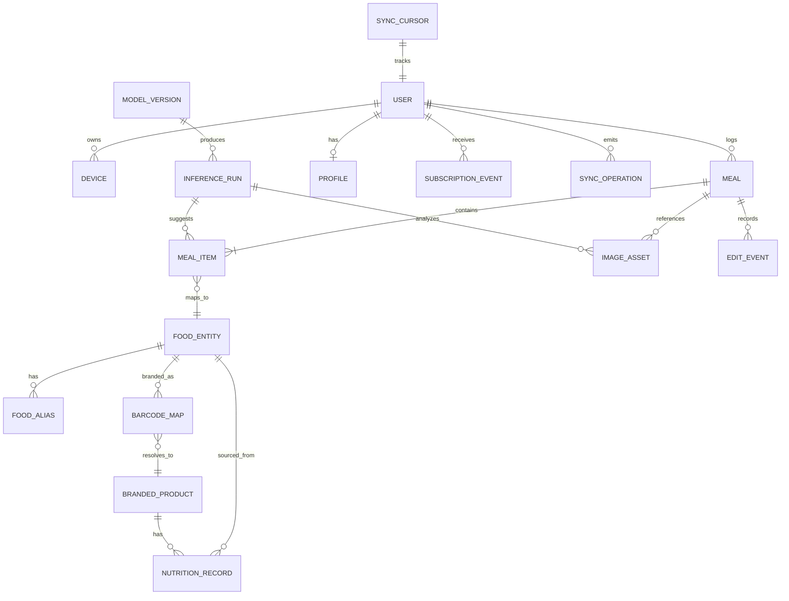
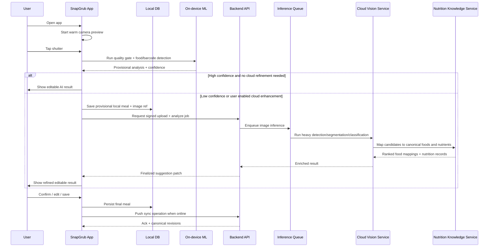

# SnapGrub Technical Solution Document

## Executive Summary

SnapGrub should be built as a **camera-first, privacy-forward premium nutrition product** for Apple platforms: a native iOS app and a native macOS app that share a strong common core, use SwiftUI as the UI layer, prefer Swift Concurrency for business workflows, use Combine selectively for event streams, integrate AVFoundation/Vision for camera and barcode flows, Speech and Natural Language for voice/text fallback, HealthKit for Apple health data, and StoreKit 2 plus the App Store Server API for subscriptions. Apple’s platform stack already provides the primitives SnapGrub needs for a premium, low-friction experience: SwiftUI is designed for Apple-platform UI, Vision exposes barcode detection, Speech and Natural Language expose system speech/NLP capabilities, HealthKit is Apple’s central health repository, and StoreKit 2 gives modern Swift APIs for in-app purchase flows. citeturn36search4turn36search1turn5search2turn20search2turn20search3turn32search6turn21search6turn21search0

From an architecture perspective, the best long-term shape is **Clean Architecture with separate native app shells and shared Swift packages**, not a Mac Catalyst-first strategy. Mac Catalyst is useful for porting iPad-style apps to the Mac quickly, but SnapGrub’s long-term premium positioning depends on desktop-native affordances such as richer sidebars, keyboard shortcuts, menu commands, multiwindow editing, and a less iPad-like journal/insights experience. SwiftUI’s multiplatform model and Apple’s Mac Catalyst guidance make it practical to share a great deal of UI code where appropriate, while still shipping a distinct native macOS experience. citeturn36search4turn36search0turn4search1

The central product thesis should be: **open the app, see a live camera preview immediately, snap food, review an editable AI result, save in seconds**. Competing products already market barcode scanning, macros, photo logging, meal scan, and AI guidance in different combinations, so SnapGrub will not win by merely matching feature checklists. It needs to win on **camera-first speed, editability, trust signals, regional cuisine coverage, local-first privacy, and premium design quality**. Publicly marketed competitor flows are still often search-first, ecosystem-heavy, or optimized more for broad utility than for a delightful capture flow. citeturn8search2turn8search5turn8search12turn10search1turn8search4turn8search10turn9search0

The recommended ML strategy is **hybrid inference**. Do fast image quality checks, food/non-food gating, coarse detection, barcode reading, and some dish classification on-device using Core ML–optimized models; escalate to server inference only when confidence is low, portion estimation is ambiguous, or the user has opted in for cloud accuracy enhancement. Apple’s Core ML tooling supports direct PyTorch-to-Core ML conversion and model optimization techniques such as pruning and quantization, while Apple’s Neural Engine guidance makes on-device inference especially compelling for latency, privacy, and cost control. citeturn26search2turn26search10turn24search3turn24search7turn24search11turn24search23turn26search18

For nutrition data, SnapGrub should anchor its nutrient truth to **authoritative food composition sources**: USDA FoodData Central for U.S. and many base ingredients, UK CoFID for UK food composition continuity, EuroFIR/FoodEXplorer for harmonized European food data, and ICMR-NIN’s Indian Food Composition Tables for Indian foods. Branded packaged-food flows should resolve against exact barcode identifiers first, using GTIN/EAN/UPC normalization and data sources such as Open Food Facts, with GS1 Digital Link treated as the future-proof identity layer for product-linked web data. citeturn13search4turn13search0turn12search4turn12search1turn11search1turn12search2turn12search11turn12search3turn12search6turn11search7turn13search1turn13search14turn33search14

The most important scope recommendation is ruthless prioritization. **MVP should not try to be the most clinically complete nutrition app on day one.** It should be the most elegant and fastest photo-first calorie and macro app on Apple platforms, with trustworthy editing and strong baseline regional coverage. Micronutrient depth, highly advanced coaching, Watch depth, and broader ecosystem features should follow in subsequent releases once meal capture quality and user trust are strong.

## Product Vision and Competitive Positioning

The attached mockups already point in the right direction: warm pastel palettes, playful mascots, large tappable surfaces, clear macro rings, and a friendly but not childish tone. The strongest part of that visual direction is that it feels **approachable**, which matters because daily meal logging is a habit product. The biggest product upgrade needed is to make the **camera preview a permanent home-screen primitive**, not just another logging mode.

The market baseline is already crowded. MyFitnessPal markets all-in-one nutrition tracking with calories, macros, fasting, barcode scanning, Meal Scan, and AI nutrition coaching. Lose It! markets photo meal logging, AI voice logging, barcode scanning, and advanced tracking. Cronometer emphasizes validated nutrition data, barcode scanning, recipe import, Apple Health/device connectivity, and detailed macro/micronutrient tracking. Lifesum now markets multimodal logging using photo, voice, text, and barcode flows, alongside meal plans and food-rating guidance. CalorieMama has long centered its value proposition on photo-based recognition of meals plus packaged-food/barcode handling. citeturn8search2turn8search5turn8search11turn8search14turn8search12turn8search3turn10search1turn10search3turn8search4turn8search10turn8search13turn9search0turn9search2turn9search3

The implication is straightforward: **SnapGrub should not position itself as “another calorie tracker with AI.”** It should position itself as **the best Apple-native camera-first nutrition app**. The moat should be product integration and trust, not hype.

The table below synthesizes the publicly marketed strengths of major competitors and the clearest opportunity for SnapGrub to differentiate.

| Product | Publicly marketed core experience | What it does well in market positioning | SnapGrub opportunity |
|---|---|---|---|
| MyFitnessPal | Calories, macros, fasting, barcode scan, Meal Scan, AI coaching | Broad ecosystem, familiarity, breadth | Beat it on camera-first flow, visual polish, local-first privacy, and lower-friction editing |
| Lose It! | Photo meal logging, AI voice, barcode scan, advanced tracking | Weight-loss framing and convenience | Beat it on regional cuisine accuracy, macOS experience, and richer AI confidence/correction UX |
| Cronometer | Detailed macro + micronutrient tracking, barcode, recipe import, Apple Health/device sync | Accuracy and nutrient depth | Beat it on photo-first delight, capture speed, and more joyful daily use |
| Lifesum | Photo, voice, text, barcode logging plus meal plans and ratings | Lifestyle guidance and multimodal entry | Beat it on stronger Apple-native UX, Indian cuisine depth, and local inference defaults |
| CalorieMama | Photo-recognition-led logging, packaged foods, global cuisine support | Clear camera-first thesis | Beat it on modern design system, database quality, premium trust, and Apple ecosystem depth |
| SnapGrub target | Live camera preview on home, one-tap capture, editable AI result, local-first privacy, premium design, native macOS | Premium camera-first habit loop | Product moat through speed, trust, regional nuance, and delightful design |

What SnapGrub should deliberately emphasize for premium positioning is not “more features than everyone else” but **fewer taps, better confidence handling, and a distinctly Apple-quality feel**. In practice, that means four product principles:

- **The camera is always ready.** Users should never feel they are traversing menus just to log food.
- **The result is AI-assisted, not AI-forced.** Confidence should be visible, and edits should be first-class.
- **The app is trustworthy about uncertainty.** Barcode exact matches, recipe-derived estimates, and low-confidence visual guesses must be distinguished clearly.
- **The design must feel premium every day.** Smooth motion, haptics, clean typography, and calm layouts are part of the business model because the app is paid.

That positioning also aligns with the opportunity left open by current competitors: many market AI features, but few publicly center a **small always-ready live camera surface on the home screen** as the core interaction model.

## System Goals and Application Architecture

### System goals

The technical system should optimize for five outcomes:

| Goal | Target recommendation |
|---|---|
| Time to camera-ready home | Live preview visible within about 300–500 ms after app foreground on modern devices |
| Snap to provisional result | Under 1.5 s p50 on supported newer iPhones for on-device-first flow; under 4 s p95 when cloud refinement is needed |
| Save while offline | User can capture, review, edit, and save without network connectivity |
| Privacy | No raw photo upload by default; cloud enhancement is explicit and revocable |
| Trust | Every result is provenance-tagged: barcode exact, recipe-derived, AI estimated, or user-entered |

The non-functional requirements should be explicit from the beginning. SnapGrub is operating at the intersection of camera, media, health-adjacent data, subscriptions, and ML, so hidden quality problems will become visible to users quickly.

| Category | Architectural target |
|---|---|
| Performance | Cold launch < 3.5 s; warm resume < 1 s; home scroll 60 fps; image capture not blocked by network |
| Battery | Preview runs in low-power preview mode unless user is actively framing a shot |
| Offline-first | Full journal, edits, deletions, and saved meals function offline; background uploads are deferred |
| Security | On-device encrypted store, TLS everywhere, signed upload URLs, least-privilege backend access |
| Scalability | Start as modular monolith + dedicated inference workers; split only when hotspots are proven |
| Localization | en-US UI first, but food ontology and search aliases must support U.S., Western/European, and Indian food naming from day one |
| Accessibility | Dynamic Type support, VoiceOver labels, strong contrast, no information encoded by color alone |

### Platform choice

For the app stack, the right choice is **SwiftUI for UI, Swift Concurrency as the default async model, and Combine only where stream processing is natural**. SwiftUI is Apple’s multiplatform declarative UI framework; NavigationStack and NavigationSplitView map cleanly to phone and desktop navigation patterns; Swift Concurrency is Apple’s structured async model; and Combine remains useful for event-processing and publisher-based streams. Apple’s own documentation explicitly frames Combine around asynchronous event handling and notes that a `Publisher` occupies a role similar to `AsyncSequence`, which is why the pragmatic approach is: use `async/await` for request/response business flows, and use Combine when working with pipelines such as camera state, sync progress, reachability, or legacy framework publishers. citeturn36search1turn3search3turn36search0turn36search15turn36search12turn37search0turn37search4turn37search22

For macOS, I recommend **a separate native macOS target in the same workspace**, sharing domain/data/design packages with iOS. Use Mac Catalyst only as a temporary internal prototype path if schedule pressure is severe. The commercial reason is simple: a paid desktop companion should not feel like an iPad app drifting in a Mac window. SnapGrub’s macOS version should lean into desktop strengths: sidebar navigation, drag-and-drop photo import, recipe editing, journal review, analytics, export, and keyboard shortcuts. Apple’s guidance on SwiftUI multiplatform apps and Mac Catalyst makes that split practical. citeturn36search4turn4search1

For persistence, I recommend **SQLite as the durable local store, wrapped behind repository interfaces and encrypted with SQLCipher**, rather than binding the core journal directly to SwiftData or Core Data. Apple’s frameworks are fully capable for local storage, and SwiftData/Core Data are strong options for many apps, but SnapGrub needs exact control over sync metadata, conflict handling, background import jobs, encryption, and cross-target debugging. SQLite is a high-reliability, serverless embedded database; SQLCipher provides transparent AES-256 encryption for SQLite databases; and Apple’s Keychain/Secure Enclave stack is the right place to store and wrap the local database key material. citeturn30search0turn30search1turn30search22turn31search8turn31search5turn31search1turn31search2turn31search3turn31search9

### Clean Architecture layers

At the package level, SnapGrub should enforce inward dependencies only.

```mermaid
flowchart LR
    subgraph AppShells
        IOS[iOS App Shell]
        MAC[macOS App Shell]
    end

    subgraph Presentation
        DS[Design System]
        HOME[Home Feature]
        CAP[Capture Feature]
        BAR[Barcode Feature]
        MAN[Manual Entry Feature]
        JRN[Journal Feature]
        INS[Insights Feature]
        PRO[Profile Feature]
        PAY[Paywall Feature]
    end

    subgraph Domain
        ENT[Entities]
        UC[Use Cases]
        POL[Policies]
        REPO[Repository Protocols]
    end

    subgraph Data
        PERS[Persistence]
        NET[Networking]
        SYNC[Sync Engine]
        NUT[Nutrition Index]
        INF[Inference Gateway]
        ENTL[Entitlement Store]
    end

    subgraph PlatformAdapters
        CAM[AVFoundation Camera]
        VIS[Vision Barcode/OCR]
        CML[Core ML]
        HK[HealthKit]
        SK[StoreKit]
        SPEECH[Speech + Natural Language]
    end

    IOS --> Presentation
    MAC --> Presentation
    Presentation --> Domain
    Data --> Domain
    PlatformAdapters --> Data
```



A practical module split looks like this:

| Module | Responsibility | Allowed dependencies |
|---|---|---|
| `AppShelliOS` | App lifecycle, scenes, push/deep links, app groups, permissions bootstrapping | Feature packages, platform adapters |
| `AppShellmacOS` | Windows, commands, menu bar actions, drag/drop, desktop scene structure | Feature packages, platform adapters |
| `DesignSystem` | Colors, typography, iconography, spacing, reusable controls, motion rules | None inward except platform UI SDKs |
| Feature packages | Screen state, view models, reducers/stores, navigation intents | Domain, DesignSystem |
| `Domain` | Entities, value objects, use cases, repository protocols, policies | None |
| `Data` | Repo implementations, mappers, sync engine, storage gateways, APIs | Domain |
| Platform adapters | Camera, barcode, speech, StoreKit, HealthKit, widgets, extensions | Data-facing protocols only |

The most important dependency rule is this: **the domain layer owns contracts; the data layer implements them; the presentation layer cannot depend on concrete infrastructure**. That is what keeps camera, nutrition data, ML inference, barcode services, and subscriptions replaceable without feature-level rewrites.

### State management and navigation

Use **feature-local unidirectional state containers**. Each major feature should expose:

- a `State` value,
- a small set of `Intent` or `Action` inputs,
- async use-case calls into the domain layer,
- immutable UI models produced for rendering.

On iPhone, use a bottom-tab structure with one `NavigationStack` per tab. On macOS, use `NavigationSplitView` for sidebar-driven information density. Shared route types can still unify deep links and restore state. Apple’s navigation primitives map well to this split. citeturn3search3turn36search0

For observation, keep presentation state SwiftUI-friendly, but do not allow UI models to become repositories. `ObservableObject` remains appropriate for feature view models where it improves view binding, while the use-case and repository boundaries stay pure. Combine can be used to power reactive streams such as hot camera-state publishers, upload progress, and entitlement refresh events. citeturn37search2turn37search0turn37search16turn37search22

### The always-on camera preview requirement

This requirement should be treated as a system-level architectural constraint, not a UI garnish. The home screen should embed an AVFoundation preview surface using `AVCaptureSession` and `AVCaptureVideoPreviewLayer`, with a “warm session” model:

- preview runs at low-power settings while idle,
- full-resolution still capture is armed but not continuously processed,
- the session pauses when the app backgrounds or the preview leaves view,
- Vision barcode detection can run opportunistically on sampled frames,
- permission denial falls back to a static empty-state card with “Enable Camera,” “Pick Photo,” “Type,” and “Speak.”

Apple requires explicit camera/media authorization, and AVFoundation provides the preview/capture plumbing required for this design. Vision exposes barcode detection directly through `VNDetectBarcodesRequest`. citeturn32search5turn32search21turn5search1turn5search2

## Experience Design and Feature Roadmap

### Feature roadmap

SnapGrub should be built in four deliberate waves. The common failure mode in this category is building too much “nutrition software” before building the best capture habit.

| Release wave | Product objective | Must-have scope | What stays out |
|---|---|---|---|
| MVP | Nail camera-first capture and trust | Live preview home, snap flow, editable AI result, barcode scan, manual text, voice fallback, journal, goals, daily progress, subscriptions, offline journal, health basics | Meal plans, coach chat, deep micronutrients, restaurants at scale, watch app |
| Precision wave | Make results feel dramatically smarter | Portion correction UX, confidence labels, depth-assisted estimation on supported devices, favorites/recent meals, recipes, copy meal, widgets, shortcuts, better macOS journal/edit flows | Advanced coaching, family plans, clinician exports |
| Ecosystem wave | Build recurring value beyond logging | Apple Watch companion, HealthKit write-back, share extension, richer insights, streaks, cuisine personalization, restaurant/import tools, desktop analytics | Heavy social/community features |
| Intelligence wave | Create a premium moat | Micronutrients, adaptive coaching, food quality scoring, proactive suggestions, region packs, model personalization, export/reporting for coaches | Anything that turns the product into a medical claims surface without appropriate compliance path |

### What belongs in MVP

MVP should include the following user-facing capabilities, all built to premium quality:

**Home**
: persistent small live camera preview, today’s calorie and macro status, quick access to recent meals, and one-tap fallback actions for barcode, type, and voice.

**Capture**
: photo snap, quality prompts, provisional AI estimate, visible confidence, easy correction of food items, serving sizes, meal time, and save.

**Fallback logging**
: barcode scanning for packaged foods, free-text meal entry, voice-to-structured meal entry.

**Journal**
: meal history, meal detail, edit/delete, copy meal, favorite meal.

**Goals and insights**
: calorie target, macro targets, weight goal, streak basics, simple daily/weekly summaries.

**Premium plumbing**
: StoreKit paywall, entitlement restore, local-first defaults, optional cloud-enhancement toggle, privacy controls.

**Foundational integrations**
: HealthKit read for weight/steps and optional dietary write after saving, plus background sync.

If this sounds smaller than what competitors market, that is intentional. SnapGrub’s MVP should do fewer things, better.

### Subsequent versions in priority order

The first follow-up release should focus on **precision**. This is where SnapGrub begins to feel materially better than the market: smarter portion editing, stronger result correction ergonomics, iPhone depth support where available, “recently corrected” learning loops, and fast repeat logging.

The next release should focus on **ecosystem stickiness**. Here the app becomes more than an intake form: widgets, shortcuts, Apple Watch quick-add, share extension import, richer insights, and a stronger macOS experience for journal review and planning.

The third release should focus on **high-end intelligence**. Only after data quality and user trust are established should SnapGrub add coach-like guidance, micronutrients, regional personalization, and more proactive product experiences. Otherwise the product risks over-promising on noisy inputs.

### Key user flows

The primary flow should be:


Secondary flows should be first-class, not afterthoughts:

- **Packaged food**: open barcode mode from home, resolve exact product, confirm serving, save.
- **Text/voice**: dictate or type one line, parse into structured items, confirm amounts, save.
- **Desktop flow**: on macOS, drag in a food photo or paste from clipboard, review result, save to same journal.

### Annotated wireframes

#### Home with persistent camera preview

```text
┌──────────────────────────────────────────────┐
│ SnapGrub                         ☀ 12-day streak │
│ Good morning, Alex                               │
│                                                  │
│ ┌────────────────────────────────────────────┐   │
│ │ LIVE CAMERA PREVIEW                        │   │
│ │ [ framing guides ]              [expand]   │   │
│ │                                            │   │
│ │            ● Quick Snap                    │   │
│ │   Hint: Tap once to capture your meal      │   │
│ └────────────────────────────────────────────┘   │
│                                                  │
│ Calories      Protein      Carbs       Fat       │
│ 1,320/2,000   92/140g      142/220g    45/70g    │
│                                                  │
│ Quick log   [Barcode] [Type] [Voice] [Recent]    │
│                                                  │
│ Recent meals                                      │
│ • Grilled Chicken Bowl                 520 kcal   │
│ • Greek Yogurt & Berries               260 kcal   │
│                                                  │
│ Insight: You usually undershoot protein at lunch │
│                                                  │
│ Home   Journal   Snap   Insights   Profile       │
└──────────────────────────────────────────────┘
```

**Design note:** the preview card is the product. Everything else supports it. The card should remain live whenever the screen is visible and the app has permission.

#### Snap flow

```text
┌──────────────────────────────────────────────┐
│ < Back                              Flash    │
│                                              │
│              FULL CAMERA VIEW                │
│      ┌──────────────────────────────┐        │
│      │  Align the whole plate       │        │
│      │  Avoid heavy shadows         │        │
│      └──────────────────────────────┘        │
│                                              │
│  [Gallery]                   [Shutter] [Voice]│
│                                              │
│  Tips:                                       │
│  • One plate at a time                       │
│  • Include cup/bowl if relevant             │
│  • Tap “Close-up” for packaged labels       │
└──────────────────────────────────────────────┘
```

**Behavior note:** quality guidance should appear before bad estimates happen. If blur or glare is high, the app should prompt before capture or immediately recommend retake.

#### AI result screen

```text
┌──────────────────────────────────────────────┐
│ < Back                        Confidence: High│
│                                              │
│ ┌──────────────────────────────────────────┐ │
│ │ meal image with food region overlays     │ │
│ └──────────────────────────────────────────┘ │
│                                              │
│ Chicken quinoa bowl          560 kcal        │
│ Source: AI estimate + nutrition DB           │
│                                              │
│ Items detected                               │
│ • Grilled chicken breast   150 g   240 kcal  │
│ • Cooked quinoa             1 cup  222 kcal  │
│ • Avocado                 1/4 med   60 kcal  │
│ • Cherry tomatoes         1/2 cup   18 kcal  │
│ • Greens                    1 cup   20 kcal  │
│                                              │
│ Macros: 45g P   62g C   18g F                │
│                                              │
│ [Adjust Portion] [Edit Items] [Add Barcode]  │
│ [Looks right]                                │
│                                              │
│ Save to: Breakfast / Lunch / Dinner / Snack  │
│                            [Save Meal]       │
└──────────────────────────────────────────────┘
```

**Design note:** confidence must be visible, and provenance must be visible. “AI estimate” should never look identical to “barcode exact match.”

#### Manual entry and voice parsing

```text
┌──────────────────────────────────────────────┐
│ Manual entry                                 │
│                                              │
│ “2 eggs, 2 slices toast, butter, coffee”     │
│                                              │
│ Parsed meal                                  │
│ • Eggs, cooked                qty 2          │
│ • Bread, toast                qty 2 slices   │
│ • Butter                      qty 2 tsp      │
│ • Coffee, black               qty 1 cup      │
│                                              │
│ Ambiguities                                    │
│ • Toast type? [white] [whole wheat] [edit]   │
│ • Butter amount? [1 tsp] [2 tsp] [edit]      │
│                                              │
│                          [Save parsed meal]   │
└──────────────────────────────────────────────┘
```

**Design note:** voice and text do not need to be fancy if they are structured, editable, and fast.

#### Barcode scan

```text
┌──────────────────────────────────────────────┐
│ Barcode scan                                 │
│                                              │
│      [ live barcode finder with guide ]      │
│                                              │
│ Looking for UPC / EAN / GTIN                 │
│                                              │
│ Exact match found                            │
│ Chobani Greek Yogurt Strawberry              │
│ 140 kcal per cup                             │
│                                              │
│ Serving                                      │
│ [1 container ▼]                              │
│                                              │
│                    [Add to breakfast]        │
└──────────────────────────────────────────────┘
```

#### Meal detail

```text
┌──────────────────────────────────────────────┐
│ Meal detail                                  │
│                                              │
│ Grilled Chicken Quinoa Bowl                  │
│ Saved today • Lunch                          │
│                                              │
│ Calories 560   Protein 45g  Carbs 62g  Fat18g│
│ Fiber 6g      Sodium 480mg                   │
│                                              │
│ Ingredients and serving details              │
│ Source mappings                              │
│ Confidence history                           │
│ User edits                                   │
│                                              │
│ [Duplicate] [Favorite] [Edit] [Delete]       │
└──────────────────────────────────────────────┘
```

#### Insights

```text
┌──────────────────────────────────────────────┐
│ Insights                                     │
│                                              │
│ Week view    Month view                      │
│                                              │
│ Calories trend      Macro adherence          │
│ Protein streak      Most common lunches      │
│ Common corrections  Restaurant vs home split │
│                                              │
│ Recommendation                               │
│ “You usually undershoot protein at lunch.    │
│ Try adding one high-protein side.”           │
└──────────────────────────────────────────────┘
```

#### Profile and privacy

```text
┌──────────────────────────────────────────────┐
│ Profile                                      │
│                                              │
│ Goal: Lose weight                            │
│ Daily calories: 2,000                        │
│ Macro split: 30 / 40 / 30                    │
│ Cuisine preferences: U.S., European, Indian  │
│ Units: kcal, grams                           │
│                                              │
│ Privacy                                      │
│ [ ] Allow cloud-enhanced photo analysis      │
│ [ ] Contribute anonymized corrections        │
│ [ ] Save meal photos after analysis          │
│                                              │
│ HealthKit   Subscription   Export Data       │
└──────────────────────────────────────────────┘
```

#### Subscription and paywall

```text
┌──────────────────────────────────────────────┐
│ SnapGrub Premium                             │
│                                              │
│ Snap meals faster. Track smarter.            │
│                                              │
│ Includes                                     │
│ • Unlimited AI photo logging                 │
│ • Advanced insights and trends               │
│ • Native macOS companion                     │
│ • HealthKit and widget integrations          │
│ • Portion correction and premium models      │
│                                              │
│ Monthly   Annual (Best value)                │
│                                              │
│          [Start free trial]                  │
│          Restore purchases                   │
└──────────────────────────────────────────────┘
```

## AI, Data, and Nutrition Intelligence

### Recommended ML architecture

SnapGrub should use a **multistage system**, not a single monolithic “food model.” That is both architecturally safer and easier to improve.

| Stage | Runs where | Recommended model family | Primary job |
|---|---|---|---|
| Quality gate | On-device | MobileNetV3-Small classifer | Detect blur, glare, non-food, low-light, framing problems |
| Coarse food detection | On-device | YOLOv8n-style detector or similar lightweight detector | Find plate/bowl/cup/food regions fast |
| Barcode detection | On-device | Vision barcode request | Resolve packaged foods exactly when possible |
| Food segmentation | On-device or cloud | Lightweight DeepLab/SegFormer-class model | Separate food regions and containers |
| Dish classification and retrieval | Cloud-first, distilled subset on-device | ConvNeXt/ViT hybrid classifier + retrieval head | Identify plausible dish candidates and ingredients |
| Portion estimation | Hybrid | Geometry + depth + heuristics + learned regressor | Estimate grams/volume with uncertainty |
| Nutrition grounding | Backend | Deterministic DB-backed aggregation | Map foods/portions to canonical nutrition values |

MobileNetV3 was explicitly designed for low-resource mobile use cases, including detection and segmentation variants; ViT and ConvNeXt are strong higher-capacity backbones; and YOLOv8 is optimized for real-time detection workloads. Apple’s Core ML toolchain supports direct conversion from PyTorch and offers model optimization features that make lightweight device models practical. citeturn19search0turn19search1turn19search2turn19search3turn26search2turn24search3turn24search7turn24search11

The architectural recommendation is:

- **On-device by default** for latency-sensitive and privacy-sensitive steps.
- **Cloud refine only when valuable**.
- **Never let an unconstrained generative model be the primary source of nutrient numbers**.

That last point matters. Recent nutrition-analysis benchmark work shows that contextual metadata can improve large multimodal model performance, but it also reinforces the need for structured grounding and proper evaluation rather than free-form hallucinated nutrition output. SnapGrub should use retrieval, constrained parsing, and deterministic nutrient aggregation instead of “ask an LLM how many calories are in this bowl.” citeturn15search18turn15search22

### Multi-task outputs and confidence scoring

Each inference result should produce a structured object with six output families:

- `dish_candidates`
- `ingredient_candidates`
- `food_regions`
- `portion_estimates`
- `nutrition_estimates`
- `uncertainty_explanations`

Confidence should not be a single opaque score. Use a composite confidence model:

- **recognition confidence** for dish/ingredient identification,
- **segmentation confidence** for region quality,
- **portion confidence** for grams/volume,
- **nutrition match confidence** for how cleanly the recognized dish maps to canonical nutrition data.

Then derive a user-facing bucket:

- **Exact**: barcode or deterministic product match.
- **High**: AI recognition + strong portion estimate + good nutrition mapping.
- **Medium**: recognition is good, portion or mapping is ambiguous.
- **Low**: user should correct before saving.

This distinction is central to product trust.

### Portion estimation

Portion estimation is where camera-food products usually fail. SnapGrub should use a layered strategy:

**Depth-first on supported devices**
: On LiDAR-capable or depth-capable Apple devices, use ARKit scene depth or AVFoundation depth maps as a strong signal, combined with plate/bowl segmentation and confidence maps. Apple documents scene depth, AVDepthData, LiDAR capture, and confidence maps directly, which makes depth-assisted portioning a realistic premium differentiator on supported hardware. citeturn35search1turn35search3turn35search6turn35search10turn35search25turn35search30

**Geometric heuristics**
: Detect container type first. A shallow round plate, a soup bowl, and a takeaway box have different volume priors. Infer approximate scale from vessel geometry when depth is unavailable.

**Reference objects**
: If utensils, cans, common cups, or user-calibrated plates are present, use them as scale references.

**User correction UX**
: Never hide quantity editing. The best UX is a fast confirmation ladder: “Looks right,” “a little more,” “a lot more,” plus direct gram/serving controls. Users are much more willing to nudge a good estimate than to rebuild a meal from scratch.

**Modeling plan**
: Start with a gradient-boosted or small neural regressor over visual embeddings, detected vessel geometry, and optional depth features. Promote to richer learned volume estimation when proprietary data becomes strong.

Nutrition5k is especially valuable here because it includes realistic dishes with depth images, component weights, and high-accuracy nutrition annotations. citeturn18search0turn18search3turn34search3

### Text and voice fallback

Voice and text fallback should be built as a three-step parser:

1. **Speech-to-text** using Apple’s Speech framework.
2. **Local NLP normalization** using Apple’s Natural Language tools plus domain lexicons.
3. **Structured meal parsing** into food entities, quantities, preparation modifiers, and optional brand hints.

Apple’s Speech framework exposes supported locales and speech recognition flows, while the Natural Language framework supports multilingual NLP primitives. That makes it feasible to support English-language voice logging initially while still preparing the lexicon layer for Indian food transliterations and multilingual aliases. citeturn20search2turn20search9turn20search3

A good parser schema should recognize:

- food entity,
- quantity,
- unit,
- preparation modifier,
- brand,
- ambiguity list.

Examples:

- “two idlis and sambar” → `idli x2`, `sambar default bowl`
- “paneer tikka, half plate” → dish + serving qualifier
- “one protein yogurt, chobani strawberry” → branded-food hint
- “rice, dal, sabzi, little ghee” → multi-item Indian home meal

### Datasets, annotation, and licensing strategy

No single public dataset will get SnapGrub to excellent coverage across American, Western, European, Indian, multi-item meals, portion estimation, and branded packaged foods. Public food CV datasets are fragmented by geography, task type, and licensing. That means public datasets should be treated as **bootstrap assets**, not the final moat. citeturn14search8turn16search2turn14search10turn18search2turn18search0turn17search4

The public-dataset plan should look like this:

| Dataset | Best use | Why it matters | Commercial/licensing note |
|---|---|---|---|
| Food-101 | Baseline dish classification | 101,000 images across 101 classes; still a staple benchmark; useful for Western dish classes and transfer learning | Treat as research-oriented bootstrap data; dataset cards note the images come from Foodspotting and use beyond scientific fair use should be negotiated with image owners. citeturn14search8turn34search13 |
| UEC-Food256 | Detection + classification | 256 food categories with bounding boxes, useful for localization and multi-item meals | Use after legal review; strong for food localization work. citeturn14search10turn14search22 |
| UECFoodPixComplete | Segmentation | 10,000 food images with segmentation masks, valuable for dish/ingredient region learning | Excellent for segmentation bootstrap. citeturn18search2turn18search20 |
| FoodSeg103 | Ingredient segmentation | Ingredient-level pixel-wise annotations from food imagery, helpful for region and ingredient reasoning | Strong segmentation benchmark. citeturn18search5turn18search13 |
| VireoFood-172 | Ingredient recognition + Asian dish coverage | Includes dish categories and ingredient labels; useful for multi-task modeling | Good for ingredient heads, but verify license terms before production training. citeturn16search2turn16search6 |
| Recipe1M+ | Retrieval and recipe grounding | More than 1M recipes and 13M food images; useful for cross-modal retrieval and dish grounding | Publicly useful academically, but repository access notes research-only access, so do not assume commercial training rights. citeturn14search7turn15search25turn34search18 |
| Nutrition5k | Portion/nutrition estimation | RGB, depth, component weights, and nutrient labels for realistic cafeteria meals | Strongest public set for nutrient regression; CC BY 4.0, commercially adaptable with attribution. citeturn18search0turn18search3turn34search3 |
| Open Images | Generic detection pretraining | Massive object-detection and segmentation resource; useful for containers, utensils, generic context recognition | Useful for general CV pretraining; verify image/annotation license details per component before production use. citeturn34search4turn34search12turn34search16 |
| IndianFoodNet | Indian dish/object detection bootstrap | Small but directly relevant Indian-food detection dataset | Helpful, but much smaller than Western/East-Asian datasets; proprietary data collection is mandatory. citeturn17search4turn17search1 |

The coverage gap is especially important for Indian cuisine. Public Western and East-Asian datasets are already large—Food-101, VireoFood-172, and ISIA Food-500 all illustrate this—while published Indian-food sets are much smaller. Therefore SnapGrub should assume from day one that **Indian food excellence will require proprietary data collection**. citeturn14search8turn16search2turn16search10turn17search4

The annotation schema for proprietary data should include:

- dish boxes,
- food-region masks,
- container class,
- ingredient labels,
- serving/portion weight,
- final accepted nutrient values,
- locale and cuisine metadata,
- edit history from the user.

The proprietary data flywheel should be:

1. user opt-in upload,
2. bootstrap with model predictions,
3. retain user corrections,
4. send difficult cases to human labelers,
5. retrain region packs,
6. redeploy and compare acceptance/edit rates.

Good sources of proprietary data are likely to be opt-in in-app corrections, dietitian labeling programs, restaurant/cafeteria partnerships, and possibly image-rights-cleared recipe publishers.

### Nutrition knowledge graph and barcode data

Nutrition truth should come from a **canonical food knowledge graph**, not directly from whatever the model says. The graph should separate:

- `Ingredient`
- `PreparedDish`
- `RecipeVariant`
- `BrandedProduct`
- `Barcode`
- `ServingUnit`
- `NutritionSourceRecord`
- `Alias`

For authoritative composition data, the recommended sources are:

| Source | Role in SnapGrub | Key note |
|---|---|---|
| USDA FoodData Central | Primary U.S. ingredient and branded-food backbone | API available; data in the public domain under CC0. citeturn13search4turn13search0 |
| UK CoFID / McCance & Widdowson | UK composition reference | Official UK composition dataset maintained for nutrient analysis use. citeturn12search4turn12search1 |
| EuroFIR / FoodEXplorer | Harmonized European food composition reference | Membership/pay-per-view style access and harmonized vocabularies such as LanguaL-style descriptors. citeturn11search1turn12search2turn12search11turn12search18 |
| Indian Food Composition Tables | Core Indian food composition truth | ICMR-NIN source; 528 key foods and 151 food components are explicitly described in official materials. citeturn12search3turn12search6turn11search2 |
| Open Food Facts | Open packaged-food lookup layer | Open data API; good global packaged-food support, but crowd-sourced quality varies. citeturn11search7turn11search27 |
| GS1 Digital Link | Product identity layer | Standardizes product identifiers as web links and is strategically important for future barcode/web integration. citeturn13search1turn13search14turn33search14 |

For Indian foods specifically, IFCT gives ingredient and food composition truth but not enough recipe-level granularity for every regional dish. SnapGrub should therefore maintain **recipe variants** for dishes such as rajma chawal, poha, dosa, pav bhaji, butter chicken, dal makhani, paneer bhurji, misal pav, and Gujarati thali components, each with:

- region,
- default serving weight,
- ingredient composition,
- restaurant vs home-style flag,
- density/portion priors.

### ML training, evaluation, and delivery pipeline

For model development, I recommend **PyTorch for training**, **MLflow for experiment tracking and model registry**, **DVC for data/model version linkage**, and **GitHub Actions for ML CI**. PyTorch remains the strongest practical choice for research velocity and production flexibility; MLflow is a mature model-tracking and registry system; DVC is well-suited for versioning data and models alongside Git; and GitHub Actions gives a practical CI backbone. Apple’s Core ML tools also recommend direct PyTorch conversion over ONNX as the preferred path when targeting Core ML. citeturn24search0turn25search0turn25search11turn25search1turn25search5turn24search1turn26search2

The recommended ML pipeline is:

```text
ingest data
→ validate licenses and consent tags
→ version dataset snapshot in DVC
→ train in PyTorch
→ log metrics/artifacts in MLflow
→ run eval suite by cuisine/meal-type/device-quality band
→ register candidate model
→ convert to Core ML for device builds
→ apply quantization/pruning where beneficial
→ run device benchmarks
→ stage rollout by cohort
→ monitor acceptance/edit-rate drift
```

Use separate evaluation dashboards for:

- dish top-1 and top-3 accuracy,
- ingredient F1,
- segmentation mIoU,
- detection mAP,
- portion MAE and MAPE,
- calorie/macronutrient MAE,
- save-without-edit rate,
- edit distance from first result to final saved result,
- per-cuisine performance,
- per-device-class performance.

The product metrics matter as much as the model metrics. If users accept results faster, SnapGrub is winning, even if a paper benchmark does not move dramatically.

## Backend, APIs, and Integrations

### Backend shape

SnapGrub should be **logically service-oriented but physically a modular monolith for MVP**, plus one dedicated async inference pipeline. That gives clean boundaries without paying the early tax of full microservices.

The logical services are:

- **Identity and account service**
- **User profile and goal service**
- **Meal journal service**
- **Food knowledge service**
- **Barcode resolution service**
- **Inference orchestration service**
- **Image processing queue**
- **Subscription/entitlement service**
- **Analytics and experimentation service**
- **Sync/changefeed service**

The physical deployment for MVP should be:

- one main API application,
- one worker deployment for async jobs,
- one or more GPU inference workers,
- one object store,
- one Postgres cluster,
- one Redis cache/queue layer.

That is enough operational separation for the first phase.

### Data model

Use Postgres for relational truth, Redis for short-lived cache/idempotency/queue coordination, and object storage for uploaded images or derived artifacts. This is a conventional fit: relational data for users, meals, aliases, and entitlements; cache and job coordination for low-latency operational flows; object storage for media. Managed relational and caching products are explicitly designed for scalable, managed deployment, while S3-style object stores are intended for durable high-scale object storage. citeturn29search4turn29search10turn29search8turn28search10

A workable core ER model is:



Important modeling rules:

- store **grams as the canonical quantity unit**,
- treat servings/cups/spoons/pieces as presentation units backed by conversion records,
- keep nutrition **source provenance** on every mapped food,
- keep **edit history** so model quality can be measured against corrections,
- keep **consent tags** separate from product data for any image used in training.

### Offline-first sync strategy

SnapGrub should be truly offline-first:

1. Every user action writes locally first.
2. Every write becomes a `SyncOperation`.
3. The app projects local state immediately from the local encrypted DB.
4. Background sync pushes operations and pulls server changes.
5. Conflicts are resolved deterministically, with humans only when necessary.

Use **client-generated stable IDs** such as UUIDv7-style sortable IDs. For conflict handling:

- meal scalar fields can use last-write-wins with revision stamps,
- nested meal items should merge by item ID,
- deletions use tombstones,
- ambiguous merges should become conflict states visible only on the relevant record, not app-wide.

For media, use background upload jobs through `URLSession` background upload patterns after the local save completes. Apple’s documentation explicitly supports background file/data transfers and connectivity waiting patterns, which is ideal for large photo uploads or delayed cloud refinement. citeturn30search3turn30search11turn30search30

### Snap flow sequence



### API contracts

For MVP, I strongly recommend **REST**, not GraphQL, as the primary public API style. Snap analysis, barcode resolution, save operations, and sync are command-heavy and background-job-heavy; REST is simpler to reason about for retries, idempotency, and observability. If the macOS product later needs complex read-oriented insights screens with nested data, add a GraphQL read facade later.

#### Snap analysis

```json
POST /v1/snaps/analyze
Content-Type: application/json

{
  "client_request_id": "req_01JV9H6A5J6T6E6KJ8M2WQ3F4P",
  "user_id": "usr_123",
  "device_id": "dev_456",
  "locale": "en-US",
  "capture_mode": "photo",
  "meal_slot": "lunch",
  "image_upload_token": "upl_abc123",
  "client_side_analysis": {
    "model_version": "ios_foodlite_1.3.0",
    "food_regions": [
      {
        "region_id": "r1",
        "bbox": [0.12, 0.08, 0.81, 0.76],
        "top_candidates": [
          {"label": "grilled_chicken_bowl", "confidence": 0.78},
          {"label": "chicken_salad", "confidence": 0.12}
        ]
      }
    ],
    "barcode_candidates": []
  },
  "context": {
    "country_hint": "US",
    "preferred_cuisines": ["american", "european", "indian"],
    "cloud_refinement_allowed": true
  }
}
```

```json
200 OK

{
  "analysis_id": "anl_789",
  "status": "completed",
  "result_type": "hybrid_refined",
  "confidence_bucket": "medium",
  "provenance": {
    "vision_model": "snapgrub_vision_3.2.1",
    "portion_model": "snapgrub_portion_1.1.0",
    "nutrition_mapping_version": "nutrition_map_2026_05"
  },
  "meal_candidates": [
    {
      "meal_candidate_id": "mc_1",
      "display_name": "Chicken Quinoa Bowl",
      "items": [
        {
          "food_entity_id": "food_001",
          "display_name": "Grilled chicken breast",
          "portion": {"value": 150, "unit": "g"},
          "confidence": 0.91,
          "source_type": "ai_estimate"
        },
        {
          "food_entity_id": "food_002",
          "display_name": "Cooked quinoa",
          "portion": {"value": 185, "unit": "g"},
          "confidence": 0.83,
          "source_type": "ai_estimate"
        }
      ],
      "nutrition": {
        "energy_kcal": 560,
        "protein_g": 45,
        "carbs_g": 62,
        "fat_g": 18,
        "fiber_g": 6,
        "sodium_mg": 480
      },
      "review_required": true,
      "suggested_user_actions": [
        "confirm_portion",
        "confirm_quinoa_amount"
      ]
    }
  ]
}
```

#### Barcode resolution

```json
POST /v1/barcodes/resolve
Content-Type: application/json

{
  "code": "012345678905",
  "symbology": "upc_a",
  "locale": "en-US",
  "user_country": "US"
}
```

```json
200 OK

{
  "match_type": "exact",
  "product": {
    "product_id": "prod_777",
    "gtin": "00012345678905",
    "brand": "Example Foods",
    "name": "Greek Yogurt Strawberry",
    "serving": {"value": 150, "unit": "g"},
    "nutrition": {
      "energy_kcal": 140,
      "protein_g": 12,
      "carbs_g": 18,
      "fat_g": 2
    },
    "data_source": "open_food_facts"
  }
}
```

#### Save meal

```json
POST /v1/meals
Content-Type: application/json

{
  "client_meal_id": "meal_01JV9HF6WQ9Y6K",
  "user_id": "usr_123",
  "meal_slot": "lunch",
  "consumed_at": "2026-05-16T12:34:56Z",
  "source": "photo_ai",
  "analysis_id": "anl_789",
  "items": [
    {
      "food_entity_id": "food_001",
      "quantity_g": 150,
      "display_quantity": {"value": 150, "unit": "g"}
    },
    {
      "food_entity_id": "food_002",
      "quantity_g": 185,
      "display_quantity": {"value": 1, "unit": "cup"}
    }
  ],
  "nutrition_override": null,
  "notes": "extra avocado removed",
  "idempotency_key": "idem_meal_01JV9HF6WQ9Y6K"
}
```

```json
201 Created

{
  "meal_id": "meal_srv_998",
  "revision": 4,
  "sync_status": "committed",
  "totals": {
    "energy_kcal": 520,
    "protein_g": 42,
    "carbs_g": 46,
    "fat_g": 18
  }
}
```

#### Entitlements

```json
GET /v1/entitlements
Authorization: Bearer <token>
```

```json
200 OK

{
  "user_id": "usr_123",
  "plan": "premium_annual",
  "status": "active",
  "store": "apple_app_store",
  "effective_until": "2027-05-15T23:59:59Z",
  "features": {
    "ai_photo_logging": true,
    "advanced_insights": true,
    "macos_app_access": true,
    "cloud_refinement": true
  }
}
```

### Payments and subscription architecture

Use **StoreKit 2 on device** and the **App Store Server API on the backend**. On device, resolve current access using transaction and entitlement APIs. On the server, mirror entitlements from App Store-signed transaction data and use that record as the cross-device source of truth. Apple’s documentation also notes that the legacy `verifyReceipt` flow is deprecated in favor of the newer validation approach. citeturn21search6turn21search0turn23search1turn23search6

Recommended flow:

1. purchase initiated with StoreKit 2,
2. app verifies transaction locally,
3. app posts signed transaction data to backend,
4. backend validates and updates entitlement row,
5. app fetches or observes entitlements,
6. macOS and iOS stay consistent through server mirrored entitlements.

Product rule: maintain a short local grace cache so a user who has already paid does not suddenly lose access while offline.

### Apple platform integrations

The integrations roadmap should follow Apple’s platform capabilities closely:

- **HealthKit** for weight, steps, and optional dietary write-back after explicit consent. HealthKit is Apple’s central repository for health and fitness data across iPhone, iPad, and Apple Watch. citeturn32search6
- **WatchConnectivity** for an eventual Apple Watch companion. Apple’s framework is specifically designed to transfer data between an iOS app and its paired watchOS extension. citeturn32search3turn32search11
- **WidgetKit** for calorie/macro progress and quick-log widgets in later releases. Apple’s widget and complication model supports these patterns. citeturn4search2turn32search22
- **Share extension** for importing existing food photos from other apps. Apple notes that share extensions are separate processes, so the extension should only enqueue an import into shared storage rather than perform heavy inference itself. citeturn32search0turn32search8
- **Photos import** via privacy-preserving picker flows where possible, requesting broad photo access only when truly necessary. Apple’s Photos guidance around limited library access and pickers supports this approach. citeturn32search13turn32search17turn32search9
- **Camera API** through AVFoundation with explicit permission messaging. Apple requires user authorization for camera and microphone access. citeturn32search5turn32search21
- **Barcode scanning** via Vision’s barcode request rather than bringing in a heavy third-party dependency first. citeturn5search2

## Security, Privacy, Quality, and Delivery

### Privacy and security posture

SnapGrub sits in a health-adjacent space, so the privacy stance should be more conservative than the category average:

- **Local-first by default**
- **Raw food-photo uploads off by default**
- **Training-data usage requires separate, revocable consent**
- **Clear export/delete controls**
- **No raw meal text or photos in analytics unless separately consented**
- **Short retention for cloud-processed images**
- **Strict provenance on every nutrition result**

On device, use **SQLCipher** for the local DB, store wrapping keys in the **Keychain**, and use **Secure Enclave-backed protection where applicable** for key material. Apple documents the Keychain as an encrypted database for storing small sensitive items, while Apple’s platform security documentation explains that Keychain data is encrypted with AES-256-GCM–based protections. SQLCipher adds transparent AES-256 encryption to SQLite files. citeturn31search2turn31search13turn31search9turn31search8turn31search5

On the server, require:

- TLS everywhere,
- signed short-lived upload URLs,
- KMS-backed encryption at rest,
- least-privilege IAM,
- strict tenant scoping in every query path,
- centralized authz middleware,
- audit logs for exports/deletes/admin actions,
- separate training and production storage buckets.

OWASP MASVS is the right mobile baseline for security verification. GDPR and CCPA requirements mean SnapGrub must support access, deletion, transparency, and purpose limitation workflows from the start. citeturn6search3turn6search11turn6search8turn6search1

### Threat model summary

| Threat | Realistic SnapGrub scenario | Primary mitigation |
|---|---|---|
| Device loss | Lost phone exposes meal history and images | Encrypted local DB, Keychain-stored keys, biometric app lock option |
| Network interception | Attacker observes uploads on public Wi‑Fi | TLS, signed upload URLs, request signing, token expiry |
| Cross-tenant data leakage | API bug returns another user’s meals | Row-level authorization, tenant-scoped queries, integration tests |
| Subscription spoofing | Forged local purchase state | StoreKit 2 verification + server entitlement mirror |
| Model poisoning | Malicious “corrections” contaminate training set | Separate trust tiers, human review, anomaly detection, consent gating |
| Privacy violation | Raw images reused for training without consent | Separate opt-in flag, segregated storage, data lineage policies |
| Abusive traffic | Image-flooding or barcode spam | Rate limits, WAF, queue controls, abuse scoring |

### GDPR, CCPA, and HIPAA considerations

GDPR and CCPA apply to personal data governance regardless of whether SnapGrub is a medical app, so practical requirements include data minimization, lawful basis/consent handling, subject-access workflows, deletion/export flows, and transparent privacy notices. The California Attorney General’s CCPA overview explicitly frames the law as giving consumers more control over the personal information businesses collect. citeturn6search1turn6search8

HIPAA is more nuanced. U.S. HHS is clear that HIPAA applies to covered entities and business associates, not automatically to every consumer health app. For SnapGrub, HIPAA generally **does not apply by default** if the app is a direct-to-consumer wellness product operating on its own behalf. It **can become relevant** if SnapGrub begins creating, receiving, maintaining, or transmitting ePHI on behalf of a covered entity or business associate, such as a health plan, provider, or clinical partner. In that case, BAAs, Security Rule controls, and much stricter operational safeguards become mandatory. citeturn7search2turn7search0turn7search1turn7search10turn7search13

That distinction should shape product strategy. If SnapGrub plans future clinician/coach integrations, architect for optional HIPAA-grade controls early, but do not assume the default consumer product is already in that regime.

### Testing, model validation, and monitoring

The testing plan should be multi-layered.

**Application quality**
: unit tests for use cases and policies, repository contract tests, sync-engine conflict tests, screenshot/snapshot tests for critical screens, XCUITest flows for capture/save/paywall/restore.

**ML quality**
: golden datasets by cuisine and meal morphology, bias slices by region and dish type, acceptance-edit metrics from production, regression gates before model promotion.

**Operational quality**
: API contract tests, background upload retry tests, entitlement restore tests, disaster recovery tests, and object-store retention policy tests.

**Drift monitoring**
: daily or weekly dashboards for edit rate, save-without-edit rate, portion correction rate, per-cuisine error rate, and barcode miss rate.

For runtime observability, Sentry is a practical choice for crash/error tracing and mobile performance, while Prometheus is a strong choice for backend metric collection and alerting in a service-oriented environment. GitHub Actions is a practical CI/CD backbone for both app and ML workflows. citeturn25search2turn25search13turn25search3turn25search7turn24search1

### Deployment, cost, and scaling

For deployment:

- iOS builds go through CI to TestFlight,
- macOS builds go through CI, signing, notarization, and staged beta distribution,
- backend deploys automatically to staging and production with schema migration gates,
- models roll out separately from app binaries when possible.

A good cost shape for the first year is **heavy on-device inference, light cloud refinement**. Current public pricing signals make the economics clear:

- AWS Lambda is billed at about **$0.20 per million requests** and **$0.0000166667 per GB-second** of compute. Ten million 200 ms invocations at 1 GB would be roughly **$35** in Lambda request + compute charges before API gateway, logging, and egress. citeturn29search0
- Amazon S3 Standard storage is listed at **$0.023 per GB-month** for the first 50 TB, so **2 TB-month** of retained cloud images is roughly **$47/month** before request and bandwidth charges. citeturn28search2
- On current GCP public GPU pricing, a **T4 GPU at $0.35/hour** costs roughly **$255/month** for the GPU component alone if run continuously, before CPU, memory, and other instance costs. citeturn27search6
- Cloudflare R2 lists **$0.015 per GB-month** standard storage with **zero egress fees**, which can become attractive for image/object storage economics if download/export traffic grows. citeturn27search11turn27search3

The architectural lesson is important: **serverless CPU post-processing is cheap; always-on GPU inference is not ruinous, but it is materially more expensive than opportunistic serverless enrichment**. That is another reason the hybrid on-device-first approach is correct.

The scaling plan should be:

| Stage | Traffic assumption | Infra move |
|---|---|---|
| Early MVP | up to tens of thousands of MAU | modular monolith API, one Postgres, one Redis, one object store, one GPU worker pool |
| Growth | low hundreds of thousands MAU | split inference orchestration from core API, add region-aware read replicas, async queue hardening |
| Scale | high hundreds of thousands to 1M+ MAU | separate food-knowledge indexing/search service, regional object storage policies, dedicated model-serving fleet, stronger experimentation stack |

### Implementation timeline and resourcing

A realistic premium-quality plan is below. These estimates assume the team is building for quality, not hackathon speed.

| Phase | Duration | Recommended team | Milestone outcome |
|---|---|---|---|
| MVP | 5–6 months | 1 staff/principal engineer, 2 Apple app engineers, 1 backend engineer, 1 ML engineer, 1 product designer, 1 PM, 0.5 QA/SDET | iPhone-first launch candidate with live-preview home, snap flow, barcode/text/voice fallback, journal, subscriptions, privacy controls |
| Precision wave | 2–3 months | Same core team + 0.5 data/ML ops | Portion correction, confidence UX, higher-quality regional models, widgets/shortcuts, stronger background sync |
| Ecosystem wave | 3–4 months | Add 1 Apple engineer or watchOS specialist | Apple Watch companion, share extension, richer insights, stronger macOS companion, HealthKit write-back |
| Intelligence wave | 3–4 months | Add 1 data/ML engineer and possibly nutrition SME/dietitian consultant | Micronutrients, adaptive coaching, region packs, export/reporting, personalization loop |

That corresponds roughly to **45–50 FTE-months for MVP** and another **50–60 FTE-months** across the next three waves, depending on how much watchOS, macOS depth, and proprietary labeling infrastructure you bring forward.

A leaner build is possible, but with trade-offs. If the actual team is closer to 5 core contributors, I would recommend:

- launch iPhone first,
- keep macOS as a focused companion in the next wave,
- keep Apple Watch out of MVP,
- use simpler cloud refinement first,
- defer deeper micronutrients and advanced coaching.

### Open constraints

The architecture above is strong, but a few business constraints still materially affect the final shape:

- whether macOS must ship on the same day as iOS or can follow in the first expansion,
- whether food photos may be uploaded by default or only by explicit opt-in,
- the acceptable legal/licensing budget for EuroFIR and any commercial packaged-food APIs,
- the exact launch-market order inside Europe and India,
- whether SnapGrub will ever serve clinicians, providers, or employers in a way that changes the compliance regime,
- whether the premium business model is pure subscription or includes a time-limited free experience,
- how much proprietary labeling budget is available in the first year.

The core recommendation stands even under those uncertainties: **build SnapGrub first as the best camera-first Apple-native calorie and macro app, with trustable editing and local-first privacy, then layer the broader ecosystem and intelligence moat on top.**