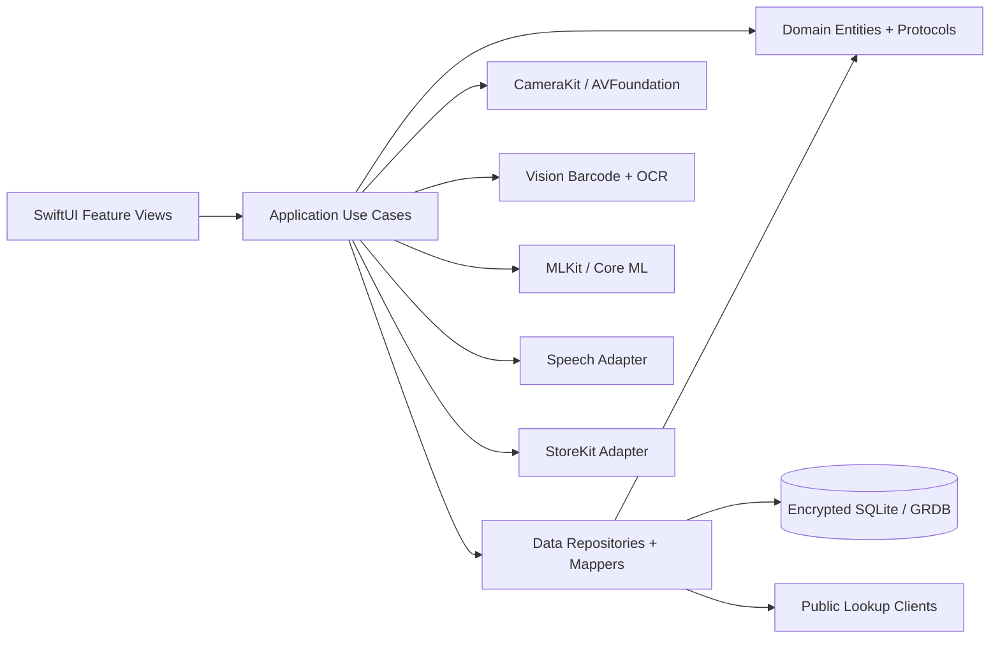
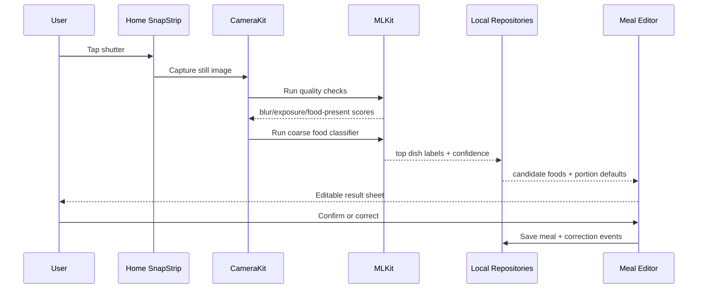

# SnapGrub iOS MVP Technical Build Spec

**Document owner:** Product/Engineering  
**Audience:** iOS developer, ML developer, backend developer who will join after MVP  
**Version:** 1.0  
**Date:** 2026-05-17

## 1. Executive decision

You can build the first SnapGrub MVP **without a custom backend** if the MVP is defined as a **single-device, local-first iOS app** that produces useful, editable calorie and macro logs from photo, barcode, text, and voice inputs. The app must be honest that photo results are estimates and must make editing fast.

You should **not** skip the backend if the MVP promise is any of the following:

- cloud-grade photo recognition for mixed meals
- cross-device sync
- account login with cloud restore
- server-validated subscriptions and refund/grace-period handling
- dynamic catalog/model updates without an app release
- secure use of paid APIs such as commercial nutrition APIs or hosted vision models
- retention, export, or deletion of cloud-stored photos

**Recommended path:** Ship a backendless MVP as a high-quality TestFlight or first App Store release only if you accept the constraints below. Design the code as if a backend already exists by putting every data source behind protocols and by storing all local changes in an outbox. Add the backend after the MVP without rewriting the app.

## 2. MVP definition

### MVP product promise

"Open SnapGrub, snap food or scan a package, confirm/edit the estimate, and save calories plus macros in seconds."

### MVP must ship

1. Onboarding for goal, calories, macro targets, units, cuisine preferences, and permissions.
2. Home screen with a persistent mini camera card called **SnapStrip**.
3. Photo capture flow with local quality checks and an editable result screen.
4. Barcode scan flow using on-device barcode detection plus local/remote public lookup.
5. Text entry flow for meals like `2 rotis, dal, paneer`.
6. Voice entry flow that transcribes to the same text parser.
7. Meal editor with ingredient rows, portion units, and confidence labels.
8. Journal with today, history, meal details, duplicate meal, delete meal, and favorites.
9. Goals and daily progress for calories, protein, carbs, and fat.
10. Local custom foods and custom meal components.
11. Local data export and delete-all-local-data.
12. StoreKit purchase/paywall only if you are comfortable with local entitlement handling until backend exists.

### MVP should not ship

- full AI coach
- meal planner
- social/community feed
- restaurant menu scan
- before/after consumption analysis
- deep micronutrient system
- Apple Health calorie-adjustment engine
- cloud sync
- cloud photo retention
- background remote model training

## 3. Backend decision matrix

| Requirement | Backendless MVP support | Notes |
|---|---:|---|
| Onboarding, goals, local profile | Yes | Store in encrypted local database. |
| Persistent home camera | Yes | AVFoundation local only. |
| Photo capture | Yes | Store local image asset and thumbnail. |
| Food/non-food and quality checks | Yes | Use local heuristics and small Core ML model. |
| Coarse food recognition | Limited | Good enough for candidate suggestions, not final truth. |
| Mixed meal segmentation | No/limited | Requires cloud or a larger on-device model; push to v1 backend. |
| Portion estimation | Limited | Use portion templates and user controls. |
| Barcode scan | Yes | Barcode detection is local; product lookup can use local cache and public sources. |
| Voice entry | Yes | Use Apple Speech where available; always provide text fallback. |
| Text food parsing | Yes | Use local grammar + alias search. |
| USDA generic food search | Yes | Ship a filtered local catalog. Do not query huge datasets live from device. |
| Open Food Facts barcode lookup | Yes with caution | Keep source boundaries and provenance. Legal review before merging data into proprietary catalog. |
| Paid third-party nutrition APIs | No | Do not embed paid API keys in the app. |
| Hosted vision API | No | Do not embed hosted AI credentials in the app. |
| Subscriptions | Partial | StoreKit 2 local entitlement works, but server validation should be added later. |
| Cross-device sync | No | Add backend later. |

## 4. Target Apple stack

- **Language:** Swift
- **UI:** SwiftUI
- **Architecture:** Clean Architecture plus local Swift Package modules
- **Camera:** AVFoundation
- **Barcode:** AVFoundation metadata output and/or Vision barcode request
- **OCR:** Vision text recognition, not custom OCR in MVP
- **Voice:** Speech framework; parse transcription through local meal parser
- **ML runtime:** Core ML
- **Local database:** SQLite using GRDB
- **Encryption:** SQLCipher or equivalent encrypted SQLite strategy
- **Secrets:** Keychain for local keys and StoreKit state metadata
- **Purchases:** StoreKit 2
- **Background work:** BackgroundTasks for deferred catalog maintenance and queued analysis retry
- **Networking:** URLSession for public food lookups only
- **Testing:** XCTest, snapshot tests, dependency-injected fake repositories

Minimum OS should be chosen based on your product launch target, but the MVP should avoid depending on newest-only language-model APIs. The core build works with stable Apple frameworks: camera, Vision, Speech, Core ML, StoreKit, and SQLite.

## 5. Architecture overview

SnapGrub should be local-first. The UI never talks directly to SQLite, APIs, Core ML, Speech, or AVFoundation. It talks to use cases. Use cases talk to repository and service protocols. Implementations live in outer packages.



### Dependency rules

1. `Domain` imports no app framework, no database, no networking, no Core ML.
2. Feature packages import `Domain`, `DesignSystem`, and their own view models.
3. `Data` implements repository protocols from `Domain`.
4. `Persistence` owns schema, migrations, encryption, and GRDB access.
5. `CameraKit`, `MLKit`, `PlatformAdapters`, and `Networking` are replaceable adapters.
6. The future backend replaces or extends `Networking` and `SyncEngine`, not feature screens.

## 6. Exact iOS project structure

Use one Xcode workspace with an app target and local Swift packages. The app target should be thin.

```text
snapgrub-ios/
  SnapGrub.xcworkspace
  apps/
    SnapGrub/
      SnapGrubApp.swift
      AppDelegate.swift
      Info.plist
      Assets.xcassets
      Preview Content/
  packages/
    AppShell/
      Sources/AppShell/
      Tests/AppShellTests/
    DesignSystem/
      Sources/DesignSystem/
      Tests/DesignSystemTests/
    Domain/
      Sources/Domain/
        Entities/
        ValueObjects/
        UseCaseProtocols/
        RepositoryProtocols/
        Policies/
      Tests/DomainTests/
    Application/
      Sources/Application/
        UseCases/
        Coordinators/
        DTOs/
      Tests/ApplicationTests/
    Persistence/
      Sources/Persistence/
        Migrations/
        Records/
        DatabaseWriter.swift
        DatabaseReader.swift
      Tests/PersistenceTests/
    Data/
      Sources/Data/
        Repositories/
        Mappers/
        LocalDataSources/
      Tests/DataTests/
    SyncEngine/
      Sources/SyncEngine/
        Outbox/
        ConflictResolution/
        Idempotency/
      Tests/SyncEngineTests/
    Networking/
      Sources/Networking/
        PublicFoodAPIs/
        RetryPolicy.swift
        HTTPClient.swift
      Tests/NetworkingTests/
    CameraKit/
      Sources/CameraKit/
        CameraSessionController.swift
        PhotoCaptureService.swift
        PreviewView.swift
        CameraPowerPolicy.swift
      Tests/CameraKitTests/
    VisionKit/
      Sources/VisionKitAdapters/
        BarcodeScanner.swift
        NutritionLabelOCR.swift
      Tests/VisionKitAdaptersTests/
    MLKit/
      Sources/MLKit/
        ModelManager.swift
        FoodQualityAnalyzer.swift
        FoodClassifier.swift
        ConfidenceCalibrator.swift
      Tests/MLKitTests/
    PlatformAdapters/
      Sources/PlatformAdapters/
        Speech/
        StoreKit/
        Keychain/
        FileProtection/
        Notifications/
      Tests/PlatformAdaptersTests/
    FeatureOnboarding/
    FeatureHome/
    FeatureCapture/
    FeatureMealEditor/
    FeatureBarcode/
    FeatureTextVoice/
    FeatureJournal/
    FeatureInsights/
    FeatureGoals/
    FeatureAccount/
  tools/
    catalog-builder/
    model-metadata-builder/
    seed-data-validator/
  data/
    raw/
    curated/
    generated/
  docs/
    architecture/
    api-backend-later/
    decisions/
```

## 7. Feature modules and responsibilities

| Module | Responsibility |
|---|---|
| `AppShell` | App lifecycle, DI container, navigation root, permission routing. |
| `DesignSystem` | Colors, typography, cards, rings, buttons, mascot slots, haptics. |
| `FeatureOnboarding` | Goal setup, unit preferences, cuisine preferences, permissions. |
| `FeatureHome` | SnapStrip, daily summary, recent meals, quick actions. |
| `FeatureCapture` | Full camera, capture guidance, local analysis loading state. |
| `FeatureMealEditor` | Candidate dish, ingredients, portions, source labels, save. |
| `FeatureBarcode` | Barcode scan, product match, create product if no match. |
| `FeatureTextVoice` | Text parser, voice transcription, parsed items review. |
| `FeatureJournal` | Calendar/history, meal detail, duplicate, favorite, delete. |
| `FeatureInsights` | Day/week trend, macro adherence, streaks. Keep simple in MVP. |
| `FeatureGoals` | Calorie and macro target editing. |
| `FeatureAccount` | Subscription, privacy controls, export, delete local data. |
| `Domain` | Business entities, rules, repository protocols. |
| `Persistence` | SQLite schema, migrations, SQLCipher configuration. |
| `Data` | Repository implementations and mappers. |
| `SyncEngine` | Local outbox and future backend sync seams. |
| `CameraKit` | AVFoundation preview/capture and battery policy. |
| `MLKit` | Core ML wrappers, preprocessing, confidence fusion. |
| `Networking` | Public food API lookup clients only. |
| `PlatformAdapters` | Speech, StoreKit, Keychain, file protection, notifications. |

## 8. Domain model

### Core entities

```swift
struct UserProfile: Identifiable, Codable {
    let id: UUID
    var displayName: String?
    var unitSystem: UnitSystem
    var preferredCuisines: [Cuisine]
    var createdAt: Date
}

struct GoalPlan: Identifiable, Codable {
    let id: UUID
    var dailyCalories: Int
    var proteinGrams: Double
    var carbGrams: Double
    var fatGrams: Double
    var goalType: GoalType
    var effectiveFrom: Date
}

struct MealEntry: Identifiable, Codable {
    let id: UUID
    var mealSlot: MealSlot
    var eatenAt: Date
    var source: MealSource
    var title: String
    var components: [MealComponent]
    var totals: NutritionTotals
    var confidence: ConfidenceScore
    var assetIds: [UUID]
    var revision: Int
    var syncState: SyncState
}

struct MealComponent: Identifiable, Codable {
    let id: UUID
    var foodId: UUID?
    var displayName: String
    var quantity: Double
    var unit: PortionUnit
    var grams: Double?
    var nutrients: NutritionTotals
    var sourceLabel: SourceLabel
    var userConfirmed: Bool
}

struct FoodItem: Identifiable, Codable {
    let id: UUID
    var displayName: String
    var aliases: [String]
    var cuisineTags: [Cuisine]
    var sourceSystem: FoodSourceSystem
    var sourceRecordId: String?
    var nutrientsPer100g: NutritionTotals
    var servingUnits: [PortionUnit]
    var confidence: Double
}
```

### Key value objects

- `NutritionTotals`: calories, protein, carbs, fat; optional fiber, sugar, sodium later.
- `ConfidenceScore`: overall, dish, portion, barcode, source quality.
- `SourceLabel`: USDA, OpenFoodFacts, InternalRecipe, UserCustom, Estimated.
- `PortionUnit`: grams, ounces, cup, tablespoon, teaspoon, piece, slice, bowl, katori, roti, idli, serving.
- `MealSource`: photo, barcode, text, voice, manual, duplicated.
- `CorrectionEvent`: wrong dish, wrong portion, missing ingredient, removed ingredient, source override.

## 9. Local database schema

Use SQLite with migrations. Store UUIDs as text or blobs consistently. Keep nutrition values in grams and kcal as numeric columns, not only JSON.

```sql
CREATE TABLE user_profiles (
  id TEXT PRIMARY KEY,
  display_name TEXT,
  unit_system TEXT NOT NULL,
  preferred_cuisines_json TEXT NOT NULL,
  created_at TEXT NOT NULL,
  updated_at TEXT NOT NULL
);

CREATE TABLE goal_plans (
  id TEXT PRIMARY KEY,
  daily_calories INTEGER NOT NULL,
  protein_g REAL NOT NULL,
  carbs_g REAL NOT NULL,
  fat_g REAL NOT NULL,
  goal_type TEXT NOT NULL,
  effective_from TEXT NOT NULL,
  created_at TEXT NOT NULL
);

CREATE TABLE meal_entries (
  id TEXT PRIMARY KEY,
  meal_slot TEXT NOT NULL,
  eaten_at TEXT NOT NULL,
  source TEXT NOT NULL,
  title TEXT NOT NULL,
  total_kcal REAL NOT NULL,
  protein_g REAL NOT NULL,
  carbs_g REAL NOT NULL,
  fat_g REAL NOT NULL,
  confidence_overall REAL NOT NULL,
  revision INTEGER NOT NULL DEFAULT 1,
  is_deleted INTEGER NOT NULL DEFAULT 0,
  sync_state TEXT NOT NULL,
  created_at TEXT NOT NULL,
  updated_at TEXT NOT NULL
);

CREATE TABLE meal_components (
  id TEXT PRIMARY KEY,
  meal_id TEXT NOT NULL REFERENCES meal_entries(id),
  food_id TEXT,
  display_name TEXT NOT NULL,
  quantity REAL NOT NULL,
  unit_key TEXT NOT NULL,
  grams REAL,
  kcal REAL NOT NULL,
  protein_g REAL NOT NULL,
  carbs_g REAL NOT NULL,
  fat_g REAL NOT NULL,
  source_label TEXT NOT NULL,
  user_confirmed INTEGER NOT NULL DEFAULT 0,
  sort_order INTEGER NOT NULL
);

CREATE TABLE food_items (
  id TEXT PRIMARY KEY,
  display_name TEXT NOT NULL,
  source_system TEXT NOT NULL,
  source_record_id TEXT,
  cuisine_tags_json TEXT NOT NULL,
  kcal_per_100g REAL NOT NULL,
  protein_per_100g REAL NOT NULL,
  carbs_per_100g REAL NOT NULL,
  fat_per_100g REAL NOT NULL,
  source_quality REAL NOT NULL,
  last_verified_at TEXT
);

CREATE TABLE food_aliases (
  id TEXT PRIMARY KEY,
  food_id TEXT NOT NULL REFERENCES food_items(id),
  alias TEXT NOT NULL,
  locale TEXT,
  normalized_alias TEXT NOT NULL
);

CREATE VIRTUAL TABLE food_alias_fts USING fts5(
  normalized_alias,
  display_name,
  cuisine_tags,
  content=''
);

CREATE TABLE portion_units (
  id TEXT PRIMARY KEY,
  food_id TEXT NOT NULL REFERENCES food_items(id),
  unit_key TEXT NOT NULL,
  display_name TEXT NOT NULL,
  grams_per_unit REAL,
  default_quantity REAL NOT NULL
);

CREATE TABLE branded_products (
  id TEXT PRIMARY KEY,
  food_id TEXT REFERENCES food_items(id),
  brand_name TEXT,
  product_name TEXT NOT NULL,
  source_system TEXT NOT NULL,
  source_record_id TEXT,
  serving_size_g REAL,
  serving_label TEXT,
  last_seen_at TEXT NOT NULL
);

CREATE TABLE barcode_refs (
  barcode TEXT PRIMARY KEY,
  branded_product_id TEXT NOT NULL REFERENCES branded_products(id),
  source_system TEXT NOT NULL,
  match_confidence REAL NOT NULL,
  cached_at TEXT NOT NULL
);

CREATE TABLE assets (
  id TEXT PRIMARY KEY,
  meal_id TEXT REFERENCES meal_entries(id),
  asset_type TEXT NOT NULL,
  local_path TEXT NOT NULL,
  width INTEGER,
  height INTEGER,
  sha256 TEXT,
  created_at TEXT NOT NULL
);

CREATE TABLE correction_events (
  id TEXT PRIMARY KEY,
  meal_id TEXT NOT NULL REFERENCES meal_entries(id),
  event_type TEXT NOT NULL,
  payload_json TEXT NOT NULL,
  created_at TEXT NOT NULL,
  sync_state TEXT NOT NULL
);

CREATE TABLE outbox_commands (
  id TEXT PRIMARY KEY,
  command_type TEXT NOT NULL,
  aggregate_id TEXT NOT NULL,
  payload_json TEXT NOT NULL,
  idempotency_key TEXT NOT NULL UNIQUE,
  local_revision INTEGER NOT NULL,
  status TEXT NOT NULL,
  created_at TEXT NOT NULL,
  last_attempt_at TEXT
);
```

## 10. How SnapGrub pulls nutrition data without a backend

### Build-time catalog builder

Create a macOS command-line tool at `tools/catalog-builder`. This runs before app release and creates `CatalogSeed.sqlite`, which is bundled with the app on first install.

Inputs:

1. `data/raw/usda/` - downloaded USDA FoodData Central snapshots or curated exports.
2. `data/raw/openfoodfacts/` - optional legally separated packaged-food seed data.
3. `data/curated/indian_recipes.csv` - internally curated Indian dish templates.
4. `data/curated/european_recipes.csv` - internally curated European/Western dish templates.
5. `data/curated/portion_units.csv` - mapping such as roti, idli, katori, bowl, cup, slice.
6. `data/curated/aliases.csv` - aliases and common spellings.

Outputs:

- `CatalogSeed.sqlite`
- `CatalogSeedManifest.json`
- `CatalogSeedValidationReport.json`

The app imports the seed database into the encrypted user database on first launch.

### Runtime data lookup

| User action | Runtime lookup path | Backendless behavior |
|---|---|---|
| Photo capture | Core ML candidates -> local food alias search -> portion templates | Show top candidates and ask user to confirm/edit. |
| Barcode scan | Local barcode cache -> public Open Food Facts lookup if online -> manual product creation | Cache only the scanned product and preserve source label. |
| Text entry | Normalize text -> local parser -> FTS5 alias search -> portion extraction | Return editable ingredient chips. |
| Voice entry | Speech transcription -> same text entry path | Always show parsed text before saving. |
| Custom food | User-created food item in local DB | Mark as UserCustom. |

### Data source policy

1. **USDA FoodData Central:** Use as primary U.S. generic food seed. Import a curated subset for MVP; do not ship the entire raw dataset if it makes the app too large.
2. **Open Food Facts:** Use for barcode fallback. Keep it source-separated because database licensing and data quality differ from USDA. Show `Source: Open Food Facts` in the product result.
3. **Indian data:** For MVP, use curated recipe templates and portion defaults. Do not commercially embed any dataset with uncertain reuse rights until legal review is done.
4. **European data:** For MVP, include curated common foods and recipes. Add licensed official European food composition data later.
5. **Commercial APIs:** Do not call paid APIs directly from the app. Add them only after the backend exists.

## 11. Photo analysis without backend

The backendless MVP should not claim perfect recognition. It should make the photo path fast and useful by combining simple ML with a great editor.

### On-device analysis pipeline



### Models to include in the app bundle

1. `FoodPresence.mlmodelc` - binary food/non-food classifier.
2. `ImageQualityHeuristics` - blur, exposure, brightness, and framing checks. These can be native code, not ML.
3. `CoarseDishClassifier.mlmodelc` - top-k dish family classifier. It does not need to identify every ingredient.
4. Optional later: `SimplePlateSegmenter.mlmodelc` only if the model is small and useful.

### Photo result confidence rules

| Condition | App behavior |
|---|---|
| Food not detected | Ask user to retake or use text entry. Do not save an AI result. |
| Image blurred/dark | Show warning and allow retake. |
| Top candidate confidence high | Preselect dish and show one-tap save. |
| Top candidates close together | Show top 3 dish choices before save. |
| Portion confidence low | Ask one portion question: grams, serving, plate fraction, bowl size, or count. |
| Mixed/Indian meal detected | Bias toward ingredient chips and portion editor rather than one dish total. |

## 12. Portion system

MVP portion accuracy comes from a good UX, not from pretending the camera knows everything.

Supported portion modes:

- grams
- ounces
- serving
- cup
- tablespoon
- teaspoon
- slice
- piece
- bowl
- katori
- roti count
- idli count
- paratha count
- plate fraction: 1/4, 1/2, 3/4, full

Portion conversion priority:

1. food-specific portion conversion from `portion_units`
2. recipe template serving size
3. generic unit conversion
4. user-confirmed manual grams
5. fallback serving estimate marked as low confidence

## 13. Barcode flow

### Implementation

- Use the same SnapStrip camera surface when possible.
- Detect EAN/UPC/QR using AVFoundation metadata output or Vision.
- When a barcode is detected:
  1. Look up `barcode_refs` locally.
  2. If online and no local match, query the public product source permitted for MVP.
  3. Normalize the result into `branded_products` and `food_items`.
  4. Show product, brand, serving size, source, and confidence.
  5. Let the user correct serving quantity before save.

### No-match behavior

Show a fast custom product form:

- product name
- brand
- serving size
- calories
- protein, carbs, fat
- optional photo of nutrition label

Store it locally as `UserCustom` and link it to the barcode.

## 14. Text and voice flow

### Parser behavior

Input examples:

- `2 rotis and dal`
- `oatmeal with milk and banana`
- `salmon rice bowl with avocado`
- `paneer butter masala, one bowl, two naan`
- `coffee with milk and sugar`

Pipeline:

1. Normalize case, punctuation, plurals, and common transliterations.
2. Extract quantities and units.
3. Split on connectors: `with`, `and`, comma, plus.
4. Match phrase chunks through FTS5 alias search.
5. Apply cuisine preference reranking.
6. Return editable `ParsedMealDraft`.

### Voice behavior

- Press and hold shutter or mic button.
- Transcribe to text using Speech framework.
- Show the transcript and parsed meal before save.
- If speech fails, keep typed entry one tap away.

## 15. Home screen technical behavior

The home screen is the product. It should feel like a camera with context.

### SnapStrip behavior

- Starts camera preview only after permission is granted.
- Uses low-power preset for preview.
- Does not run heavy ML continuously.
- Runs lightweight food-present checks on throttled frames only.
- Suspends camera when app goes background or when user leaves Home/Capture.
- Shows static placeholder if battery is low, thermal state is high, or camera permission is denied.
- Offers fallback buttons: Barcode, Describe, Voice, Manual.

### Home screen sections

1. Greeting and streak.
2. SnapStrip camera card.
3. Calories remaining card.
4. Macro bars or rings.
5. Recent meals.
6. One simple insight.
7. Bottom tabs: Home, Journal, Capture, Insights, Profile.

## 16. Backend-later design

Even without a backend, implement the local outbox now. Every local mutation becomes a command. The backend will later consume these commands.

### Local command examples

```json
{
  "id": "2B17B2D7-5B41-4D80-9C1A-26825E7E3F7A",
  "commandType": "meal.create",
  "aggregateId": "MEAL-UUID",
  "idempotencyKey": "DEVICE-UUID:MEAL-UUID:1",
  "localRevision": 1,
  "payload": {
    "mealSlot": "lunch",
    "eatenAt": "2026-05-17T12:30:00Z",
    "source": "photo",
    "components": []
  }
}
```

### Future backend endpoints

When the backend is added, implement these contracts first:

| Endpoint | Purpose |
|---|---|
| `POST /v1/auth/apple` | Exchange Sign in with Apple token for SnapGrub session. |
| `POST /v1/sync/push` | Upload local outbox commands. |
| `GET /v1/sync/pull?since=` | Pull server changes since cursor. |
| `POST /v1/assets/upload-session` | Get signed photo upload URL. |
| `POST /v1/analysis/photo` | Run cloud meal analysis. |
| `GET /v1/analysis/{id}` | Poll or stream photo analysis result. |
| `GET /v1/catalog/search` | Search canonical food catalog. |
| `GET /v1/barcodes/{code}` | Resolve barcode server-side. |
| `POST /v1/corrections` | Send correction events for active learning. |
| `POST /v1/subscriptions/apple/notifications` | Receive App Store server notifications. |
| `POST /v1/privacy/export` | Request user export. |
| `POST /v1/privacy/delete` | Request account/data deletion. |

### Backend migration plan

Phase 1: Add account and sync.

- Add Sign in with Apple.
- Upload local profile, goals, meals, corrections, and custom foods.
- Keep local DB authoritative until server ack.
- Resolve conflicts using revision numbers and user-confirmed fields.

Phase 2: Add cloud catalog.

- Server becomes source for canonical catalog search.
- App keeps a hot local cache and search fallback.
- Product/barcode misses are resolved server-side.

Phase 3: Add cloud photo analysis.

- App uploads compressed image after local pre-checks.
- Server returns ingredients, portions, confidence, and provenance.
- App still requires confirmation and allows edits.

Phase 4: Add subscription validation and remote model updates.

- Server listens to App Store notifications.
- Entitlements sync across devices.
- Model/catalog manifests are signed and downloaded in background.

## 17. Repository protocols

Define these in `Domain` or `Application` before writing implementations.

```swift
protocol MealRepository {
    func meal(id: UUID) async throws -> MealEntry?
    func meals(on day: Date) async throws -> [MealEntry]
    func saveMeal(_ meal: MealEntry, corrections: [CorrectionEvent]) async throws
    func deleteMeal(id: UUID) async throws
}

protocol FoodCatalogRepository {
    func searchFoods(query: String, context: FoodSearchContext) async throws -> [FoodItem]
    func food(id: UUID) async throws -> FoodItem?
    func portionUnits(for foodId: UUID) async throws -> [PortionUnit]
    func saveCustomFood(_ food: FoodItem) async throws
}

protocol BarcodeRepository {
    func resolveBarcode(_ code: String) async throws -> BarcodeResolution
    func saveUserBarcodeProduct(_ product: BrandedProduct, barcode: String) async throws
}

protocol MealAnalysisService {
    func analyzePhoto(_ photo: CapturedMealPhoto, context: MealContext) async throws -> MealAnalysisDraft
    func analyzeText(_ text: String, context: MealContext) async throws -> MealAnalysisDraft
}

protocol SpeechTranscriptionService {
    func transcribeLive() -> AsyncThrowingStream<SpeechPartialResult, Error>
}

protocol PurchaseEntitlementRepository {
    func currentEntitlement() async throws -> PremiumEntitlement
    func observeTransactions() -> AsyncStream<PremiumEntitlement>
}
```

## 18. MVP screens and acceptance criteria

### Onboarding

Acceptance criteria:

- User can set daily calorie target manually.
- User can set protein/carbs/fat targets manually or use simple default split.
- User can choose units.
- User can select cuisines: American, Western/European, Indian, mixed.
- Camera, speech, and notification permissions are requested contextually, not all at first launch.

### Home

Acceptance criteria:

- Camera preview appears after permission.
- If permission denied, Home still works through text, barcode, and manual entry.
- Daily totals update immediately after meal save.
- Camera stops when the app backgrounds.

### Photo capture

Acceptance criteria:

- User can capture a meal photo.
- App creates a local draft even without network.
- App shows top candidate dish or asks for text if confidence is low.
- User can edit every ingredient before saving.

### Meal editor

Acceptance criteria:

- User can change dish title.
- User can add/remove components.
- User can change quantity and unit.
- Totals recalculate from components.
- Source and confidence are visible.
- Save writes meal, components, asset, correction events, and outbox command.

### Barcode

Acceptance criteria:

- Barcode scan works from camera view.
- Cached barcode resolves offline.
- Online public lookup caches result with provenance.
- No match opens custom product form.

### Text/voice

Acceptance criteria:

- Text parser handles at least 100 curated meal phrases.
- Voice transcript is editable before parse/save.
- Ambiguous foods show alternatives.

### Journal

Acceptance criteria:

- Today view shows meals grouped by slot.
- History view supports date navigation.
- Meal detail supports edit, duplicate, favorite, and delete.

### Account/settings

Acceptance criteria:

- Export local data to JSON/CSV package.
- Delete all local data.
- Manage subscription if enabled.
- Show privacy explanation for local photos and dietary logs.

## 19. Security and privacy requirements

- Encrypt local database.
- Store encryption key material in Keychain.
- Use file protection for photos and thumbnails.
- Strip EXIF metadata from meal photos before any future upload.
- Do not embed commercial API keys in the app.
- Do not upload photos in backendless MVP.
- Provide local export and delete controls.
- Keep source provenance for all food data.
- Make photo retention explicit: thumbnails for journal, original optional or temporary.

## 20. Testing plan

### Unit tests

- nutrition totals recalculate from components
- portion conversion works for grams, cups, pieces, roti, idli, katori
- text parser extracts quantities and units
- search reranking respects cuisine preference
- meal save creates outbox command
- delete meal marks deletion and updates totals

### Integration tests

- first launch imports seed catalog
- barcode lookup caches product
- meal editor writes meal + components + correction events
- export produces valid JSON/CSV
- StoreKit sandbox entitlement gates premium screen if enabled

### UI tests

- onboarding to home
- camera permission denied path
- photo capture to meal editor
- text meal to saved meal
- barcode no-match to custom product
- journal edit and duplicate

### Performance tests

- Home loads under 1 second after cold start on target device.
- SnapStrip preview starts under 1 second after permission.
- Local photo candidate result appears under 2 seconds for simple meals.
- Barcode detection feels instant under normal lighting.
- Daily total recalculation stays under 100 ms for normal journal sizes.

## 21. Delivery plan for backendless MVP

### Sprint 1 - Foundation

- Xcode workspace and Swift package structure
- design tokens and core UI components
- Domain entities and repository protocols
- encrypted SQLite setup and migrations
- seed catalog import skeleton

### Sprint 2 - Home and camera

- SnapStrip camera preview
- camera permission handling
- capture still photo
- asset storage and thumbnail generation
- camera low-power policy

### Sprint 3 - Food catalog and manual logging

- catalog-builder v1
- local food search and aliases
- manual meal creation
- portion units and totals engine
- journal day view

### Sprint 4 - Photo analysis and editor

- Core ML model wrapper or stub model
- quality checks
- candidate mapping to local food catalog
- meal editor
- correction events

### Sprint 5 - Barcode, text, and voice

- barcode detection
- local/public product resolver
- custom product flow
- text parser
- Speech framework adapter

### Sprint 6 - Goals, insights, privacy, paywall, hardening

- goal setup and daily progress
- basic insights and streaks
- export/delete local data
- StoreKit paywall if included
- performance pass and TestFlight build

## 22. Risks and mitigations

| Risk | Impact | Mitigation |
|---|---|---|
| Photo recognition feels inaccurate | User loses trust | Use confidence labels, top candidates, and fast edit controls. |
| Portion estimates are wrong | Calorie totals wrong | Use portion UX and mark estimates clearly. |
| App bundle becomes too large | Install friction | Ship curated seed catalog, not full raw datasets. |
| Open data licensing issue | Business/legal risk | Keep source-separated and get legal review. |
| Paid API key leakage | Cost/security risk | No paid APIs until backend exists. |
| Camera drains battery | Uninstalls | Low-power preview, no continuous heavy ML, suspend aggressively. |
| Backend migration causes rewrite | Delay | Protocols, outbox, stable UUIDs, source provenance from day one. |

## 23. Non-negotiable engineering rules

1. No feature view talks directly to SQLite or URLSession.
2. No commercial API secrets in the app bundle.
3. Every food result has source provenance.
4. Every photo result is editable before save.
5. Totals are calculated from components, not manually stored only.
6. The app works offline for viewing, manual logging, cached barcode hits, and saved drafts.
7. All mutations create outbox commands for future sync.
8. All model outputs include model name/version in local metadata.
9. All correction events are stored even before backend exists.
10. The MVP optimizes for speed, honesty, and editability over magical claims.

## 24. Definition of done

The backendless MVP is done when:

- a new user can onboard, capture or describe a meal, edit it, and save it locally;
- daily calories and macros update immediately;
- barcode scanning resolves cached and online public products;
- the app works with no custom backend service;
- local export/delete exists;
- app privacy language matches actual behavior;
- code is structured so backend sync and cloud analysis can be added through existing protocols;
- TestFlight users can complete the core flow without developer intervention.

## 25. What the backend developer should build later

When you add the backend, start with a modular monolith rather than microservices.

Recommended modules:

- Auth: Sign in with Apple, user sessions, device records.
- Meal Journal: meals, components, revisions, sync cursors.
- Catalog: canonical foods, aliases, barcodes, product sources.
- Analysis: photo upload sessions, cloud inference, result revisions.
- Corrections: user correction events and label queue.
- Subscriptions: App Store server notifications and entitlement state.
- Privacy: export, deletion, retention policies.

Recommended infrastructure:

- PostgreSQL for transactional data.
- Object storage for photos if users opt in or cloud analysis is enabled.
- Redis for caching hot barcode/catalog results.
- Queue for analysis jobs.
- Containerized API and workers.
- Signed model/catalog manifests for app downloads.

The client should not need a redesign when this arrives. It should switch repository implementations from local-only to local-plus-sync.
